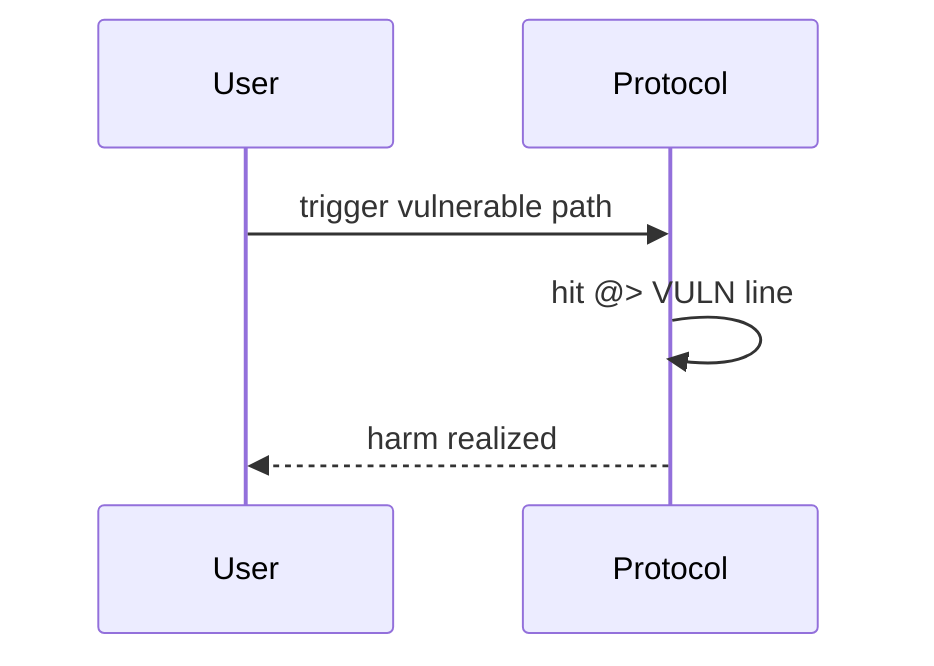

# Rubicon — Migration can underpay users via price manipulation

> **Vulnerability classes:** spot-price · price-manipulation · fot-slippage

> **Reproduction:** self-contained Foundry PoC with **only `forge-std`** — no fork, no RPC.
> Full trace: [output.txt](output.txt). PoC:
> [test/48953-h-14-users-might-get-less-assets-than-expected-upon-migratio_exp.sol](test/48953-h-14-users-might-get-less-assets-than-expected-upon-migratio_exp.sol).

<!-- non-defihacklabs -->
<!-- source-auditvault: https://github.com/Auditware/AuditVault/blob/main/findings/48953-h-14-users-might-get-less-assets-than-expected-upon-migratio.md -->
<!-- date: 2023-04 -->

---

## Key info

| | |
|---|---|
| **Impact** | **HIGH** — V2Migrator.migrate has no slippage guard; inflated BathV2 rate can mint 0 shares and enable drain |
| **Protocol** | [Rubicon](https://rubicon.finance) |
| **Bug class** | spot-price · price-manipulation · fot-slippage |
| **Finding** | Code4rena 2023-04-rubicon · #48953 · H-14 · reporter **0xNineDec** |
| **Report** | [code4rena.com/reports/2023-04-rubicon](https://code4rena.com/reports/2023-04-rubicon) |
| **Source** | [AuditVault](https://github.com/Auditware/AuditVault/blob/main/findings/48953-h-14-users-might-get-less-assets-than-expected-upon-migratio.md) |
| **Status** | Confirmed. Reproduced as a standalone local synthetic. |
| **Compiler** | `^0.8.24` (PoC) |

---

## TL;DR

migrate redeems V1 then mints V2 with no minOut; low-liquidity exchangeRate inflation rounds victim to 0 shares.

---

## The vulnerable code

See synthetic `test/48953-h-14-users-might-get-less-assets-than-expected-upon-migratio.sol` (`@> VULN` markers).

**Fix:** Require min shares out / simulate redeem and bind underlying received.

---

## Root cause

migrate redeems V1 then mints V2 with no minOut; low-liquidity exchangeRate inflation rounds victim to 0 shares.

---

## Preconditions

Protocol deployed with the vulnerable code paths from the Code4rena contest.

---

## Attack walkthrough

See PoC `run()` and [output.txt](output.txt).

---

## Diagrams

---

## Impact

V2Migrator.migrate has no slippage guard; inflated BathV2 rate can mint 0 shares and enable drain

---

## Taxonomy

- `genome: spot-price · price-manipulation · fot-slippage`
- `severity/high` · `platform/code4rena`

---

## Sources

- [AuditVault finding #48953](https://github.com/Auditware/AuditVault/blob/main/findings/48953-h-14-users-might-get-less-assets-than-expected-upon-migratio.md)
- [Code4rena report 2023-04-rubicon](https://code4rena.com/reports/2023-04-rubicon)
- Repo@commit: [code-423n4/2023-04-rubicon](https://github.com/code-423n4/2023-04-rubicon) · contracts migrator + CToken mintFresh
