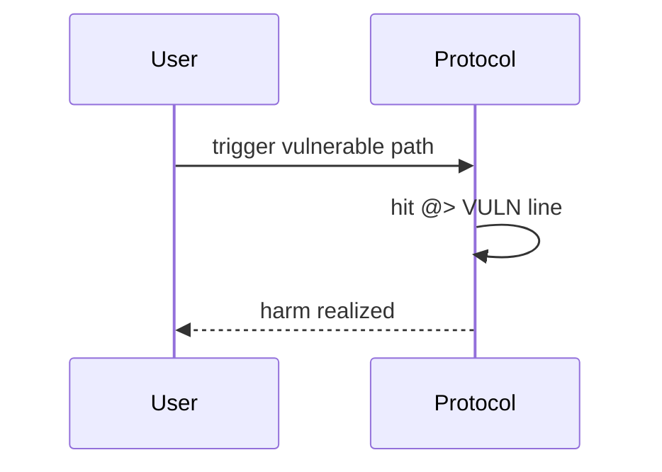

# Rubicon — Last borrowed asset is not collateralized

> **Vulnerability classes:** liquidation-logic · direct-drain · liquidation-underwater

> **Reproduction:** self-contained Foundry PoC with **only `forge-std`** — no fork, no RPC.
> Full trace: [output.txt](output.txt). PoC:
> [test/48954-h-15-the-last-borrowed-asset-will-not-be-collateralized-and_exp.sol](test/48954-h-15-the-last-borrowed-asset-will-not-be-collateralized-and_exp.sol).

<!-- non-defihacklabs -->
<!-- source-auditvault: https://github.com/Auditware/AuditVault/blob/main/findings/48954-h-15-the-last-borrowed-asset-will-not-be-collateralized-and.md -->
<!-- date: 2023-04 -->

---

## Key info

| | |
|---|---|
| **Impact** | **HIGH** — Final swapped asset sits free on Position; debt equals full CF of supplied margin only |
| **Protocol** | [Rubicon](https://rubicon.finance) |
| **Bug class** | liquidation-logic · direct-drain · liquidation-underwater |
| **Finding** | Code4rena 2023-04-rubicon · #48954 · H-15 · reporter **cccz** |
| **Report** | [code4rena.com/reports/2023-04-rubicon](https://code4rena.com/reports/2023-04-rubicon) |
| **Source** | [AuditVault](https://github.com/Auditware/AuditVault/blob/main/findings/48954-h-15-the-last-borrowed-asset-will-not-be-collateralized-and.md) |
| **Status** | Confirmed. Reproduced as a standalone local synthetic. |
| **Compiler** | `^0.8.24` (PoC) |

---

## TL;DR

_borrowLoop supplies, borrows, swaps but never supplies the last swapped asset as collateral.

---

## The vulnerable code

See synthetic `test/48954-h-15-the-last-borrowed-asset-will-not-be-collateralized-and.sol` (`@> VULN` markers).

**Fix:** After the loop, supply remaining asset balance as collateral.

---

## Root cause

_borrowLoop supplies, borrows, swaps but never supplies the last swapped asset as collateral.

---

## Preconditions

Protocol deployed with the vulnerable code paths from the Code4rena contest.

---

## Attack walkthrough

See PoC `run()` and [output.txt](output.txt).

---

## Diagrams

---

## Impact

Final swapped asset sits free on Position; debt equals full CF of supplied margin only

---

## Taxonomy

- `genome: liquidation-logic · direct-drain · liquidation-underwater`
- `severity/high` · `platform/code4rena`

---

## Sources

- [AuditVault finding #48954](https://github.com/Auditware/AuditVault/blob/main/findings/48954-h-15-the-last-borrowed-asset-will-not-be-collateralized-and.md)
- [Code4rena report 2023-04-rubicon](https://code4rena.com/reports/2023-04-rubicon)
- Repo@commit: [code-423n4/2023-04-rubicon](https://github.com/code-423n4/2023-04-rubicon) · contracts/utilities/poolsUtility/Position.sol _borrowLoop ~L251-L269
