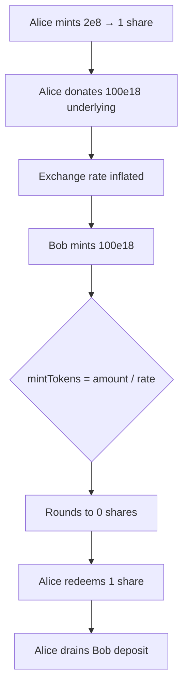

# Rubicon — First depositor bug on unmodified Compound fork

> **Vulnerability classes:** rounding-direction · direct-drain · frontrun · first-deposit

> **Reproduction:** self-contained Foundry PoC with **only `forge-std`** — no fork.
> Full trace: [output.txt](output.txt). PoC:
> [test/48956-h-17-first-depositor-bug-on-unmodified-compound-fork-code4re_exp.sol](test/48956-h-17-first-depositor-bug-on-unmodified-compound-fork-code4re_exp.sol).

<!-- non-defihacklabs -->
<!-- source-auditvault: https://github.com/Auditware/AuditVault/blob/main/findings/48956-h-17-first-depositor-bug-on-unmodified-compound-fork-code4re.md -->
<!-- date: 2023-04 -->

---

## Key info

| | |
|---|---|
| **Impact** | **HIGH** — attacker steals victim deposit; market per-underlying is unique so BathHouse market is bricked |
| **Protocol** | Rubicon BathToken / Compound V2 `CToken` fork |
| **Vulnerable code** | `CToken.mintFresh` — `mintTokens = div_(actualMintAmount, exchangeRate)` with no dead-share floor |
| **Bug class** | First-deposit share inflation / rounding to zero |
| **Finding** | Code4rena 2023-04-rubicon · #48956 · H-17 · reporter **fs0c** |
| **Report** | [code4rena.com/reports/2023-04-rubicon](https://code4rena.com/reports/2023-04-rubicon) |
| **Source** | [AuditVault](https://github.com/Auditware/AuditVault/blob/main/findings/48956-h-17-first-depositor-bug-on-unmodified-compound-fork-code4re.md) |
| **Status** | Acknowledged. Classic Compound/ERC4626 first-depositor pattern. |
| **Compiler** | `^0.8.24` (PoC) |

---

## TL;DR

1. Fresh CToken has `totalSupply == 0` and `exchangeRate = 2e26`.
2. Attacker mints the minimum (`2e8` underlying → 1 share), then **donates** a large underlying amount to the CToken.
3. Victim deposits `100e18`; inflated rate rounds their `mintTokens` to **0**.
4. Attacker redeems their 1 share and drains the entire cash (including the victim's deposit).
5. Because `BathHouse` allows only one bathToken per underlying, the market cannot be recreated.

---

## The vulnerable code

```solidity
uint mintTokens = div_(actualMintAmount, exchangeRate);
// @> VULN: no dead-share floor; inflated rate → mintTokens rounds to 0
totalSupply = totalSupply + mintTokens;
accountTokens[minter] = accountTokens[minter] + mintTokens;
```

**Fix:** on first mint, mint a dead-share floor to `address(0)` (Uniswap V2 style).

---

## Root cause

Share minting uses pure division against the exchange rate with no minimum liquidity / dead shares. A donation after a 1-wei mint inflates the rate so the next depositor rounds to zero shares while their underlying is still pulled in.

---

## Preconditions

- New CToken/BathToken with `totalSupply == 0`.
- Attacker can mint and transfer underlying to the CToken before the victim deposits.

---

## Attack walkthrough

1. Alice mints `2e8` → 1 cToken.
2. Alice transfers `100e18` underlying directly to the CToken.
3. Bob mints `100e18` → **0** shares.
4. Alice redeems 1 share → receives ~all cash including Bob's deposit.

---

## Diagrams



---

## Impact

Direct theft of depositor funds; unique-underlying market in BathHouse becomes unusable without full redeploy.

---

## Taxonomy

- `genome: rounding-direction`, `direct-drain`, `frontrun`, `first-deposit`
- `severity/high` · `sector/lending` · `platform/code4rena`

---

## Sources

- [AuditVault finding #48956](https://github.com/Auditware/AuditVault/blob/main/findings/48956-h-17-first-depositor-bug-on-unmodified-compound-fork-code4re.md)
- [Code4rena report 2023-04-rubicon](https://code4rena.com/reports/2023-04-rubicon)
- Repo@commit: [code-423n4/2023-04-rubicon](https://github.com/code-423n4/2023-04-rubicon) · `contracts/compound-v2-fork/CToken.sol` L398–L449
