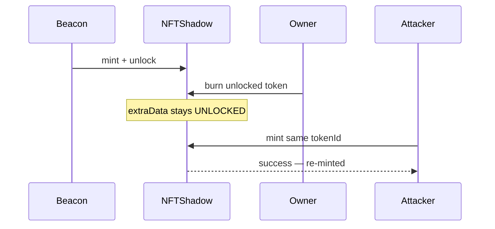

# NFTMirror — Anyone can re-mint a token that was burned by the owner

> **Vulnerability classes:** access-roles · specific-token-type

> **Reproduction:** self-contained Foundry PoC with **only `forge-std`** — no fork.
> Full trace: [output.txt](output.txt). PoC:
> [test/50036-c-01-anyone-can-re-mint-a-token-that-was-burned-by-the-owner_exp.sol](test/50036-c-01-anyone-can-re-mint-a-token-that-was-burned-by-the-owner_exp.sol).

<!-- non-defihacklabs -->
<!-- source-auditvault: https://github.com/Auditware/AuditVault/blob/main/findings/50036-c-01-anyone-can-re-mint-a-token-that-was-burned-by-the-owner.md -->
<!-- date: 2024-12 -->

---

## Key info

| | |
|---|---|
| **Impact** | **HIGH** — burned shadow NFTs can be re-minted by anyone, breaking burn finality |
| **Protocol** | NFTMirror — `NFTShadow` |
| **Vulnerable code** | `burn()` unlocked branch does not re-lock; `_beforeTokenTransfer` only gates locked ids |
| **Bug class** | Missing state reset after burn / access control hole |
| **Finding** | Pashov Audit Group · NFTMirror-security-review 2024-12-30 · C-01 |
| **Report** | [pashov/audits NFTMirror](https://github.com/pashov/audits/blob/master/team/md/NFTMirror-security-review_2024-12-30.md) |
| **Source** | [AuditVault](https://github.com/Auditware/AuditVault/blob/main/findings/50036-c-01-anyone-can-re-mint-a-token-that-was-burned-by-the-owner.md) |
| **Status** | Audit finding. Reproduced as a standalone local synthetic. |
| **Compiler** | `^0.8.24` (PoC) |

---

## TL;DR

1. Non-existent tokens default to **locked**, so only the beacon can mint them.
2. Owner can burn an **unlocked** token; burn does **not** set lock state back to locked.
3. After burn the id stays unlocked → anyone can call `mint(to, tokenId)` successfully.
4. Fix: `_setExtraData(tokenId, LOCKED)` after owner burn.

---

## The vulnerable code

```solidity
function burn(uint256 tokenId) external {
    if (tokenIsLocked(tokenId)) {
        _burn(tokenId);
    } else {
        // @> VULN: burn leaves the token unlocked — anyone can mint again
        _burn(msg.sender, tokenId);
        // FIX: _setExtraData(tokenId, LOCKED);
    }
}
```

```solidity
function _beforeTokenTransfer(...) internal view {
    if (msg.sender != BEACON_CONTRACT_ADDRESS) {
        if (tokenIsLocked(tokenId)) revert CallerNotBeacon();
    }
}
```

---

## Root cause

Mint gating relies on the default-locked status of token ids. Burn of an unlocked token clears ownership but leaves the unlock flag, so the gate no longer applies to the burned id.

---

## Preconditions

- Token was unlocked (beacon unlock path).
- Owner burns it.
- Attacker calls `mint` on the same id.

---

## Attack walkthrough

1. Beacon mints token `8903` to owner and unlocks it.
2. Owner burns `8903` → `tokenIsLocked(8903) == false` still.
3. Attacker mints `8903` to themselves → owns the "burned" id.

---

## Diagrams



---

## Impact

Burn is not final; arbitrary callers can resurrect burned shadow NFTs.

---

## Taxonomy

- `genome: access-roles`, `specific-token-type`
- `severity/high` · `sector/bridge` · Pashov Audit Group

---

## Sources

- [AuditVault finding #50036](https://github.com/Auditware/AuditVault/blob/main/findings/50036-c-01-anyone-can-re-mint-a-token-that-was-burned-by-the-owner.md)
- [Pashov NFTMirror security review 2024-12-30](https://github.com/pashov/audits/blob/master/team/md/NFTMirror-security-review_2024-12-30.md)
