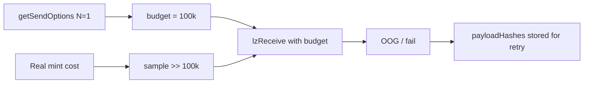

# NFTMirror — lzReceive for releaseOnEid results in OOG

> **Vulnerability classes:** dos-resistance · unbounded-loop · known-pattern

> **Reproduction:** self-contained Foundry PoC with **only `forge-std`** — no fork.
> Full trace: [output.txt](output.txt). PoC:
> [test/50038-h-02-lzreceive-call-for-releaseoneid-results-in-oog-error-pa_exp.sol](test/50038-h-02-lzreceive-call-for-releaseoneid-results-in-oog-error-pa_exp.sol).

<!-- non-defihacklabs -->
<!-- source-auditvault: https://github.com/Auditware/AuditVault/blob/main/findings/50038-h-02-lzreceive-call-for-releaseoneid-results-in-oog-error-pa.md -->
<!-- date: 2024-12 -->

---

## Key info

| | |
|---|---|
| **Impact** | **HIGH** — destination `lzReceive` always OOGs under protocol gas options; messages stuck for costly retry |
| **Protocol** | NFTMirror — `NFTShadow.getSendOptions` / LayerZero path |
| **Vulnerable code** | `getSendOptions`: `80_000 + 20_000 * n` underestimates mint (~46.7k+) per token |
| **Bug class** | Underfunded cross-chain execution gas / DoS |
| **Finding** | Pashov Audit Group · NFTMirror-security-review 2024-12-30 · H-02 |
| **Report** | [pashov/audits NFTMirror](https://github.com/pashov/audits/blob/master/team/md/NFTMirror-security-review_2024-12-30.md) |
| **Source** | [AuditVault](https://github.com/Auditware/AuditVault/blob/main/findings/50038-h-02-lzreceive-call-for-releaseoneid-results-in-oog-error-pa.md) |
| **Status** | Audit finding. Sample+extrapolate gas measurement in synthetic. |
| **Compiler** | `^0.8.24` (PoC) |

---

## TL;DR

1. `releaseOnEid` builds LZ options via `getSendOptions(tokenIds)`.
2. Budget = `80_000 + 20_000 * length` — too low for destination mint/transfer (and worse with transfer validators).
3. DVN `lzReceive` with that stipend OOGs; payload stored for retry.
4. Every release path needs manual higher-gas retry.

---

## The vulnerable code

```solidity
uint128 totalGasRequired =
    _BASE_OWNERSHIP_UPDATE_COST + (_INCREMENTAL_OWNERSHIP_UPDATE_COST * uint128(tokenIds.length));
// @> VULN: 20k/token << real mint/transfer cost (~46.7k+)
```

**Fix:** raise constants; allow user override of lzReceive gas.

---

## Root cause

Hard-coded gas options ignore real destination work (mint, transfer, optional `validateTransfer`).

---

## Preconditions

- User releases shadow NFT(s) to another eid via `releaseOnEid`.
- Destination handler performs mint/transfer under the computed stipend.

---

## Attack walkthrough / PoC

1. Compute budget for 1 token → `100_000`.
2. Measure full-gas unlock cost for 1 token → **exceeds** budget.
3. Call `lzReceive` with budget → fails / OOG; `payloadHashes != 0` (retry queue).

---

## Diagrams



---

## Impact

Cross-chain release is non-functional under default options; every message needs a higher-gas retry (cost + latency DoS).

---

## Taxonomy

- `genome: dos-resistance`, `unbounded-loop`, `known-pattern`
- `severity/high` · `sector/bridge` · `sector/nft`

---

## Sources

- [AuditVault finding #50038](https://github.com/Auditware/AuditVault/blob/main/findings/50038-h-02-lzreceive-call-for-releaseoneid-results-in-oog-error-pa.md)
- [Pashov NFTMirror security review 2024-12-30](https://github.com/pashov/audits/blob/master/team/md/NFTMirror-security-review_2024-12-30.md)


## References

- https://x.com/blockaid_/status/2091084691491164602 (@blockaid_ secondary analysis)
