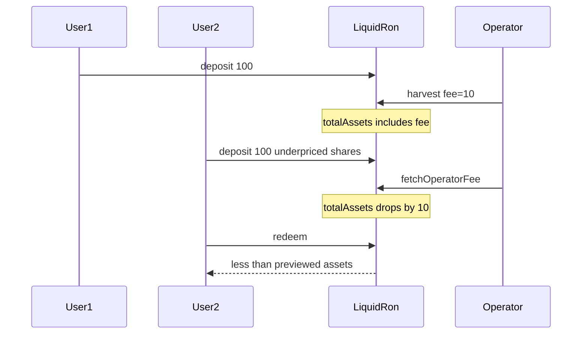

# Liquid Ron — totalAssets wrong when operatorFeeAmount > 0

> **Vulnerability classes:** fee-accounting · arithmetic/precision-loss · data-corruption/accounting-error · loss-of-funds/indirect-loss

> **Reproduction:** self-contained Foundry PoC with **only `forge-std`** — no fork.
> Full trace: [output.txt](output.txt). PoC:
> [test/50051-h-01-the-calculation-of-totalassets-could-be-wrong-if-operat_exp.sol](test/50051-h-01-the-calculation-of-totalassets-could-be-wrong-if-operat_exp.sol).

<!-- non-defihacklabs -->
<!-- source-auditvault: https://github.com/Auditware/AuditVault/blob/main/findings/50051-h-01-the-calculation-of-totalassets-could-be-wrong-if-operat.md -->
<!-- date: 2025-01 -->

---

## Key info

| | |
|---|---|
| **Impact** | **HIGH** — new depositors mint against inflated assets including operator fee; redeem less after fee withdrawal |
| **Protocol** | Liquid Ron — `LiquidRon.totalAssets` |
| **Vulnerable code** | `totalAssets()` = balance + staked + rewards **without** subtracting `operatorFeeAmount` |
| **Bug class** | Fee included in ERC-4626 asset base |
| **Finding** | Code4rena 2025-01-liquid-ron · #50051 · H-01 · reporter **0xvd** |
| **Report** | [code4rena.com/reports/2025-01-liquid-ron](https://code4rena.com/reports/2025-01-liquid-ron) |
| **Source** | [AuditVault](https://github.com/Auditware/AuditVault/blob/main/findings/50051-h-01-the-calculation-of-totalassets-could-be-wrong-if-operat.md) |
| **Status** | Confirmed and mitigated (subtract `operatorFeeAmount`). |
| **Compiler** | `^0.8.24` (PoC) |

---

## TL;DR

1. Operator fee sits in the vault balance and is tracked in `operatorFeeAmount`.
2. `totalAssets()` still counts that fee toward share pricing.
3. New depositor mints fewer shares (priced against inflated assets).
4. Operator `fetchOperatorFee` removes the fee from the vault → `totalAssets` drops.
5. Depositor redeems less than `previewRedeem` at deposit time — loss.

---

## The vulnerable code

```solidity
function totalAssets() public view override returns (uint256) {
    // @> VULN: operator fee included in asset base
    return super.totalAssets() + getTotalStaked() + getTotalRewards();
    // FIX: … - operatorFeeAmount;
}
```

---

## Root cause

Operator fee is an accounting liability (claimable by operator) but is treated as user-backing assets in the 4626 `totalAssets` formula.

---

## Preconditions

- `operatorFeeAmount > 0` (after harvest).
- New user deposits, then operator claims fee before user redeems.

---

## Attack walkthrough

1. User1 deposits 100 ETH.
2. Harvest books 10 ETH operator fee (balance still holds it).
3. User2 deposits 100 ETH while `totalAssets` includes the 10 fee.
4. Operator fetches fee.
5. User2 redeems → receives strictly less than pre-fee preview.

---

## Diagrams



---

## Impact

Consistent dilution of deposits whenever a non-zero operator fee is outstanding; can also make fee irredeemable if vault is emptied.

---

## Taxonomy

- `genome: fee-accounting`, `arithmetic/precision-loss`, `data-corruption/accounting-error`, `loss-of-funds/indirect-loss`
- `severity/high` · `sector/vault` · `platform/code4rena`

---

## Sources

- [AuditVault finding #50051](https://github.com/Auditware/AuditVault/blob/main/findings/50051-h-01-the-calculation-of-totalassets-could-be-wrong-if-operat.md)
- [Code4rena report 2025-01-liquid-ron](https://code4rena.com/reports/2025-01-liquid-ron)
- Repo@commit: [code-423n4/2025-01-liquid-ron@e4b0b7c](https://github.com/code-423n4/2025-01-liquid-ron/blob/e4b0b7c256bb2fe73b4a9c945415c3dcc935b61d/src/LiquidRon.sol) L293–L295
