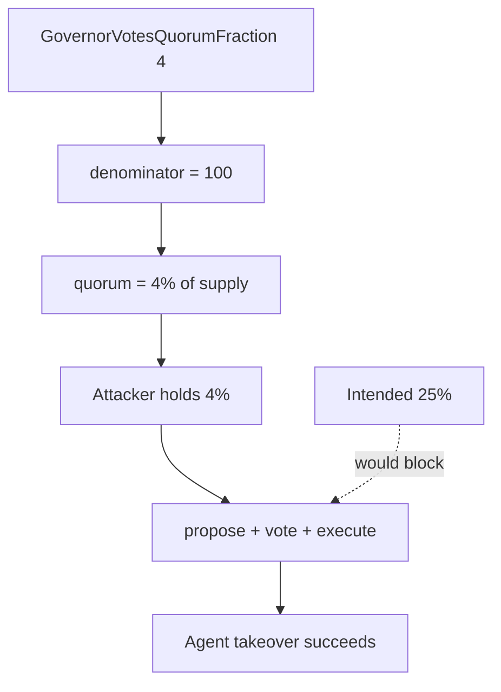

# IQ AI — Adversary can win proposals with voting power as low as 4%

> **Vulnerability classes:** quorum-supply-drift · governance-voting-power-snapshot · governance/proposal-manipulation

> **Reproduction:** self-contained Foundry PoC with **only `forge-std`** — no fork.
> Full trace: [output.txt](output.txt). PoC:
> [test/50064-h-01-adversary-can-win-proposals-with-voting-power-as-low-as_exp.sol](test/50064-h-01-adversary-can-win-proposals-with-voting-power-as-low-as_exp.sol).

<!-- non-defihacklabs -->
<!-- source-auditvault: https://github.com/Auditware/AuditVault/blob/main/findings/50064-h-01-adversary-can-win-proposals-with-voting-power-as-low-as.md -->
<!-- date: 2025-01 -->

---

## Key info

| | |
|---|---|
| **Impact** | **HIGH** — malicious proposal executes with only 4% of supply (comment claimed 25%) |
| **Protocol** | IQ AI — `TokenGovernor` |
| **Vulnerable code** | `GovernorVotesQuorumFraction(4)` with OZ denominator 100 → 4% quorum |
| **Bug class** | Quorum misconfiguration / comment-vs-code (treated as 4% effective quorum) |
| **Finding** | Code4rena 2025-01-iq-ai · #50064 · H-01 · reporter **DoD4uFN** |
| **Report** | [code4rena.com/reports/2025-01-iq-ai](https://code4rena.com/reports/2025-01-iq-ai) |
| **Source** | [AuditVault](https://github.com/Auditware/AuditVault/blob/main/findings/50064-h-01-adversary-can-win-proposals-with-voting-power-as-low-as.md) |
| **Status** | Judge maintained High (Agent ownership / LP risk on low-cap agent tokens). |
| **Compiler** | `^0.8.24` (PoC) |

---

## TL;DR

1. Constructor sets `GovernorVotesQuorumFraction(4)` with comment "quorum is 25% (1/4th)".
2. OZ `quorumDenominator()` defaults to **100**, so quorum = `supply * 4 / 100` = **4%**.
3. Attacker with 4% of votes meets quorum alone and can execute proposals (e.g. Agent takeover).
4. Fix: `GovernorVotesQuorumFraction(25)`.

---

## The vulnerable code

```solidity
// constructor:
quorumNumeratorValue = 4; // claimed 25% (1/4th) — wrong for denominator 100

function quorum(uint256) public view returns (uint256) {
    // @> VULN: numerator 4 / denominator 100 ⇒ 4% (intended 25%)
    return (token().getPastTotalSupply(t) * quorumNumerator(t)) / quorumDenominator();
}
```

---

## Root cause

Misread of OZ quorum fraction API: `4` means 4%, not "1/4". Comment documents the intended 25% but code ships 4%.

---

## Preconditions

- Attacker holds ≥ 4% of voting power (delegated).
- Other holders do not vote against (or lack voting power at snapshot).

---

## Attack walkthrough

1. Whale holds 100M supply; attacker gets 4M (4%) and self-delegates.
2. `governor.quorum() == 4M`.
3. Attacker proposes Agent `takeover`, votes For, executes — succeeds.
4. With true 25% quorum (25M), the same 4% vote would fail.

---

## Diagrams



---

## Impact

Low-cap agent tokens can have multiple 4% holders; governance of Agent (holding LP) is capturable far below the documented 25% threshold.

---

## Taxonomy

- `genome: quorum-supply-drift`, `governance-voting-power-snapshot`, `governance/proposal-manipulation`
- `severity/high` · `sector/governance` · `platform/code4rena`

---

## Sources

- [AuditVault finding #50064](https://github.com/Auditware/AuditVault/blob/main/findings/50064-h-01-adversary-can-win-proposals-with-voting-power-as-low-as.md)
- [Code4rena report 2025-01-iq-ai](https://code4rena.com/reports/2025-01-iq-ai)
- Repo: [code-423n4/2025-01-iq-ai](https://github.com/code-423n4/2025-01-iq-ai) · `src/TokenGovernor.sol` L55
- OZ: `GovernorVotesQuorumFraction` v5.2.0 L62–L74
