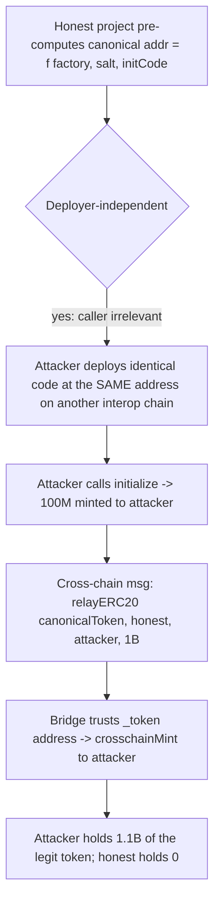
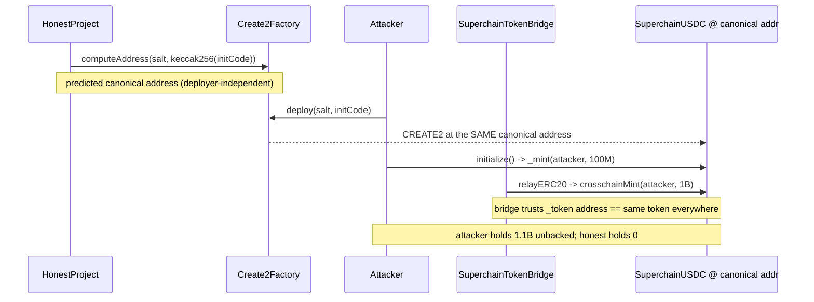

# Optimism Interop — malicious tokens at deterministic addresses steal cross-chain funds

> **Vulnerability classes:** vuln/access-control/misplaced-trust · vuln/cross-chain/address-assumption · vuln/loss-of-funds/unbacked-mint

> **Reproduction:** a self-contained Foundry PoC that compiles & runs in an
> isolated project with **only `forge-std`** — no fork, no RPC, no two real
> chains. Full trace: [output.txt](output.txt). PoC:
> [test/50077-malicious-tokens-can-be-deployed-at-deterministic-addresses.sol](test/50077-malicious-tokens-can-be-deployed-at-deterministic-addresses.sol).

<!-- non-defihacklabs -->
<!-- source-auditvault: https://github.com/Auditware/AuditVault/blob/main/findings/50077-malicious-tokens-can-be-deployed-at-deterministic-addresses.md -->
<!-- date: 2025-02 -->

**AuditVault taxonomy:** `lang/solidity` · `sector/bridge` · `sector/governance` · `sector/multisig` · `sector/stable` · `sector/token` · `platform/spearbit` · `has/github` · `has/poc` · `severity/high` · genome `[[frontrun-exposure]]` · `[[direct-drain]]`

---

## Key info

| | |
|---|---|
| **Impact** | **HIGH** — an attacker gains unlimited minting rights over a legitimate SuperchainERC20 by controlling its (deployer-independent) canonical address on another interop chain, then bridges the unbacked supply to where the real token lives — stealing value from real holders |
| **Protocol** | [Optimism Interop](https://docs.optimism.io/) — `SuperchainTokenBridge` + `SuperchainERC20` |
| **Vulnerable code** | `SuperchainTokenBridge.relayERC20` — `ISuperchainERC20(_token).crosschainMint(_to, _amount);` trusts `_token` names the same token on both chains |
| **Bug class** | Misplaced trust in a cross-chain address assumption, enabled by deployer-independent CREATE2 + `initialize()`-based supply allocation |
| **Finding** | Spearbit — Optimism Interop Security Review, Feb 2025 · #50077 · reporter **Zach Obront** |
| **Report** | [OptimismInterop-Spearbit-Security-Review-February-2025.pdf](https://github.com/spearbit/portfolio/blob/master/pdfs/OptimismInterop-Spearbit-Security-Review-February-2025.pdf) |
| **Source** | [AuditVault](https://github.com/Auditware/AuditVault/blob/main/findings/50077-malicious-tokens-can-be-deployed-at-deterministic-addresses.md) |
| **Status** | Audit finding — caught in review, acknowledged by OP Labs (documentation mitigation). Reproduced here as a standalone local PoC. |
| **Compiler** | `^0.8.24` (PoC) |

This is an **audit finding**, not a historical on-chain incident. The PoC collapses two
interop chains into one EVM and keeps the vulnerable pieces faithful: `SuperchainUSDC`'s
`initialize()`/`name()`/`symbol()` verbatim from the finding, a generic CREATE2 factory
(the finding's `Create2Factory` interface), and the verbatim vulnerable bridge line
`ISuperchainERC20(_token).crosschainMint(_to, _amount);`.

---

## TL;DR

1. Superchain tokens are deployed through a **generic CREATE2 factory** that exists at the
   same address on every interop chain. A token's address therefore depends only on
   `(factory, salt, initCode)` — **never on the deployer**.
2. `SuperchainUSDC` allocates its entire 100M supply in `initialize()`, minting to
   `msg.sender`. Whoever calls `initialize()` first on a given chain owns the supply.
3. `SuperchainTokenBridge.relayERC20` mints on **whatever contract lives at `_token`** on
   the destination chain, *assuming* it is the same token that was sent on the source chain
   (because it shares the canonical address).
4. An attacker deploys identical token code at the **same canonical address** on a chain
   where the honest project has not deployed yet (or predeploys it before interop is
   enabled), calls `initialize()` to grab the 100M, and — because the bridge trusts the
   address — can have the bridge mint the "legit" canonical token to them without any
   backing.
5. In the PoC the attacker ends holding **1,100,000,000 USDC** at the exact address the
   honest project pre-computed for itself: 100M from `initialize()` + 1B minted unbacked
   through the bridge. The honest project holds **nothing**.

---

## The vulnerable code

The misplaced-trust mint (verbatim, `SuperchainTokenBridge.relayERC20`):

```solidity
function relayERC20(address _token, address _from, address _to, uint256 _amount) external {
    require(msg.sender == messenger, "Unauthorized");
    // @> VULN: trusts `_token` has the same address == the same token on both chains.
    ISuperchainERC20(_token).crosschainMint(_to, _amount);
}
```

The supply-in-`initialize()` token pattern that makes the address collision profitable
(verbatim from the finding):

```solidity
function initialize() external {
    require(totalSupply() == 0, "already initialized");
    _mint(msg.sender, 100_000_000e18);   // @> mints to msg.sender — deployer-independent claim
}
```

The generic CREATE2 factory whose output address is independent of the caller:

```solidity
function computeAddress(bytes32 salt, bytes32 codeHash) external view returns (address) {
    return address(uint160(uint256(keccak256(
        abi.encodePacked(bytes1(0xff), address(this), salt, codeHash)
    ))));   // depends on (factory, salt, initCode) only — never the deployer
}
```

---

## Root cause

The bridge equates "same token" with "same address," and the address is a pure function of
`(factory, salt, initCode)` — none of which is bound to a trusted deployer. Any token whose
identity/ownership/supply is set **after** the constructor (via `initialize()`, or via a
hardcoded address) can be re-deployed with identical code at the identical address on a
different chain, with a different party claiming its supply. The bridge then honors the
attacker's contract as the canonical token.

## Preconditions

- Tokens are deployed via a generic (deployer-agnostic) CREATE2 factory present on every
  interop chain (the stated design).
- The token allocates ownership/supply in `initialize()` or via a fixed address rather than
  in immutable constructor arguments.
- Interop is enabled (or will be) between the chain where the real token lives and a chain
  where the attacker controls the canonical address.

## Attack walkthrough

From [output.txt](output.txt):

1. The honest project **pre-computes** where its token will live:
   `factory.computeAddress(salt, keccak256(initCode))` — a deployer-independent address.
2. The **attacker** deploys identical code at that very address through the factory and
   calls `initialize()` → the attacker's contract receives the **100M** supply.
   The PoC asserts `attackerDeployed == canonicalToken` (deployer-independence proven).
3. A cross-chain transfer of the canonical token is delivered:
   `bridge.relayERC20(canonicalToken, honest, attacker, 1_000_000_000e18)`. The bridge
   trusts the address and mints **1B more** to the attacker — with **no deposit or lock on
   this chain** (pure unbacked inflation of the "legit" token).
4. **HARM:** the attacker holds **1,100,000,000 USDC** at the honest-expected address;
   the honest side holds **0**. A control test (`test_honestSoleDeployment_isSafe`) shows
   the same mechanism is safe when no adversary races on another chain — the vulnerability
   is precisely the cross-chain, deployer-independent address collision.

## Diagrams





## Remediation

Do not equate address with identity across chains. Bind the source-chain token identity
into the relayed message and verify it on the destination (e.g. an authorized/canonical
deployer, a chain-scoped token registry, or a factory that only deploys a specific trusted
implementation). Token authors must set all identity/ownership/supply values in **immutable
constructor arguments** so that only an identical deployment with identical properties can
occupy the same address — never in `initialize()` or via hardcoded, separately-claimable
addresses. (OP Labs acknowledged and documented this deployer-hardening guidance.)

## How to reproduce

```bash
cd ~/RustroverProjects/audits/evm-hack-registry/50077-malicious-tokens-can-be-deployed-at-deterministic-addresses_exp
forge test -vvv
# Fully local — no fork, no RPC, no anvil_state required.
# Expected: both tests PASS:
#   test_exploit                     (attack: attacker holds 1.1B USDC at canonical addr; honest holds 0)
#   test_honestSoleDeployment_isSafe (control: sole honest deployer owns supply; 2nd initialize reverts)
```

PoC source: [test/50077-malicious-tokens-can-be-deployed-at-deterministic-addresses.sol](test/50077-malicious-tokens-can-be-deployed-at-deterministic-addresses.sol)
— the verbatim vulnerable `relayERC20` mint and `initialize()` pattern, the finding's
CREATE2 factory interface, and a control test.

> Note: the two interop chains are collapsed into one EVM and the bridge/predeploy wiring is
> reduced (the real bridge is a fixed predeploy and `relayERC20` is gated to the cross-domain
> inbox; the message here is delivered directly). The `100M`/`1B` magnitudes validate the
> reduced model; the bug class (cross-chain same-address trust + deployer-independent CREATE2
> + `initialize()` supply → unlimited unbacked minting of a legit token) and the verbatim
> vulnerable line are faithful.

---

*Reference: finding **#50077** by **Zach Obront** in the [Optimism Interop Spearbit Security Review (Feb 2025)](https://github.com/spearbit/portfolio/blob/master/pdfs/OptimismInterop-Spearbit-Security-Review-February-2025.pdf) · curated by [AuditVault](https://github.com/Auditware/AuditVault/blob/main/findings/50077-malicious-tokens-can-be-deployed-at-deterministic-addresses.md)*
