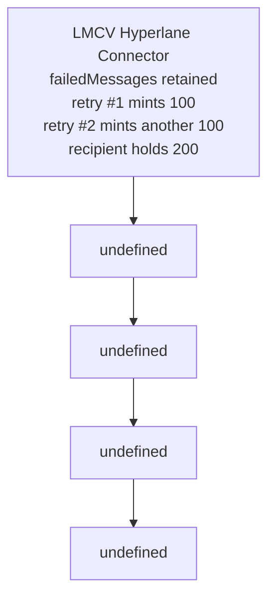

# LMCV — failed Hyperlane message replay mints dPRIME repeatedly

<!-- non-defihacklabs -->
<!-- source-auditvault: https://github.com/Auditware/AuditVault/blob/main/findings/50682-unlimited-minting-by-reusing-failed-hyperlane-messages-halbo.md -->
<!-- date: 2024-01 -->

> **Vulnerability classes:** vuln/bridge/replay · vuln/bridge/missing-validation · vuln/logic/state-update

> **Reproduction:** Fully local, cheatcode-free synthetic. Run `forge test -vvv` in this folder.

## Key info

| Field | Value |
| --- | --- |
| Protocol | LMCV |
| Finding | AuditVault 50682 |
| Impact | High |
| Reproduction | Local synthetic; no mainnet fork |
| Vulnerable contract | See `test/50682-unlimited-minting-by-reusing-failed-hyperlane-messages-halbo.sol` |
| Compiler | Solidity 0.8.24 |

## TL;DR

A failed Hyperlane transfer remains in failedMessages after retry succeeds. The exact same origin, recipient, and nonce can be retried repeatedly, minting the amount again each time.

## Vulnerable code

The minimized contract preserves the report’s blamed operation with an `@> VULN` marker in [the synthetic](test/50682-unlimited-minting-by-reusing-failed-hyperlane-messages-halbo.sol).

## Root cause

retry reads the retained amount then mints it in a try block. Its successful branch emits ReceivedTransferRemote but never clears failedMessages. The retry is therefore not a one-time state transition.

## Preconditions

The relevant protocol integration is configured and holds the affected asset or retained message. No privileged bypass beyond the intended caller is required for the demonstrated broken path.

## Attack walkthrough

The local reproduction stores one 100-unit failed message, calls retry twice, and proves the recipient holds 200 dPRIME while the failed message still records 100.

## Diagrams



## Impact

The synthetic ends with an on-chain `require` proving the report’s concrete harm, rather than merely proving a function can be called.

## Remediation

Delete failedMessages[_origin][_recipient][_nonce] before the mint (or otherwise atomically mark it consumed). If mint can fail, preserve the entry only on failure.

## How to reproduce

```bash
cd /workspaces/RustroverProjects/audits/evm-hack-registry/50682-unlimited-minting-by-reusing-failed-hyperlane-messages-halbo_exp
forge test -vvv
```

## Sources

- [AuditVault finding](https://github.com/Auditware/AuditVault/blob/main/findings/50682-unlimited-minting-by-reusing-failed-hyperlane-messages-halbo.md)
- [Halborn assessment](https://www.halborn.com/audits/)
- Reduced local source: [test/50682-unlimited-minting-by-reusing-failed-hyperlane-messages-halbo.sol](test/50682-unlimited-minting-by-reusing-failed-hyperlane-messages-halbo.sol)
