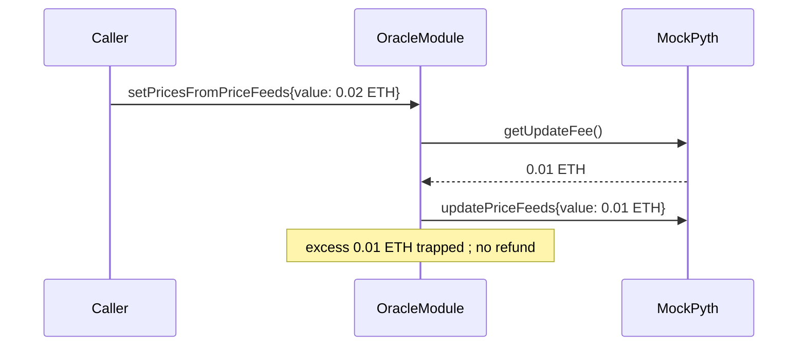

# NLX — non-refunded excess fee in `_setPricesFromPriceFeeds`

> **Vulnerability classes:** vuln/fee/missing-refund · vuln/oracle/pyth-update · genome: fee-calculation · direct-drain

> **Reproduction:** a self-contained Foundry PoC that compiles & runs in an
> isolated project with **only `forge-std`** — no fork, no RPC, no `anvil_state`.
> Full trace: [output.txt](output.txt). PoC:
> [test/50881-non-refunded-excess-fee-in-setpricesfrompricefeed-function_exp.sol](test/50881-non-refunded-excess-fee-in-setpricesfrompricefeed-function_exp.sol).

<!-- non-defihacklabs -->
<!-- source-auditvault: https://github.com/Auditware/AuditVault/blob/main/findings/50881-non-refunded-excess-fee-in-setpricesfrompricefeed-function.md -->
<!-- date: 2024-07 -->

**AuditVault taxonomy:** `lang/solidity` · `platform/halborn` · `has/github` · `has/poc` · `severity/high` · `sector/oracle` · genome: `fee-calculation` · `direct-drain` · `pyth-oracle-completeness`

---

## Key info

| | |
|---|---|
| **Impact** | **HIGH** — any caller that overpays the Pyth update fee permanently loses the excess ETH; it is trapped on the oracle module |
| **Protocol** | [NLX / CoreDAO](https://www.halborn.com/audits/coredao/nlx) — price-feed oracle module |
| **Vulnerable code** | `_setPricesFromPriceFeeds` — forwards only `updateFee` to Pyth, never refunds `msg.value - updateFee` |
| **Bug class** | Missing refund of excess native fee |
| **Finding** | Halborn — CoreDAO NLX · #50881 |
| **Report** | [halborn.com/audits/coredao/nlx](https://www.halborn.com/audits/coredao/nlx) |
| **Source** | [AuditVault](https://github.com/Auditware/AuditVault/blob/main/findings/50881-non-refunded-excess-fee-in-setpricesfrompricefeed-function.md) |
| **Status** | Audit finding — fixed by CoreDAO (refund added). Reproduced here as a standalone local PoC. |
| **Compiler** | `^0.8.24` (PoC) |

---

## TL;DR

1. `_setPricesFromPriceFeeds` reads `updateFee = pyth.getUpdateFee(...)` and requires `msg.value >= updateFee`.
2. It calls `pyth.updatePriceFeeds{value: updateFee}(...)` — only the exact fee is forwarded.
3. Any surplus `msg.value - updateFee` stays on the oracle module; there is no refund path.
4. HARM in the PoC: caller sends 0.02 ETH, fee is 0.01 ETH → 0.01 ETH trapped on `OracleModule`.

---

## The vulnerable code

```solidity
uint updateFee = pyth.getUpdateFee(pythUpdateData);
require(updateFee <= msg.value, "not enough funds to update price feeds");

pyth.updatePriceFeeds{value: updateFee}(pythUpdateData); // @> VULN: excess never refunded
// FIX: refund msg.value - updateFee to msg.sender
```

## Root cause

Fee collection and fee consumption are asymmetric: the module accepts an arbitrary overpay but only spends `updateFee`, with no return of the remainder.

## Preconditions

- Caller can invoke the price-feed update path with native value.
- Caller (or UI/integration) sends more than the exact Pyth fee.

## Attack walkthrough

1. Attacker (or honest user) calls `setPricesFromPriceFeeds{value: 0.02 ether}`.
2. Module forwards 0.01 ETH to Pyth; 0.01 ETH remains on the module.
3. **HARM:** excess is unreimbursed and stuck.

## Diagrams



## Impact

Users/keepers who overpay the Pyth fee permanently lose the surplus. At scale this is continuous value leakage from every overpaying update.

## Sources

- [AuditVault finding #50881](https://github.com/Auditware/AuditVault/blob/main/findings/50881-non-refunded-excess-fee-in-setpricesfrompricefeed-function.md)
- [Halborn report — CoreDAO NLX](https://www.halborn.com/audits/coredao/nlx)
- Remediation: [NLX-Protocol/nlx-synthetics@c385344](https://github.com/NLX-Protocol/nlx-synthetics/commit/c3853446a41e2e963e087f1c55ac935bfaeaa1a3)
