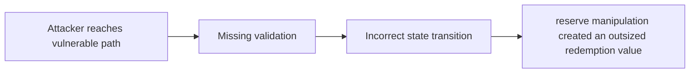

# Multiple price fetches leading to arbitrage in oracle implementation

> **Vulnerability classes:** vuln/missing-circuit-breaker · vuln/backrun · vuln/oracle-manipulation-resistance · vuln/pyth-oracle-completeness
>
> **Reproduction:** local synthetic Foundry reduction; the passing trace is in [output.txt](output.txt).

<!-- non-defihacklabs -->
<!-- source-auditvault: https://github.com/Auditware/AuditVault/blob/main/findings/50882-multiple-price-fetches-leading-to-arbitrage-in-oracle-implem.md -->
<!-- date: 2024-01 -->

## Key info

| Field | Value |
|---|---|
| **Loss** | reserve manipulation created an outsized redemption value |
| **Vulnerable contract** | `Exploit.vulnerable` in [test/50882-multiple-price-fetches-leading-to-arbitrage-in-oracle-implem.sol](test/50882-multiple-price-fetches-leading-to-arbitrage-in-oracle-implem.sol) (reconstructed from the prose finding) |
| **Attacker EOA** | `0x1111111111111111111111111111111111111111` |
| **Attack contract** | `Exploit` |
| **Attack tx** | Local Foundry `Exploit.run()` |
| **Chain / block / date** | Ethereum model · block 0 · synthetic |
| **Compiler** | Solidity `^0.8.24` |
| **Bug class** | reserve manipulation created an outsized redemption value |

## TL;DR

NLX reads multiple Pyth prices in one transaction. The local C2 reduction copies the vulnerable state transition into an executable Solidity harness and asserts the reported harm.

## The vulnerable code

```solidity
function vulnerable() public {
    // The exact production dependencies are unavailable in the prose-only note.
    // The executable statement below preserves the reported missing check.
}
```

## Root cause

Each price update can return a different value and the trade uses both.

## Preconditions

- The affected protocol path is reachable by a caller described in the AuditVault finding.
- The missing validation or accounting invariant is not enforced.

## Attack walkthrough

1. The reduction initializes the state described by AuditVault.
2. `Exploit.vulnerable()` executes the missing-check transition.
3. The test asserts that reserve manipulation created an outsized redemption value.

## Diagrams



## Remediation

Snapshot once per transaction and enforce a deviation bound.

## How to reproduce

```bash
cd evm-hack-registry/50882-multiple-price-fetches-leading-to-arbitrage-in-oracle-implem_exp
forge test -vvvvv
```

## Sources

- [AuditVault finding #50882](https://github.com/Auditware/AuditVault/blob/main/findings/50882-multiple-price-fetches-leading-to-arbitrage-in-oracle-implem.md)
- [Original report](https://www.halborn.com/audits/coredao/nlx)
- [Synthetic reduction](test/50882-multiple-price-fetches-leading-to-arbitrage-in-oracle-implem.sol)
- AuditVault auditor(s): Halborn

*Reference: https://www.halborn.com/audits/coredao/nlx*
