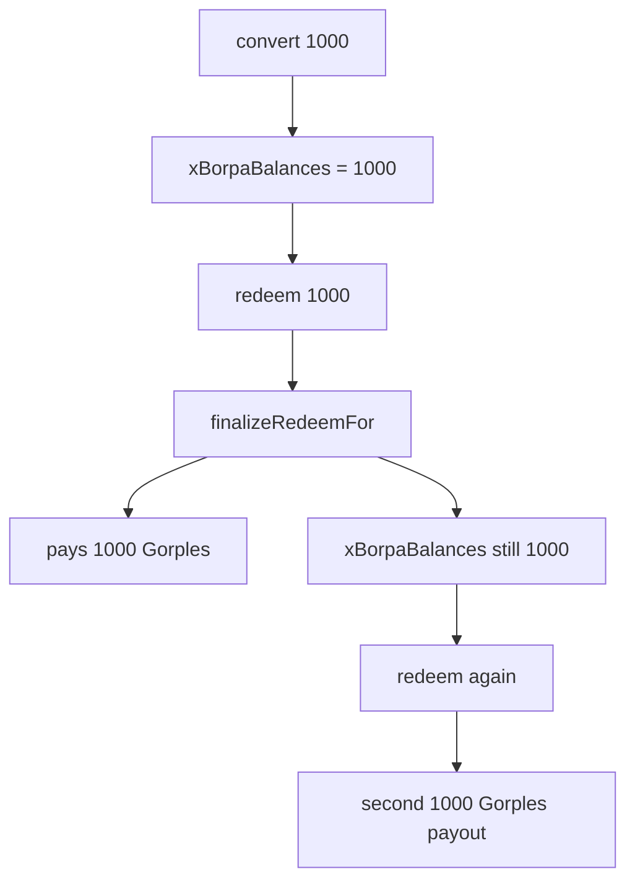

# Gorples — missing `xBorpaBalances` decrement in `finalizeRedeemFor`

> **Vulnerability classes:** vuln/accounting/missing-decrement · vuln/redeem/double-claim · genome: wrong-condition · direct-drain

> **Reproduction:** self-contained Foundry PoC with **only `forge-std`**.
> Full trace: [output.txt](output.txt). PoC:
> [test/51279-missing-xgorplestoken-decrement-in-finalizeredeemfor-halborn_exp.sol](test/51279-missing-xgorplestoken-decrement-in-finalizeredeemfor-halborn_exp.sol).

<!-- non-defihacklabs -->
<!-- source-auditvault: https://github.com/Auditware/AuditVault/blob/main/findings/51279-missing-xgorplestoken-decrement-in-finalizeredeemfor-halborn.md -->
<!-- date: 2024-07 -->

**AuditVault taxonomy:** `lang/solidity` · `platform/halborn` · `has/github` · `has/poc` · `severity/high` · `sector/token` · genome: `wrong-condition` · `direct-drain` · `reentrancy-guard` · `timestamp-dependence`

---

## Key info

| | |
|---|---|
| **Impact** | **HIGH** — after SYSTEM finalizes a redeem for a user, their internal `xBorpaBalances` stays inflated so they can redeem again and extract more Gorples than they converted |
| **Protocol** | [Gorples / Entangle](https://www.halborn.com/audits/entangle-labs/gorples-evm-contracts-revision) — `xGorplesToken` |
| **Vulnerable code** | `finalizeRedeemFor` — missing `xBorpaBalances[_for] -= amount` that `finalizeRedeem` performs |
| **Bug class** | Incomplete state update on alternate code path |
| **Finding** | Halborn — Gorples EVM Contracts Revision · #51279 |
| **Report** | [halborn.com/audits/entangle-labs/gorples-evm-contracts-revision](https://www.halborn.com/audits/entangle-labs/gorples-evm-contracts-revision) |
| **Source** | [AuditVault](https://github.com/Auditware/AuditVault/blob/main/findings/51279-missing-xgorplestoken-decrement-in-finalizeredeemfor-halborn.md) |
| **Status** | Audit finding — fixed by adding the missing decrement. Local synthetic PoC. |
| **Compiler** | `^0.8.24` (PoC) |

---

## TL;DR

1. `finalizeRedeem` correctly does `xBorpaBalances[msg.sender] -= xAmount` then pays Gorples.
2. `finalizeRedeemFor` pays via `_easyFinalizeRedeem` but **never** decrements `xBorpaBalances`.
3. User converts 1000 once, SYSTEM finalizes, balance stays 1000 → user redeems again → second payout.
4. HARM: 2000 Gorples extracted from a single 1000 convert.

---

## The vulnerable code

```solidity
function finalizeRedeemFor(address _for) external onlyRole(SYSTEM) {
    uint256 len = userRedeems[_for].length;
    while (len > 0) {
        RedeemInfo storage _userRedeem = userRedeems[_for][len - 1];
        bool finalized = _easyFinalizeRedeem(_for, _userRedeem.xBorpaAmount, _userRedeem.endTime); // @> VULN
        // missing: xBorpaBalances[_for] -= _userRedeem.xBorpaAmount;
        ...
    }
}
```

## Root cause

Two finalize paths diverged: the user-facing path updates internal balances; the SYSTEM batch path only pays out.

## Preconditions

- User has converted Gorples → x tokens and queued a redeem.
- SYSTEM role calls `finalizeRedeemFor` (normal ops path).

## Attack walkthrough

1. User converts 1000 Gorples → `xBorpaBalances = 1000`.
2. User queues redeem of 1000; SYSTEM finalizes → user receives 1000 Gorples, balance still 1000.
3. User queues and finalizes again → second 1000 Gorples.
4. **HARM:** double extraction against vault inventory.

## Diagrams



## Impact

Protocol inventory drained; users can extract more underlying than they deposited via the SYSTEM finalize path.

## Sources

- [AuditVault finding #51279](https://github.com/Auditware/AuditVault/blob/main/findings/51279-missing-xgorplestoken-decrement-in-finalizeredeemfor-halborn.md)
- [Halborn report — Gorples](https://www.halborn.com/audits/entangle-labs/gorples-evm-contracts-revision)
- Remediation: [Entangle-Protocol/gorples-evm#73](https://github.com/Entangle-Protocol/gorples-evm/pull/73/commits/8933586fc324d8e69fbdf00c816817909c50a061)
- Quoted source: [xGorplesToken.sol](https://github.com/Entangle-Protocol/gorples-evm/blob/main/contracts/xGorplesToken.sol#L368)
