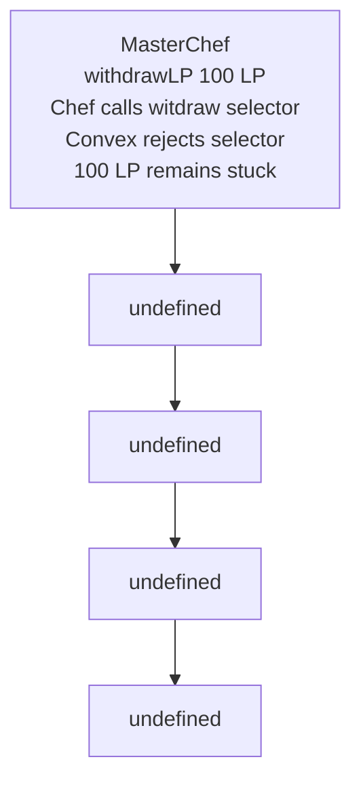

# Entangle Trillion — Curve/Convex withdrawal selector typo freezes LP exits

<!-- non-defihacklabs -->
<!-- source-auditvault: https://github.com/Auditware/AuditVault/blob/main/findings/51369-withdrawals-are-blocked-due-to-wrong-function-name-on-the-cu.md -->
<!-- date: 2024-02 -->

> **Vulnerability classes:** vuln/dependency/unsafe-external-call · vuln/logic/missing-validation · vuln/dos/frozen-funds

> **Reproduction:** Fully local, cheatcode-free synthetic. Run `forge test -vvv` in this folder.

## Key info

| Field | Value |
| --- | --- |
| Protocol | Entangle Trillion |
| Finding | AuditVault 51369 |
| Impact | High |
| Reproduction | Local synthetic; no mainnet fork |
| Vulnerable contract | See `test/51369-withdrawals-are-blocked-due-to-wrong-function-name-on-the-cu.sol` |
| Compiler | Solidity 0.8.24 |

## TL;DR

The CurveCompoundConvexSynthChef integration calls convex.witdraw rather than Convex withdraw. The selector does not exist on the target contract, so a legitimate LP withdrawal reverts and the LP stays in the chef.

## Vulnerable code

The minimized contract preserves the report’s blamed operation with an `@> VULN` marker in [the synthetic](test/51369-withdrawals-are-blocked-due-to-wrong-function-name-on-the-cu.sol).

## Root cause

withdrawLP loads the configured pool then invokes the misspelled interface method. The result cannot be true because the external selector is absent; the chef consequently reverts before it transfers LP to MasterChef.

## Preconditions

The relevant protocol integration is configured and holds the affected asset or retained message. No privileged bypass beyond the intended caller is required for the demonstrated broken path.

## Attack walkthrough

The synthetic gives the chef 100 LP. The master attempts withdrawLP, catches the expected revert, and asserts that all 100 LP remain trapped while the master received none.

## Diagrams



## Impact

The synthetic ends with an on-chain `require` proving the report’s concrete harm, rather than merely proving a function can be called.

## Remediation

Rename the interface member and call to withdraw(uint256,uint256), then regression-test an end-to-end withdrawal against the configured Convex target.

## How to reproduce

```bash
cd /workspaces/RustroverProjects/audits/evm-hack-registry/51369-withdrawals-are-blocked-due-to-wrong-function-name-on-the-cu_exp
forge test -vvv
```

## Sources

- [AuditVault finding](https://github.com/Auditware/AuditVault/blob/main/findings/51369-withdrawals-are-blocked-due-to-wrong-function-name-on-the-cu.md)
- [Halborn assessment](https://www.halborn.com/audits/)
- Reduced local source: [test/51369-withdrawals-are-blocked-due-to-wrong-function-name-on-the-cu.sol](test/51369-withdrawals-are-blocked-due-to-wrong-function-name-on-the-cu.sol)
