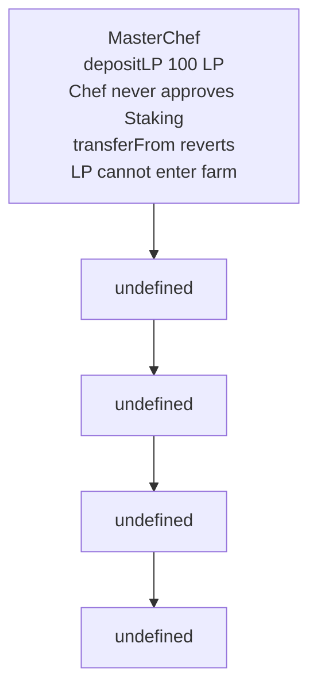

# Entangle Trillion — missing Stargate allowance blocks LP deposits

<!-- non-defihacklabs -->
<!-- source-auditvault: https://github.com/Auditware/AuditVault/blob/main/findings/51370-broken-stargate-deposit-flow-due-to-missing-allowance-halbor.md -->
<!-- date: 2024-02 -->

> **Vulnerability classes:** vuln/logic/missing-allowance · vuln/dependency/unsafe-external-call · vuln/dos/frozen-funds

> **Reproduction:** Fully local, cheatcode-free synthetic. Run `forge test -vvv` in this folder.

## Key info

| Field | Value |
| --- | --- |
| Protocol | Entangle Trillion |
| Finding | AuditVault 51370 |
| Impact | High |
| Reproduction | Local synthetic; no mainnet fork |
| Vulnerable contract | See `test/51370-broken-stargate-deposit-flow-due-to-missing-allowance-halbor.sol` |
| Compiler | Solidity 0.8.24 |

## TL;DR

StargateSynthChef deposits LP by asking the Stargate staking contract to pull tokens from the chef, but it never approves that spender. Every fresh deposit fails at transferFrom unless an unrelated approval already exists.

## Vulnerable code

The minimized contract preserves the report’s blamed operation with an `@> VULN` marker in [the synthetic](test/51370-broken-stargate-deposit-flow-due-to-missing-allowance-halbor.sol).

## Root cause

depositLP passes the amount straight into lpStaking.deposit. The staking contract calls transferFrom against the chef, which has a zero allowance because depositLP never performs the needed approve.

## Preconditions

The relevant protocol integration is configured and holds the affected asset or retained message. No privileged bypass beyond the intended caller is required for the demonstrated broken path.

## Attack walkthrough

The local run seeds 100 LP in the chef and calls depositLP. The transferFrom revert is caught and the test proves that the staking contract received zero LP and the chef still holds all 100.

## Diagrams



## Impact

The synthetic ends with an on-chain `require` proving the report’s concrete harm, rather than merely proving a function can be called.

## Remediation

Before calling lpStaking.deposit, approve the LP token for the staking contract (using a safe allowance-reset pattern where needed) and test the zero-allowance deployment state.

## How to reproduce

```bash
cd /workspaces/RustroverProjects/audits/evm-hack-registry/51370-broken-stargate-deposit-flow-due-to-missing-allowance-halbor_exp
forge test -vvv
```

## Sources

- [AuditVault finding](https://github.com/Auditware/AuditVault/blob/main/findings/51370-broken-stargate-deposit-flow-due-to-missing-allowance-halbor.md)
- [Halborn assessment](https://www.halborn.com/audits/)
- Reduced local source: [test/51370-broken-stargate-deposit-flow-due-to-missing-allowance-halbor.sol](test/51370-broken-stargate-deposit-flow-due-to-missing-allowance-halbor.sol)
