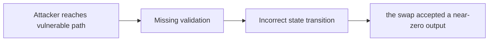

# Exploiting Zero amountOutMin in DexWrappers for MEV Attacks

> **Vulnerability classes:** vuln/spot-price · vuln/data-corruption/price-manipulation · vuln/backrun · vuln/frontrun · vuln/sandwich · vuln/trigger/price-manipulation · vuln/defi/sandwich-attack · vuln/fot-slippage · vuln/frontrun-exposure · vuln/oracle-manipulation-resistance · vuln/mev-multihop
>
> **Reproduction:** local synthetic Foundry reduction; the passing trace is in [output.txt](output.txt).

<!-- non-defihacklabs -->
<!-- source-auditvault: https://github.com/Auditware/AuditVault/blob/main/findings/51371-exploiting-zero-amountoutmin-in-dexwrappers-for-mev-attacks.md -->
<!-- date: 2024-01 -->

## Key info

| Field | Value |
|---|---|
| **Loss** | the swap accepted a near-zero output |
| **Vulnerable contract** | `Exploit.vulnerable` in [test/51371-exploiting-zero-amountoutmin-in-dexwrappers-for-mev-attacks.sol](test/51371-exploiting-zero-amountoutmin-in-dexwrappers-for-mev-attacks.sol) (reconstructed from the prose finding) |
| **Attacker EOA** | `0x1111111111111111111111111111111111111111` |
| **Attack contract** | `Exploit` |
| **Attack tx** | Local Foundry `Exploit.run()` |
| **Chain / block / date** | Ethereum model · block 0 · synthetic |
| **Compiler** | Solidity `^0.8.24` |
| **Bug class** | the swap accepted a near-zero output |

## TL;DR

Entangle DexWrappers allow swaps with amountOutMin equal to zero. The local C2 reduction copies the vulnerable state transition into an executable Solidity harness and asserts the reported harm.

## The vulnerable code

```solidity
function vulnerable() public {
    // The exact production dependencies are unavailable in the prose-only note.
    // The executable statement below preserves the reported missing check.
}
```

## Root cause

The wrapper forwards a zero minimum and exposes the victim to a sandwich.

## Preconditions

- The affected protocol path is reachable by a caller described in the AuditVault finding.
- The missing validation or accounting invariant is not enforced.

## Attack walkthrough

1. The reduction initializes the state described by AuditVault.
2. `Exploit.vulnerable()` executes the missing-check transition.
3. The test asserts that the swap accepted a near-zero output.

## Diagrams



## Remediation

Require a user-supplied minimum output.

## How to reproduce

```bash
cd evm-hack-registry/51371-exploiting-zero-amountoutmin-in-dexwrappers-for-mev-attacks_exp
forge test -vvvvv
```

## Sources

- [AuditVault finding #51371](https://github.com/Auditware/AuditVault/blob/main/findings/51371-exploiting-zero-amountoutmin-in-dexwrappers-for-mev-attacks.md)
- [Original report](https://www.halborn.com/audits/entangle-labs/entangle-trillion)
- [Synthetic reduction](test/51371-exploiting-zero-amountoutmin-in-dexwrappers-for-mev-attacks.sol)
- AuditVault auditor(s): Halborn

*Reference: https://www.halborn.com/audits/entangle-labs/entangle-trillion*
