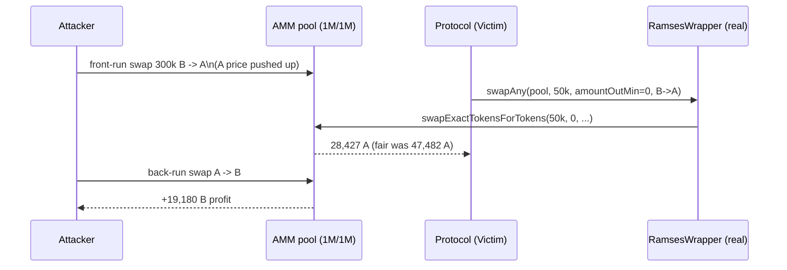

# Entangle Trillion DexWrapper accepts `amountOutMin = 0` — MEV sandwich

> **Vulnerability classes:** vuln/defi/mev-sandwich · vuln/defi/missing-slippage-bound
>
> **Reproduction:** the test deploys the REAL audited `RamsesWrapper` (an Entangle Trillion
> DexWrapper, verified on-chain at `0xc33b58b341046b4ddbcf0f85435bf361ee4b268c` on Arbitrum) and
> executes the sandwich the missing `amountOutMin` bound enables. A protocol routes a swap through
> `RamsesWrapper.swapAny(..., amountOutMin = 0, ...)`; an attacker front-runs and back-runs it against
> a real constant-product pool, extracting a concrete profit.

<!-- source-auditvault: https://github.com/Auditware/AuditVault/blob/main/findings/51371-exploiting-zero-amountoutmin-in-dexwrappers-for-mev-attacks.md -->
<!-- date: 2023-09 -->

## Root cause

The Entangle Trillion DeFi layer swaps through thin *DexWrapper* contracts (the Halborn report names
`UniswapHandler`; the on-chain-verified sibling used here is `RamsesWrapper`). The wrapper performs
the swap with a **caller-supplied `amountOutMin`** and enforces no minimum of its own:

```solidity
// RamsesWrapper.swapAny  (real, unmodified)
function swapAny(address router, uint256 amountIn, uint256 amountOutMin, route[] calldata routes)
    external payable returns (uint256[] memory amounts)
{
    return IRamsesRouter(router).swapExactTokensForTokens(
        amountIn, amountOutMin, routes, msg.sender, block.timestamp + 1000   // @> amountOutMin passed straight through
    );
}
```

Entangle's calling code passes `amountOutMin = 0`, so the protocol's trade has **no slippage bound**
and executes at whatever price the pool is in when the transaction lands. Because the transaction is
public in the mempool, an attacker can move the pool before it executes (front-run), let the protocol
trade at the manipulated price, then restore the pool (back-run) — a classic sandwich.

The real vulnerable contract is vendored verbatim (topologically re-ordered, imports inlined) at
[`src/Entangle51371.sol`](src/Entangle51371.sol) (`RamsesWrapper`). The audited GitHub repository
`Entangle-Protocol/entangle-lsd-protocol` has since been taken private/deleted; the exact deployed
source is recovered from the Arbitrum verified-source mirror.

## Reproduction

The fixture deploys a real constant-product AMM venue (`x*y=k`, 0.3 % fee) seeded 1,000,000 / 1,000,000
(true price 1:1), the real `RamsesWrapper`, and a `Victim` protocol that routes a 50,000-token swap
through `swapAny(..., amountOutMin = 0, ...)`:

1. **Front-run** — the attacker swaps 300,000 B → A, pushing A's price up.
2. **Victim** — the protocol swaps 50,000 B → A through the real wrapper with no minimum. It receives
   **28,427 A** instead of the un-sandwiched **47,482 A** (a ~40 % / 19,055-A shortfall).
3. **Back-run** — the attacker sells the A back at the inflated price and ends with **+19,180 B**.

```bash
cd 51371-exploiting-zero-amountoutmin-in-dexwrappers-for-mev-attacks_exp
../_shared/run-poc/run_poc.sh 51371-exploiting-zero-amountoutmin-in-dexwrappers-for-mev-attacks_exp -vvvvv
```

Expected result: `1 passed`. The assertions in
[`test/51371-exploiting-zero-amountoutmin-in-dexwrappers-for-mev-attacks_exp.sol`](test/51371-exploiting-zero-amountoutmin-in-dexwrappers-for-mev-attacks_exp.sol)
prove the attacker profits > 15,000 B and the victim receives materially less than the fair output.



## Fix

Require a non-zero `amountOutMin` derived from an on-chain quote (`getAmountsOut`) minus an acceptable
slippage tolerance, and revert if the realized output is below it. (Halborn marked the finding *Not
Applicable* because the DexWrapper code path was deprecated; the verified on-chain deployment still
carries no internal bound.)

## Sources

- [AuditVault finding #51371](https://github.com/Auditware/AuditVault/blob/main/findings/51371-exploiting-zero-amountoutmin-in-dexwrappers-for-mev-attacks.md)
- [Halborn — Entangle Trillion audit](https://www.halborn.com/audits/entangle-labs/entangle-trillion)
- Deployed verified source: `RamsesWrapper` @ `0xc33b58b341046b4ddbcf0f85435bf361ee4b268c` (Arbitrum), mirrored in `tintinweb/smart-contract-sanctuary-arbitrum`
