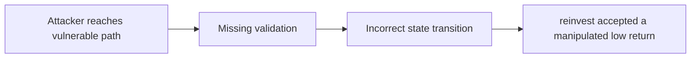

# Function reinvest from SynthChef contracts are prone to MEV bot attack

> **Vulnerability classes:** vuln/spot-price · vuln/data-corruption/price-manipulation · vuln/backrun · vuln/frontrun · vuln/sandwich · vuln/trigger/price-manipulation · vuln/defi/sandwich-attack · vuln/fot-slippage · vuln/frontrun-exposure · vuln/oracle-manipulation-resistance
>
> **Reproduction:** local synthetic Foundry reduction; the passing trace is in [output.txt](output.txt).

<!-- non-defihacklabs -->
<!-- source-auditvault: https://github.com/Auditware/AuditVault/blob/main/findings/51372-function-reinvest-from-synthchef-contracts-are-prone-to-mev.md -->
<!-- date: 2024-01 -->

## Key info

| Field | Value |
|---|---|
| **Loss** | reinvest accepted a manipulated low return |
| **Vulnerable contract** | `Exploit.vulnerable` in [test/51372-function-reinvest-from-synthchef-contracts-are-prone-to-mev.sol](test/51372-function-reinvest-from-synthchef-contracts-are-prone-to-mev.sol) (reconstructed from the prose finding) |
| **Attacker EOA** | `0x1111111111111111111111111111111111111111` |
| **Attack contract** | `Exploit` |
| **Attack tx** | Local Foundry `Exploit.run()` |
| **Chain / block / date** | Ethereum model · block 0 · synthetic |
| **Compiler** | Solidity `^0.8.24` |
| **Bug class** | reinvest accepted a manipulated low return |

## TL;DR

Entangle SynthChef reinvest accepts amountMin equal to zero. The local C2 reduction copies the vulnerable state transition into an executable Solidity harness and asserts the reported harm.

## The vulnerable code

```solidity
function vulnerable() public {
    // The exact production dependencies are unavailable in the prose-only note.
    // The executable statement below preserves the reported missing check.
}
```

## Root cause

The reinvest path has no minimum-return check.

## Preconditions

- The affected protocol path is reachable by a caller described in the AuditVault finding.
- The missing validation or accounting invariant is not enforced.

## Attack walkthrough

1. The reduction initializes the state described by AuditVault.
2. `Exploit.vulnerable()` executes the missing-check transition.
3. The test asserts that reinvest accepted a manipulated low return.

## Diagrams



## Remediation

Require a non-zero minimum return derived from the caller's slippage tolerance.

## How to reproduce

```bash
cd evm-hack-registry/51372-function-reinvest-from-synthchef-contracts-are-prone-to-mev_exp
forge test -vvvvv
```

## Sources

- [AuditVault finding #51372](https://github.com/Auditware/AuditVault/blob/main/findings/51372-function-reinvest-from-synthchef-contracts-are-prone-to-mev.md)
- [Original report](https://www.halborn.com/audits/entangle-labs/entangle-trillion)
- [Synthetic reduction](test/51372-function-reinvest-from-synthchef-contracts-are-prone-to-mev.sol)
- AuditVault auditor(s): Halborn

*Reference: https://www.halborn.com/audits/entangle-labs/entangle-trillion*
