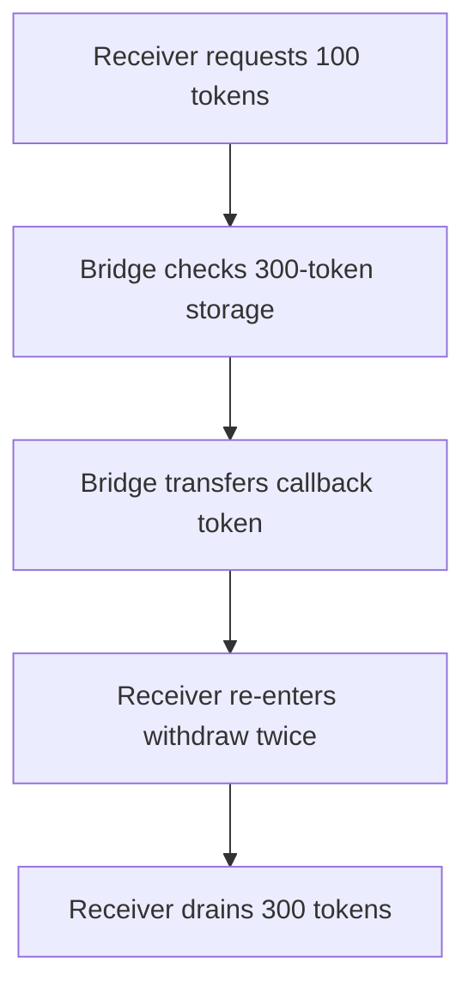

# Entangle Trillion — callback reentrancy drains bridge withdrawals

<!-- non-defihacklabs -->
<!-- source-auditvault: https://github.com/Auditware/AuditVault/blob/main/findings/51374-re-entrancy-causes-draining-of-funds-through-withdraw-swapto.md -->
<!-- date: 2024-02 -->

> **Vulnerability classes:** vuln/reentrancy/single-function · vuln/logic/wrong-order

> **Reproduction:** Fully local, cheatcode-free synthetic. Run `forge test -vvv` in this folder.

## Key info

| Field | Value |
| --- | --- |
| Protocol | Entangle Trillion |
| Finding | AuditVault 51374 |
| Impact | High |
| Reproduction | Local synthetic; no mainnet fork |
| Vulnerable contract | `EntangleTestBridge` |
| Compiler | Solidity 0.8.24 |

## TL;DR

`withdraw` transfers a callback-capable token before decrementing `tokenStorage`. A receiver re-enters twice during the token callback, so a nominal 100-token withdrawal drains the whole 300-token bridge reserve.

## Vulnerable code

The minimized contract preserves the reported operation with an `@> VULN` marker in [the synthetic](test/51374-re-entrancy-causes-draining-of-funds-through-withdraw-swapto.sol).

## Root cause

The balance check and the accounting decrement are separated by an external token transfer. An ERC677 or ERC777-style receiver can call back into `withdraw` while the original storage value is still available to every nested call.

## Preconditions

The bridge holds a callback-capable token and has enough recorded liquidity for at least one withdrawal. The attacker controls a token receiver implementing the callback.

## Attack walkthrough

The local bridge begins with 300 tokens. The receiver requests 100, receives the token callback, and recursively withdraws two more times. The proof ends with 300 tokens in the receiver and zero recorded bridge liquidity.

## Diagrams



## Impact

A malicious callback receiver can withdraw multiple times against one apparent balance check, exhausting bridge reserves. The synthetic asserts the threefold 300-token transfer on chain.

## Remediation

Apply checks-effects-interactions: decrement `tokenStorage[address(token)]` before the external transfer. A reentrancy guard provides an additional defense for all external withdrawal entry points.

## How to reproduce

```bash
cd /workspaces/RustroverProjects/audits/evm-hack-registry/51374-re-entrancy-causes-draining-of-funds-through-withdraw-swapto_exp
forge test -vvv
```

## Sources

- [AuditVault finding](https://github.com/Auditware/AuditVault/blob/main/findings/51374-re-entrancy-causes-draining-of-funds-through-withdraw-swapto.md)
- [Halborn assessment](https://www.halborn.com/audits/entangle-labs/entangle-trillion)
- Reduced local source: [test/51374-re-entrancy-causes-draining-of-funds-through-withdraw-swapto.sol](test/51374-re-entrancy-causes-draining-of-funds-through-withdraw-swapto.sol)
