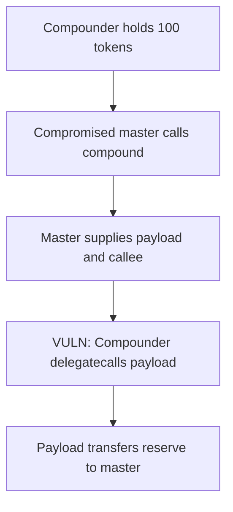

# Entangle Trillion — dynamic delegatecall lets a compromised master drain Compounder

<!-- non-defihacklabs -->
<!-- source-auditvault: https://github.com/Auditware/AuditVault/blob/main/findings/51376-vulnerability-in-compounder-contract-allowing-compromised-eo.md -->
<!-- date: 2024-02 -->

> **Vulnerability classes:** vuln/dependency/unsafe-external-call · vuln/access-control/missing-auth

> **Reproduction:** Fully local, cheatcode-free synthetic. Run `forge test -vvv` in this folder.

## Key info

| Field | Value |
| --- | --- |
| Protocol | Entangle Trillion |
| Finding | AuditVault 51376 |
| Impact | High |
| Reproduction | Local synthetic; no mainnet fork |
| Vulnerable contract | `Compounder` |
| Compiler | Solidity 0.8.24 |

## TL;DR

`Compounder.compound` accepts a callee and payload from its authorized master then runs the pair with `delegatecall`. If that master EOA is compromised, it can run arbitrary code with Compounder authority and move every held underlying token.

## Vulnerable code

The minimized contract preserves the reported operation with an `@> VULN` marker in [the synthetic](test/51376-vulnerability-in-compounder-contract-allowing-compromised-eo.sol).

## Root cause

The authorization check validates only the caller. It does not constrain dynamic delegatecall targets or payloads to a trusted allowlist, so the authorized caller can select arbitrary executable code in the Compounder context.

## Preconditions

The master SynthChef authorization is compromised or malicious, and Compounder holds an underlying asset balance.

## Attack walkthrough

The synthetic seeds Compounder with 100 tokens. Its compromised master submits a call configuration pointing to a malicious payload. Delegatecall makes that payload transfer the Compounder balance to the master, and the proof verifies a zero Compounder balance.

## Diagrams



## Impact

Compromise of the master authorization becomes a direct loss of all underlying assets held by Compounder. The test uses a 100-token reserve and proves the transfer is executed in the Compounder context.

## Remediation

Do not delegatecall dynamic callee and payload inputs. Restrict allowed code to immutable or governance-controlled trusted implementations, validate each selector, and minimize master authority.

## How to reproduce

```bash
cd /workspaces/RustroverProjects/audits/evm-hack-registry/51376-vulnerability-in-compounder-contract-allowing-compromised-eo_exp
forge test -vvv
```

## Sources

- [AuditVault finding](https://github.com/Auditware/AuditVault/blob/main/findings/51376-vulnerability-in-compounder-contract-allowing-compromised-eo.md)
- [Halborn assessment](https://www.halborn.com/audits/entangle-labs/entangle-trillion)
- Reduced local source: [test/51376-vulnerability-in-compounder-contract-allowing-compromised-eo.sol](test/51376-vulnerability-in-compounder-contract-allowing-compromised-eo.sol)
