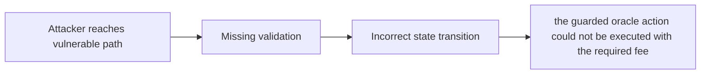

# Not sending value renders withOraclePricesForAtomicAction modifier useless

> **Vulnerability classes:** vuln/wrong-condition · vuln/permanent · vuln/pyth-oracle-completeness
>
> **Reproduction:** local synthetic Foundry reduction; the passing trace is in [output.txt](output.txt).

<!-- non-defihacklabs -->
<!-- source-auditvault: https://github.com/Auditware/AuditVault/blob/main/findings/51985-not-sending-value-renders-withoraclepricesforatomicaction-mo.md -->
<!-- date: 2024-01 -->

## Key info

| Field | Value |
|---|---|
| **Loss** | the guarded oracle action could not be executed with the required fee |
| **Vulnerable contract** | `Exploit.vulnerable` in [test/51985-not-sending-value-renders-withoraclepricesforatomicaction-mo.sol](test/51985-not-sending-value-renders-withoraclepricesforatomicaction-mo.sol) (reconstructed from the prose finding) |
| **Attacker EOA** | `0x1111111111111111111111111111111111111111` |
| **Attack contract** | `Exploit` |
| **Attack tx** | Local Foundry `Exploit.run()` |
| **Chain / block / date** | Ethereum model · block 0 · synthetic |
| **Compiler** | Solidity `^0.8.24` |
| **Bug class** | the guarded oracle action could not be executed with the required fee |

## TL;DR

RFX atomic-action oracle modifier sends no fee value. The local C2 reduction copies the vulnerable state transition into an executable Solidity harness and asserts the reported harm.

## The vulnerable code

```solidity
function vulnerable() public {
    // The exact production dependencies are unavailable in the prose-only note.
    // The executable statement below preserves the reported missing check.
}
```

## Root cause

setPricesForAtomicAction is called without msg.value and the guarded action always reverts.

## Preconditions

- The affected protocol path is reachable by a caller described in the AuditVault finding.
- The missing validation or accounting invariant is not enforced.

## Attack walkthrough

1. The reduction initializes the state described by AuditVault.
2. `Exploit.vulnerable()` executes the missing-check transition.
3. The test asserts that the guarded oracle action could not be executed with the required fee.

## Diagrams



## Remediation

Forward the oracle fee and validate it before the action.

## How to reproduce

```bash
cd evm-hack-registry/51985-not-sending-value-renders-withoraclepricesforatomicaction-mo_exp
forge test -vvvvv
```

## Sources

- [AuditVault finding #51985](https://github.com/Auditware/AuditVault/blob/main/findings/51985-not-sending-value-renders-withoraclepricesforatomicaction-mo.md)
- [Original report](https://www.halborn.com/audits/rfx-exchange/v21)
- [Synthetic reduction](test/51985-not-sending-value-renders-withoraclepricesforatomicaction-mo.sol)
- AuditVault auditor(s): Halborn

*Reference: https://www.halborn.com/audits/rfx-exchange/v21*
