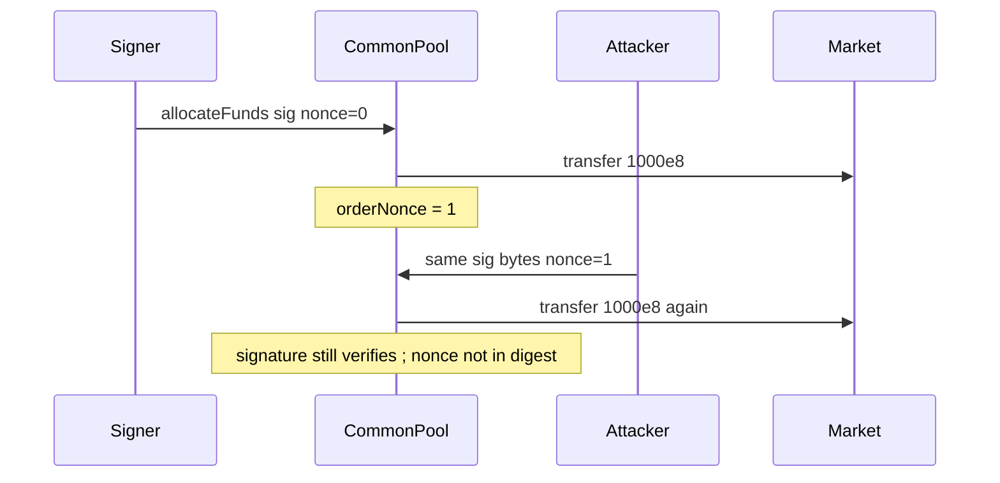

# Common Pool — signature omits nonce/expiry and can be reused

> **Vulnerability classes:** vuln/signature/incomplete-scope · vuln/auth/replay · genome: signature-replay · direct-drain

> **Reproduction:** self-contained Foundry PoC with **only `forge-std`**.
> Full trace: [output.txt](output.txt). PoC:
> [test/52006-signature-does-not-take-all-parameters-into-account-and-can_exp.sol](test/52006-signature-does-not-take-all-parameters-into-account-and-can_exp.sol).

<!-- non-defihacklabs -->
<!-- source-auditvault: https://github.com/Auditware/AuditVault/blob/main/findings/52006-signature-does-not-take-all-parameters-into-account-and-can.md -->
<!-- date: 2024-07 -->

**AuditVault taxonomy:** `lang/solidity` · `platform/halborn` · `has/github` · `has/poc` · `severity/high` · `sector/vault` · genome: `signature-replay` · `direct-drain` · `access-roles` · `permit-fork-replay` · `timestamp-dependence`

---

## Key info

| | |
|---|---|
| **Impact** | **HIGH** — anyone can replay a used `allocateFunds` signature with a fresh nonce and re-trigger deposits/withdrawals against the pool |
| **Protocol** | [Common Pool / RFX](https://www.halborn.com/audits/rfx-exchange/common-pool) |
| **Vulnerable code** | `checkAllReports` / payload hash — signs only multicall data, not `sig.nonce` or `sig.expiry` |
| **Bug class** | Incomplete signature domain / replay |
| **Finding** | Halborn — RFX Common Pool · #52006 |
| **Report** | [halborn.com/audits/rfx-exchange/common-pool](https://www.halborn.com/audits/rfx-exchange/common-pool) |
| **Source** | [AuditVault](https://github.com/Auditware/AuditVault/blob/main/findings/52006-signature-does-not-take-all-parameters-into-account-and-can.md) |
| **Status** | Audit finding — fixed by removing signature auth in favor of access control. Local synthetic PoC. |
| **Compiler** | `^0.8.24` (PoC) |

---

## TL;DR

1. Signed digest is `keccak256(abi.encode(DEPOSIT_STRUCT, multicall/amount))` only.
2. `sig.nonce` and `sig.expiry` are checked but **not bound** into the digest.
3. Observer re-submits the same signature bytes with `nonce = orderNonce` → second allocate succeeds.
4. HARM: pool inventory (2×1000e8) drained with one signature.

---

## The vulnerable code

```solidity
bytes32 input = keccak256(abi.encode(keccak256(bytes(DEPOSIT_STRUCT)), amount)); // @> VULN
// FIX: also encode sig.nonce and sig.expiry into input before signing/verifying
checkReport(sig, input, orderNonce);
```

## Root cause

Anti-replay fields exist in the struct and are validated against live state, but because they are outside the signed message an attacker can freely rewrite them to match the current epoch.

## Preconditions

- An approved signer has produced at least one valid `allocateFunds` signature (visible on-chain).
- Pool still holds inventory for another deposit of the same payload size.

## Attack walkthrough

1. Legitimate allocate with nonce 0 moves 1000e8 BTC to the market; `orderNonce = 1`.
2. Attacker copies signature bytes, sets `nonce = 1`, resubmits.
3. Recovery still succeeds; second 1000e8 leaves the pool.
4. **HARM:** double allocation from a single authorization.

## Diagrams



## Impact

Unauthorized re-allocation of pool funds; anyone can force deposits/withdrawals matching previously signed payloads.

## Sources

- [AuditVault finding #52006](https://github.com/Auditware/AuditVault/blob/main/findings/52006-signature-does-not-take-all-parameters-into-account-and-can.md)
- [Halborn report — Common Pool](https://www.halborn.com/audits/rfx-exchange/common-pool)
- Remediation discussion: [relative-finance/common-pool#22](https://github.com/relative-finance/common-pool/pull/22/files#r1759597582)
