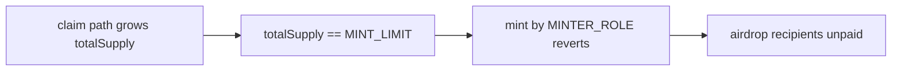

# Pepper — minting limit uses `totalSupply`, blocking legitimate minter airdrops

> **Vulnerability classes:** vuln/logic/wrong-condition · vuln/mint/shared-cap · genome: wrong-condition · permanent · reward-accounting

> **Reproduction:** self-contained Foundry PoC with **only `forge-std`**.
> Full trace: [output.txt](output.txt). PoC:
> [test/52222-minting-limit-calculation-may-prevent-legitimate-claims-halb_exp.sol](test/52222-minting-limit-calculation-may-prevent-legitimate-claims-halb_exp.sol).

<!-- non-defihacklabs -->
<!-- source-auditvault: https://github.com/Auditware/AuditVault/blob/main/findings/52222-minting-limit-calculation-may-prevent-legitimate-claims-halb.md -->
<!-- date: 2024-08 -->

**AuditVault taxonomy:** `lang/solidity` · `platform/halborn` · `has/poc` · `severity/high` · `sector/staking` · `sector/token` · genome: `wrong-condition` · `permanent` · `reward-accounting`

---

## Key info

| | |
|---|---|
| **Impact** | **HIGH** — once claims (or any non-minter mint path) push `totalSupply` to 40% of max, `MINTER_ROLE` airdrops permanently revert |
| **Protocol** | [Pepper](https://www.halborn.com/audits/pepper/pepper) |
| **Vulnerable code** | `mint` — `require(totalSupply() + amount <= MINT_LIMIT)` |
| **Bug class** | Shared cap across independent mint paths |
| **Finding** | Halborn — Pepper · #52222 |
| **Report** | [halborn.com/audits/pepper/pepper](https://www.halborn.com/audits/pepper/pepper) |
| **Source** | [AuditVault](https://github.com/Auditware/AuditVault/blob/main/findings/52222-minting-limit-calculation-may-prevent-legitimate-claims-halb.md) |
| **Status** | Audit finding — fixed with separate `minterRoleMintedAmount` tracker. Local synthetic PoC. |
| **Compiler** | `^0.8.24` (PoC) |

---

## TL;DR

1. `mint` (MINTER_ROLE) caps against **global** `totalSupply`, intended as a 40% airdrop budget.
2. `claim` also increases `totalSupply` outside that role.
3. After claims alone hit `MINT_LIMIT`, minter airdrops revert even if minters minted 0.
4. HARM: planned airdrop of 500 tokens is blocked forever (liveness/availability).

---

## The vulnerable code

```solidity
function mint(address to, uint256 amount) public {
    require(hasRole(MINTER_ROLE, msg.sender), "Must have minter role to mint");
    uint256 _amount = totalSupply() + amount;
    require(_amount <= MINT_LIMIT, "Minting exceeds 40% of total supply"); // @> VULN
    ...
}
```

## Root cause

The 40% budget was meant for controlled minter mints but is enforced on the sum of **all** supply sources.

## Preconditions

- Claim (or other non-minter) mint path can grow supply toward `MINT_LIMIT`.
- Airdrop still needs to call `mint` afterward.

## Attack walkthrough

1. User claims `CLAIM_AMOUNT == MINT_LIMIT` (40% of max).
2. Minter calls `mint(recipient, 500 ether)` → reverts.
3. **HARM:** legitimate airdrop permanently blocked.

## Diagrams



## Impact

Disrupted token distribution / airdrops; entitled users never receive minter-path tokens.

## Sources

- [AuditVault finding #52222](https://github.com/Auditware/AuditVault/blob/main/findings/52222-minting-limit-calculation-may-prevent-legitimate-claims-halb.md)
- [Halborn report — Pepper](https://www.halborn.com/audits/pepper/pepper)
- Remediation hash: `bccbd7a5747d4ef6586581ec93ac77e0d8a4de45`
