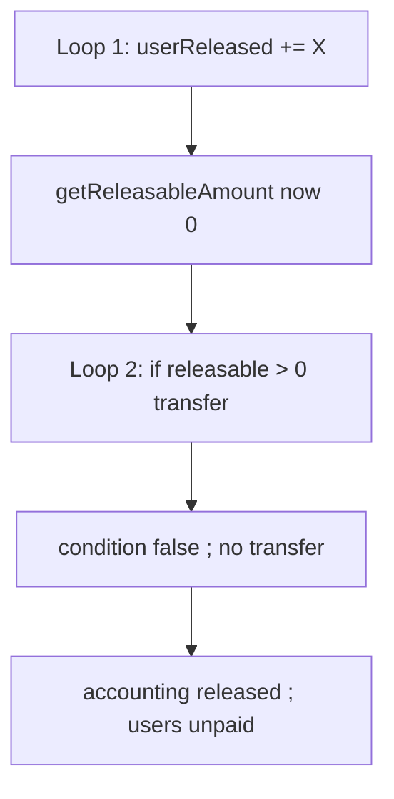

# Treasury Vesting — `batchRelease` updates state before transfer, users get nothing

> **Vulnerability classes:** vuln/logic/checks-effects-misapplied · vuln/vesting/skipped-transfer · genome: locked-funds · single-function

> **Reproduction:** self-contained Foundry PoC with **only `forge-std`**.
> Full trace: [output.txt](output.txt). PoC:
> [test/52680-no-token-distribution-in-batchrelease-due-to-premature-state_exp.sol](test/52680-no-token-distribution-in-batchrelease-due-to-premature-state_exp.sol).

<!-- non-defihacklabs -->
<!-- source-auditvault: https://github.com/Auditware/AuditVault/blob/main/findings/52680-no-token-distribution-in-batchrelease-due-to-premature-state.md -->
<!-- date: 2025-02 -->

**AuditVault taxonomy:** `lang/solidity` · `platform/halborn` · `has/poc` · `severity/high` · `sector/token` · genome: `single-function` · `use-reentrancy-guard` · `locked-funds` · `reentrancy-guard` · `timestamp-dependence`

---

## Key info

| | |
|---|---|
| **Impact** | **HIGH** — `batchRelease` marks allocations as fully released but never transfers tokens; users are permanently unpaid |
| **Protocol** | [Treasury Vesting / BlockDAG](https://www.halborn.com/audits/blockdag/treasury-vesting) |
| **Vulnerable code** | `batchRelease` — second loop re-calls `getReleasableAmount` after state update → 0 |
| **Bug class** | Mis-applied checks-effects-interactions (effects before caching transfer amounts) |
| **Finding** | Halborn — BlockDAG Treasury Vesting · #52680 |
| **Report** | [halborn.com/audits/blockdag/treasury-vesting](https://www.halborn.com/audits/blockdag/treasury-vesting) |
| **Source** | [AuditVault](https://github.com/Auditware/AuditVault/blob/main/findings/52680-no-token-distribution-in-batchrelease-due-to-premature-state.md) |
| **Status** | Audit finding — fixed by combining update+transfer in one loop. Local synthetic PoC. |
| **Compiler** | `^0.8.24` (PoC) |

---

## TL;DR

1. Loop 1: for each user, compute releasable, add to `userReleased` / `totalReleased`.
2. Loop 2: recompute releasable — now 0 because loop 1 already credited releases — skip transfers.
3. Accounting says 3000 tokens released; users hold 0; releasable stays 0 forever.
4. HARM: permanent lock / unpaid vesting.

---

## The vulnerable code

```solidity
// Loop 1: update state
userReleased[users[i]][category] += releasable;
...
// Loop 2:
uint256 releasable = getReleasableAmount(users[i], category); // @> VULN returns 0
if (releasable > 0) {
    bdagToken.safeTransferFrom(msg.sender, users[i], releasable);
}
```

## Root cause

Transfer amounts were not cached; CEI was applied by splitting loops without preserving the amounts to send.

## Preconditions

- Users have positive allocations and zero prior `userReleased`.
- Admin calls `batchRelease` for those users.

## Attack walkthrough

1. Allocate 1000 + 2000 to user1/user2.
2. Admin `batchRelease` for both.
3. `totalReleased == 3000` but both balances still 0.
4. **HARM:** users can never claim those tokens via releasable math again.

## Diagrams



## Impact

Vested tokens never reach users; protocol accounting falsely reports successful release.

## Sources

- [AuditVault finding #52680](https://github.com/Auditware/AuditVault/blob/main/findings/52680-no-token-distribution-in-batchrelease-due-to-premature-state.md)
- [Halborn report — Treasury Vesting](https://www.halborn.com/audits/blockdag/treasury-vesting)
