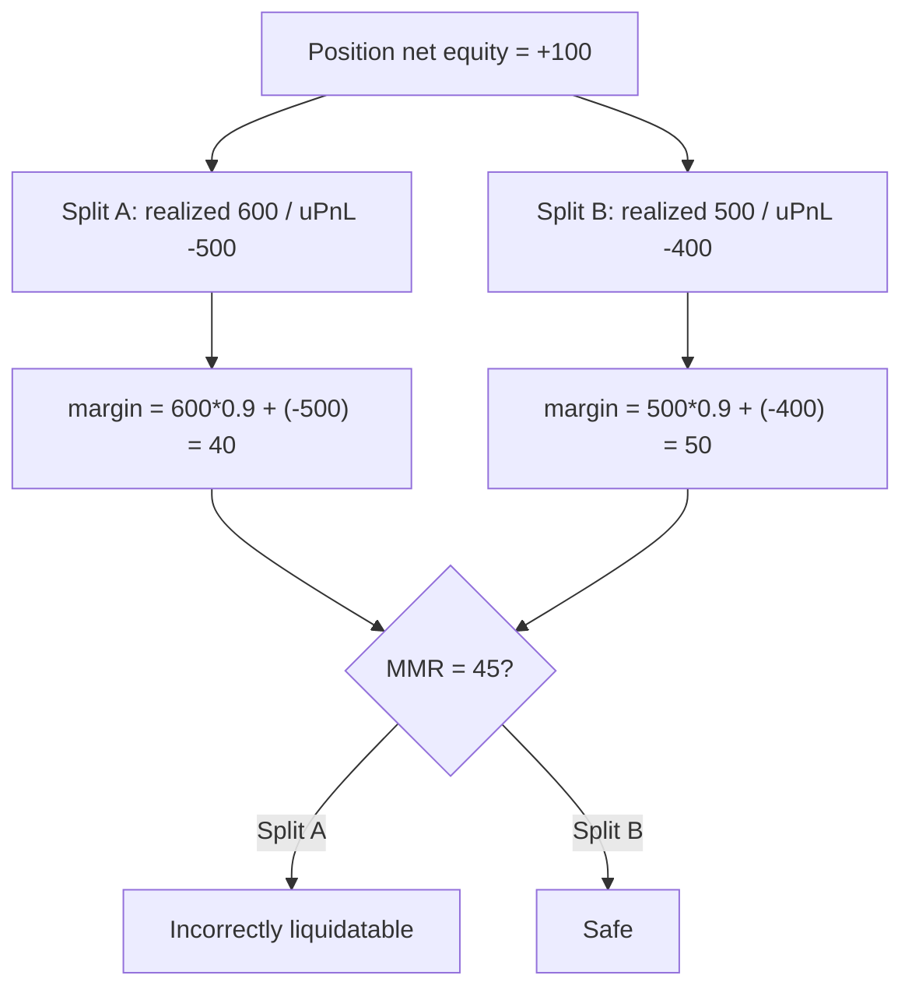

# DESK / HMX — Incorrect margin calculation due to inconsistent realized and unrealized balances

> **Vulnerability classes:** vuln/logic/liquidation-logic · misassumption/math-is-safe · novelty/variant

> **Reproduction:** a self-contained Foundry PoC that compiles & runs in an
> isolated project with **only `forge-std`** — no fork, no RPC. Full trace:
> [output.txt](output.txt). PoC:
> [test/53108-incorrect-margin-calculation-due-to-inconsistent-realized-an_exp.sol](test/53108-incorrect-margin-calculation-due-to-inconsistent-realized-an_exp.sol).

<!-- non-defihacklabs -->
<!-- source-auditvault: https://github.com/Auditware/AuditVault/blob/main/findings/53108-incorrect-margin-calculation-due-to-inconsistent-realized-an.md -->
<!-- date: 2025-01 -->

**AuditVault taxonomy:** `lang/solidity` · `sector/lending` · `sector/perpetuals` · `platform/cantina` · `severity/high` · genome: `liquidation-logic` · `variant` · `direct-drain` · `liquidation-underwater`

---

## Key info

| | |
|---|---|
| **Impact** | **HIGH** — two economically identical positions report different margins; a user can be incorrectly liquidated solely because of the realized/unrealized split |
| **Protocol** | DESK / HMX — `LiquidationHandler` margin calculation |
| **Vulnerable code** | `_executeAction` margin math: CF applied only to positive unsettled PnL while realized is already CF'd |
| **Bug class** | Inconsistent collateral-factor application across realized vs unrealized settlement balances |
| **Finding** | Cantina — HMX, January 2025 · #53108 · reporter **Tripathi** |
| **Report** | [cantina_competition_hmx_january2025.pdf](https://cdn.cantina.xyz/reports/cantina_competition_hmx_january2025.pdf) |
| **Source** | [AuditVault](https://github.com/Auditware/AuditVault/blob/main/findings/53108-incorrect-margin-calculation-due-to-inconsistent-realized-an.md) |
| **Status** | Audit finding — reproduced as a standalone local PoC |
| **Compiler** | `^0.8.24` (PoC) |

---

## TL;DR

1. Liquidation margin = `getSubaccountTotalMargin` (realized, CF already applied) + unsettled PnL.
2. Unsettled PnL only gets the collateral factor when **positive**; negative unsettled is left raw.
3. Realizing part of a loss changes the realized/unrealized split without changing net equity — but the reported margin jumps.
4. With CF=0.9 and MMR=45: position A (realized 600, uPnL −500) → margin 40 (liquidatable); after realizing 100 → margin 50 (safe). Same economics, opposite liquidation outcome.

## Diagrams

## Impact

Incorrect liquidations (or incorrectly spared accounts) purely from how much PnL has been settled — not from true risk.

## Sources

- [AuditVault finding #53108](https://github.com/Auditware/AuditVault/blob/main/findings/53108-incorrect-margin-calculation-due-to-inconsistent-realized-an.md)
- [Cantina HMX Jan 2025 report](https://cdn.cantina.xyz/reports/cantina_competition_hmx_january2025.pdf)
- Reduced from LiquidationHandler margin math quoted in the finding (DESK/HMX audit scope)
