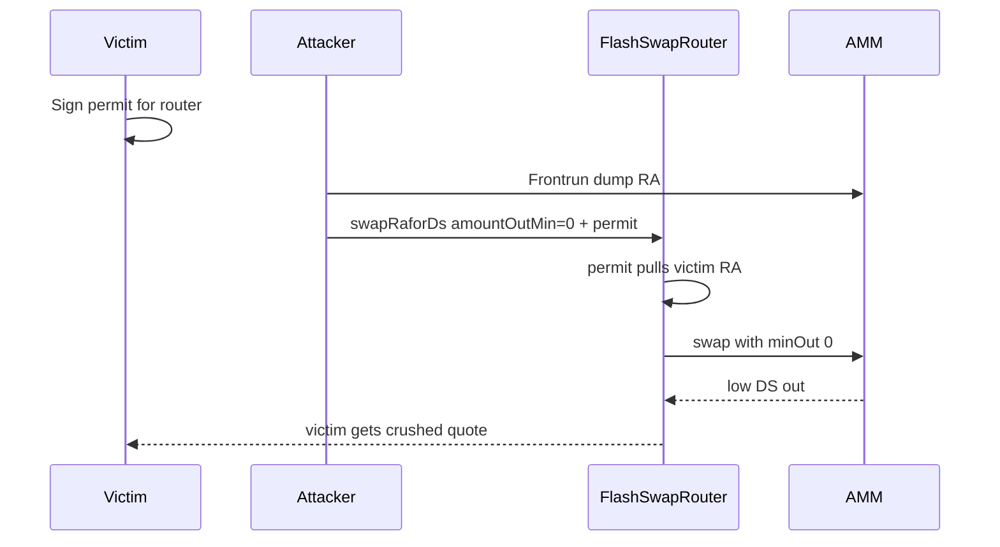

# Cork — Attacker can perform MEV by providing amountOutMin = 0 for ERC-2612 permit swaps

> **Vulnerability classes:** impact/mev/frontrun · spot-price · frontrun-exposure

> **Reproduction:** self-contained Foundry PoC with only `forge-std` — no fork.
> [output.txt](output.txt) · [test/53124-…_exp.sol](test/53124-attacker-can-perform-mev-by-providing-amountoutmin-0-for-all_exp.sol).

<!-- non-defihacklabs -->
<!-- source-auditvault: https://github.com/Auditware/AuditVault/blob/main/findings/53124-attacker-can-perform-mev-by-providing-amountoutmin-0-for-all.md -->
<!-- date: 2024-12 -->

**AuditVault taxonomy:** `lang/solidity` · `sector/dex` · `platform/cantina` · `severity/high` · `impact/mev/frontrun` · genome: `spot-price` · `frontrun` · `frontrun-exposure`

---

## Key info

| | |
|---|---|
| **Impact** | **HIGH** — anyone holding a valid user permit can submit the swap with `amountOutMin = 0`, disable slippage protection, and sandwich the victim |
| **Protocol** | Cork Protocol — `FlashSwapRouter` permit-based RA↔DS swaps |
| **Vulnerable code** | `swapRaforDs` / `swapDsforRa` accept caller-chosen `amountOutMin` after consuming the user's permit |
| **Bug class** | Slippage parameter not bound into the permit signature; third-party submission |
| **Finding** | Cantina — Cork, December 2024 · #53124 · reporter **0xDjango** |
| **Report** | [cantina_competition_cork_december2024.pdf](https://cdn.cantina.xyz/reports/cantina_competition_cork_december2024.pdf) |
| **Source** | [AuditVault](https://github.com/Auditware/AuditVault/blob/main/findings/53124-attacker-can-perform-mev-by-providing-amountoutmin-0-for-all.md) |
| **Fix** | Cork PR 280 — do not allow free `amountOutMin` on permit-initiated swaps |
| **Compiler** | `^0.8.24` (PoC) |

---

## TL;DR

1. User signs an EIP-2612 permit so the router can pull RA without a prior `approve` tx.
2. Any third party can submit that permit to `swapRaforDs(..., amountOutMin, user, sig, ...)`.
3. Attacker sets `amountOutMin = 0`, frontruns by dumping into the AMM, then lands the victim swap at a ruined rate.
4. Victim loses full input RA and receives far less DS than a fair quote; attacker extracts from the dump leg.

## Diagrams

## Impact

Material value extraction from any user who issues a permit for the flash-swap router without binding a minimum output into the signed payload.

## Sources

- [AuditVault #53124](https://github.com/Auditware/AuditVault/blob/main/findings/53124-attacker-can-perform-mev-by-providing-amountoutmin-0-for-all.md)
- [Cantina Cork Dec 2024](https://cdn.cantina.xyz/reports/cantina_competition_cork_december2024.pdf)
- Reduced FlashSwapRouter permit path from the finding quote (Cork PR 280 fixed)
