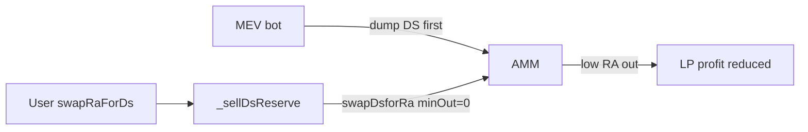

# Cork — Reserve sales vulnerable to MEV due to missing slippage protection in `_sellDsReserve`

> **Vulnerability classes:** impact/mev/sandwich · fot-slippage · frontrun-exposure

> **Reproduction:** self-contained Foundry PoC with only `forge-std` — no fork.
> [output.txt](output.txt) · [test/53125-…_exp.sol](test/53125-reserve-sales-vulnerable-to-mev-due-to-missing-slippage-prot_exp.sol).

<!-- non-defihacklabs -->
<!-- source-auditvault: https://github.com/Auditware/AuditVault/blob/main/findings/53125-reserve-sales-vulnerable-to-mev-due-to-missing-slippage-prot.md -->
<!-- date: 2024-12 -->

**AuditVault taxonomy:** `lang/solidity` · `sector/dex` · `platform/cantina` · `severity/high` · genome: `spot-price` · `sandwich` · `fot-slippage` · `frontrun-exposure`

---

## Key info

| | |
|---|---|
| **Impact** | **HIGH** — protocol DS reserve sales use `amountOutMin = 0`, so MEV can cut LP profits (~36% in the report's e2e) |
| **Protocol** | Cork Protocol — `FlashSwapRouter._sellDsReserve` |
| **Vulnerable code** | `__swapDsforRa(..., amountSellFromReserve, 0, _moduleCore)` |
| **Bug class** | Hardcoded zero min-out on internal reserve sale |
| **Finding** | Cantina — Cork, December 2024 · #53125 · reporter **Sujith Somraaj** |
| **Report** | [cantina_competition_cork_december2024.pdf](https://cdn.cantina.xyz/reports/cantina_competition_cork_december2024.pdf) |
| **Source** | [AuditVault](https://github.com/Auditware/AuditVault/blob/main/findings/53125-reserve-sales-vulnerable-to-mev-due-to-missing-slippage-prot.md) |
| **Fix** | Cork PR 280 — add slippage protection to reserve sales |
| **Compiler** | `^0.8.24` (PoC) |

---

## TL;DR

1. User RA→DS swaps can trigger a protocol reserve sale of DS for RA.
2. `_sellDsReserve` calls the swap with **hardcoded** `amountOutMin = 0`.
3. An MEV bot dumps DS into the pool first; the reserve sale realizes far less RA.
4. LP / protocol profit from the reserve sale drops materially (report: ~36%).

## Diagrams

## Impact

Reduced profits for liquidity providers; reserve sales sandwichable; negative pressure on protocol sustainability.

## Sources

- [AuditVault #53125](https://github.com/Auditware/AuditVault/blob/main/findings/53125-reserve-sales-vulnerable-to-mev-due-to-missing-slippage-prot.md)
- [Cantina Cork Dec 2024](https://cdn.cantina.xyz/reports/cantina_competition_cork_december2024.pdf)
- Reduced `_sellDsReserve` path from the finding (Cork PR 280 fixed)
