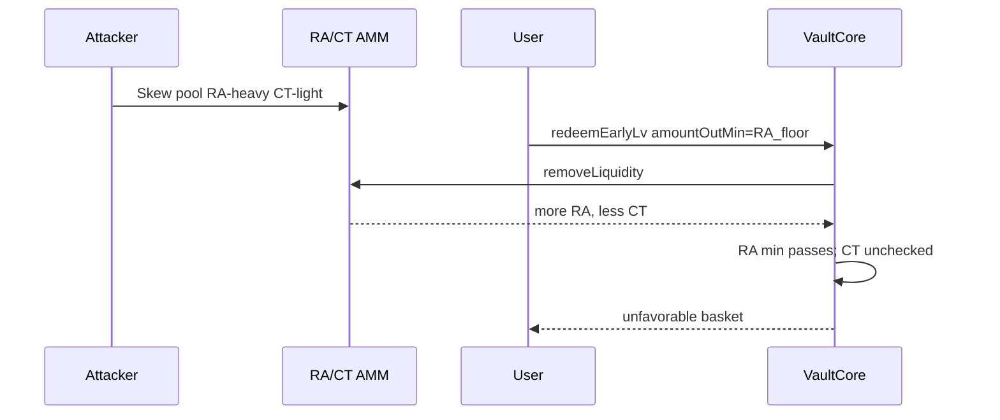

# Cork — Insufficient slippage protection in `redeemEarlyLv` leads to MEV via flash swaps

> **Vulnerability classes:** impact/mev/frontrun · fot-slippage · spot-price

> **Reproduction:** self-contained Foundry PoC with only `forge-std` — no fork.
> [output.txt](output.txt) · [test/53126-…_exp.sol](test/53126-insufficient-slippage-protection-in-redeemearlylv-leads-to-m_exp.sol).

<!-- non-defihacklabs -->
<!-- source-auditvault: https://github.com/Auditware/AuditVault/blob/main/findings/53126-insufficient-slippage-protection-in-redeemearlylv-leads-to-m.md -->
<!-- date: 2024-12 -->

**AuditVault taxonomy:** `lang/solidity` · `sector/dex` · `platform/cantina` · `severity/high` · genome: `spot-price` · `frontrun` · `fot-slippage`

---

## Key info

| | |
|---|---|
| **Impact** | **HIGH** — early LV redemption only floors RA; CT/DS/PA can be skewed by AMM manipulation while RA min still passes |
| **Protocol** | Cork Protocol — `VaultCore.redeemEarlyLv` |
| **Vulnerable code** | Only `result.raReceivedFromAmm < amountOutMin` is checked |
| **Bug class** | Incomplete multi-asset slippage protection |
| **Finding** | Cantina — Cork, December 2024 · #53126 · reporter **Sujith Somraaj** |
| **Report** | [cantina_competition_cork_december2024.pdf](https://cdn.cantina.xyz/reports/cantina_competition_cork_december2024.pdf) |
| **Source** | [AuditVault](https://github.com/Auditware/AuditVault/blob/main/findings/53126-insufficient-slippage-protection-in-redeemearlylv-leads-to-m.md) |
| **Fix** | Cork PR 280 — add min-out params for CT/DS/PA |
| **Compiler** | `^0.8.24` (PoC) |

---

## TL;DR

1. `redeemEarlyLv` takes `amountOutMin` and checks it **only** against RA from the AMM.
2. CT / DS / PA received have no floors.
3. Attacker skews the RA/CT pool (e.g. flash-style RA→CT swap) so the redeem still clears the RA min but CT is worse.
4. User's basket is value-extracted on the unprotected legs.

## Diagrams

## Impact

MEV extraction from early LV redeemers; incomplete slippage surface on multi-asset exit.

## Sources

- [AuditVault #53126](https://github.com/Auditware/AuditVault/blob/main/findings/53126-insufficient-slippage-protection-in-redeemearlylv-leads-to-m.md)
- [Cantina Cork Dec 2024](https://cdn.cantina.xyz/reports/cantina_competition_cork_december2024.pdf)
- Reduced `redeemEarlyLv` RA-only check from the finding (Cork PR 280 fixed)
