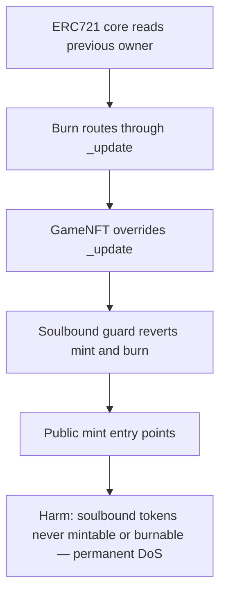

# Gigaverse: `GameNFT._update` bricks minting and burning of soulbound tokens

> **Vulnerability classes:** vuln/dos · vuln/logic
>
> **Reproduction:** a faithful minimal reproduction of the vulnerable finding — the vulnerable `_update` override of `GameNFT` is reproduced **verbatim** (marked `@>`) with faithful minimal doubles; local deploy, no fork.

<!-- source-auditvault: https://github.com/pashov/audits/blob/master/team/md/Gigaverse-security-review_2025-01-18.md -->

## Root cause

OpenZeppelin's ERC721 routes every mint, transfer and burn through `_update`. `GameNFT` overrides it with a blanket `require(!isSoulbound, ...)` that also fires on mints (`prevOwner == 0`) and burns (`to == 0`), not just transfers — so a soulbound token can never be minted and, once soulbound, can never be burnt. The vulnerable override, reproduced verbatim:

```solidity
function _update(
        address to,
        uint256 tokenId,
        address auth
    )
        internal
        virtual
        override(
            ERC721
        ) returns (address)
    {

         if (beforeUpdateHandler != address(0)) {
            IERC721UpdateHandler(
                    beforeUpdateHandler
                ).update(
                address(this),
                to,
                tokenId,
                auth
            );
        }

        address prevOwner = _ownerOf(tokenId);

        //...
        bool isSoulbound = getDocBoolValue(tokenId, IS_SOULBOUND_CID);
@>      require(!isSoulbound, "GameNFT: Token is soulbound");
        //...
    }
```

The check makes no attempt to distinguish a mint (`prevOwner == address(0)`) or a burn (`to == address(0)`) from a real owner-to-owner transfer. Because `_mint` and `_burn` both funnel through `_update`, the guard intercepts the two operations it should never block.

## Why it's exploitable here

Following the synthetic reproduction, which mirrors how `GigaNoobNFT` / `GigaNameNFT` expose `GameNFT`:

1. **Control:** `mintNormal(USER, 1)` mints a non-soulbound token — `_update` runs, `isSoulbound` is `false`, the `require` passes, and `ownerOf(1) == USER`. The mint path itself is healthy.
2. **Harm 1 — unmintable:** `mintSoulbound(USER, 2)` first sets token 2's `IS_SOULBOUND` doc value to `true`, then calls `_mint`. Inside `_update`, `prevOwner == address(0)` (a mint) yet `isSoulbound == true`, so `require(!isSoulbound)` reverts. `rawOwnerOf(2)` stays `address(0)` — the soulbound token can never come into existence.
3. **Harm 2 — unburnable:** `mintNormal(USER, 3)` mints token 3 normally, then `setSoulbound(3, true)` marks it soulbound. Calling `burn(3)` routes `_burn` → `_update(address(0), 3, ...)`; `to == address(0)` (a burn) but the same `require` reverts. `ownerOf(3)` remains `USER` forever — the token is permanently locked.

Both reverts are recorded on the `SBLCK` DoS marker (2 units minted to the sink), quantifying the permanent denial of service on the soulbound feature.

## Attack path



## Marked-line walkthrough (Playground)

The EVM Playground pins each step to the exact executed source line in `0x8ea53755…`:

1. **L62** — ERC721 core reads previous owner: Setup: ERC721's core `_update` reads the token's previous owner — every mint, transfer and burn is funneled through this single primitive.
2. **L80** — Burn routes through _update: Setup: `_burn` invokes the same `_update` with `to = address(0)`, so burns hit the identical soulbound check as transfers and mints.
3. **L89** — GameNFT overrides _update: GameNFT overrides `_update`, inheriting the mint/transfer/burn funnel and inserting its own soulbound guard directly into that shared path.
4. **L129** — Soulbound guard reverts mint and burn: Root cause: `require(!isSoulbound, ...)` reverts for any soulbound token, but mint (prevOwner==0) and burn (to==0) are not transfers, so both revert.
5. **L135** — Public mint entry points: The public entry points `mintNormal` and `mintSoulbound` forward into `_mint`, which routes through the buggy `_update` override before completing.
6. **L150** — Marking a token soulbound: `setSoulbound` flips a token's IS_SOULBOUND doc value to true, so an already-minted token becomes permanently unburnable via the same guard.
7. **L173** — DoS marker records harm: The `SBLCK` DoS marker records the harm magnitude — one unit minted to the sink for every soulbound token permanently bricked.
8. **L185** — Exploit driver proves the DoS: The exploit driver proves a normal token mints fine while the soulbound mint and burn both revert — a permanent DoS of the soulbound feature.

## PoC

Registry (Foundry, local deploy — verbatim vulnerable source + harm-asserting test):

```bash
cd 53286-h-03-soulbound-tokens-cannot-be-minted-or-burnt-due-to-an-in_exp && forge test -vvv
```

The browser Playground replays the same synthetic opcode-for-opcode and measures the harm: **a normal token mints fine, but the soulbound mint and the soulbound burn both revert on the `require(!isSoulbound)` guard — 2 tokens permanently bricked**. Both gates are green (registry `forge test` PASS + Playground `_verify-poc` **VERDICT: PASS**).
