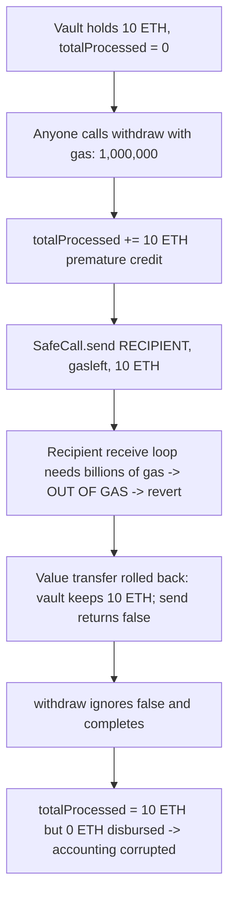
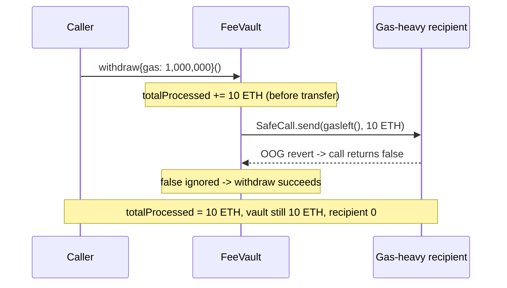

# Coinbase/Base FeeVault — `totalProcessed` inflated without sending funds (unchecked `SafeCall.send`)

> **Vulnerability classes:** vuln/dependency/unchecked-return-value · vuln/dos/unbounded-loop · vuln/accounting/integrity

> **Reproduction:** a self-contained Foundry PoC that compiles & runs in an
> isolated project with **only `forge-std`** — no fork, no RPC, no `anvil_state`.
> Full trace: [output.txt](output.txt). PoC:
> [test/54655-vault-s-totalprocessed-count-can-be-inaccurately-increased-b_exp.sol](test/54655-vault-s-totalprocessed-count-can-be-inaccurately-increased-b_exp.sol).

<!-- non-defihacklabs -->
<!-- source-auditvault: https://github.com/Auditware/AuditVault/blob/main/findings/54655-vault-s-totalprocessed-count-can-be-inaccurately-increased-b.md -->
<!-- date: 2023-07 -->

---

## Key info

| | |
|---|---|
| **Impact** | **HIGH** — fee-accounting integrity broken: `totalProcessed` is inflated by funds that never moved, misleading off-chain reconciliation and double-counting the same ETH on the next successful withdraw |
| **Protocol** | [Coinbase](https://www.base.org) / Base — Optimism `FeeVault` (`BaseFeeVault` / `SequencerFeeVault` / `L1FeeVault`) |
| **Vulnerable code** | `FeeVault.withdraw()` — `totalProcessed += value` before an **unchecked** `SafeCall.send()` |
| **Bug class** | Unchecked low-level `call` return value; `SafeCall.send` returns `false` on failure instead of reverting |
| **Finding** | Cantina — Coinbase review, Jul 2023 · #54655 · reporter **Zach Obront** |
| **Report** | [cantina_coinbase_july2023.pdf](https://cdn.cantina.xyz/reports/cantina_coinbase_july2023.pdf) |
| **Source** | [AuditVault](https://github.com/Auditware/AuditVault/blob/main/findings/54655-vault-s-totalprocessed-count-can-be-inaccurately-increased-b.md) |
| **Status** | Audit finding — caught in review (not exploited on-chain). Reproduced here as a standalone local PoC. |
| **Compiler** | `^0.8.19` (PoC) |

This is an **audit finding**, not a historical on-chain incident. The PoC copies
`SafeCall.send` and `FeeVault.withdraw` verbatim and reproduces the accounting
corruption locally.

---

## TL;DR

1. `FeeVault.withdraw()` does `totalProcessed += value` **before** attempting the
   outbound transfer.
2. It transfers via `SafeCall.send(RECIPIENT, gasleft(), value)`, which performs a
   low-level `call` and **returns `false` on failure instead of reverting** — and
   `withdraw()` **ignores the return value**.
3. The real `RECIPIENT` (a `FeeDisburser`) does non-trivial work in `receive()`.
   Because `withdraw()` forwards `gasleft()`, a caller who constrains the tx gas
   budget starves the recipient, whose `receive()` runs **out of gas** and reverts.
4. The value-bearing call reverts (ETH rolled back into the vault), `SafeCall.send`
   returns `false`, but `withdraw()` completes anyway — with `totalProcessed`
   already inflated.
5. Result: `totalProcessed` claims the full balance was disbursed while **no ETH
   left the vault** and the recipient got nothing — corrupting fee accounting and
   double-counting the funds on the next successful withdraw.

---

## The vulnerable code

`withdraw()` (verbatim from the finding):

```solidity
uint256 value = address(this).balance;
totalProcessed += value;                       // @> premature credit, BEFORE the transfer
emit Withdrawal(value, RECIPIENT, msg.sender);
emit Withdrawal(value, RECIPIENT, msg.sender, WITHDRAWAL_NETWORK);
if (WITHDRAWAL_NETWORK == WithdrawalNetwork.L2) {
    SafeCall.send(RECIPIENT, gasleft(), value); // @> return value ignored
}
```

`SafeCall.send` (verbatim) returns the success flag rather than reverting:

```solidity
function send(address _target, uint256 _gas, uint256 _value) internal returns (bool) {
    bool _success;
    assembly { _success := call(_gas, _target, _value, 0, 0, 0, 0) }
    return _success; // caller must check this — withdraw() does not
}
```

---

## Root cause

Two mistakes compose: (1) `totalProcessed` is credited **before** the transfer,
and (2) the transfer's success is **never checked** (`SafeCall.send` signals
failure by return value, not revert). Since `withdraw()` forwards `gasleft()`, any
caller can pick a gas budget that starves a gas-consuming recipient, making the
transfer fail while `withdraw()` still succeeds with inflated accounting.

## Preconditions

- `withdraw()` is permissionless (intended).
- The `RECIPIENT` consumes non-trivial gas in `receive()` (the real Base recipient
  is a `FeeDisburser` — modeled here by a gas-heavy recipient).
- The caller constrains the transaction gas so the forwarded 63/64 is insufficient.

## Attack walkthrough

From [output.txt](output.txt):

1. The FeeVault holds 10 ETH; `totalProcessed == 0`, recipient balance `== 0`.
2. Any user calls `withdraw{gas: 1_000_000}()`. The 63/64 rule forwards ~945k gas
   to the recipient.
3. `totalProcessed += 10 ether` executes (premature credit).
4. `SafeCall.send` calls the recipient, whose `receive()` loop needs billions of
   gas → **out of gas → revert** → the value transfer is rolled back and `send`
   returns `false`.
5. `withdraw()` ignores the `false` and completes.
6. **HARM:** `totalProcessed == 10 ETH`, but `vault.balance == 10 ETH` (funds
   stuck) and `recipient.balance == 0`. Accounting is corrupted; the 10 ETH will be
   double-counted on the next successful withdraw. Adding `require(success)` makes
   the PoC revert — the fix-sensitivity control.

## Diagrams





## Remediation

Check the return value (revert on failure) and/or credit `totalProcessed` only
after a confirmed transfer:

```solidity
bool success = SafeCall.send(RECIPIENT, gasleft(), value);
require(success, "FeeVault: ETH transfer failed");
```

Applying `require(success)` makes the PoC revert — confirming the fix.

## How to reproduce

```bash
cd ~/RustroverProjects/audits/evm-hack-registry/54655-vault-s-totalprocessed-count-can-be-inaccurately-increased-b_exp
forge test --match-test test_totalProcessedInflatedWithoutSendingFunds -vvv
# Fully local — no fork, no RPC, no anvil_state required.
# Expected: [PASS]; totalProcessed == 10 ETH while vault balance == 10 ETH and recipient == 0.
```

PoC source: [test/54655-vault-s-totalprocessed-count-can-be-inaccurately-increased-b_exp.sol](test/54655-vault-s-totalprocessed-count-can-be-inaccurately-increased-b_exp.sol)
— verbatim `SafeCall.send` + `FeeVault.withdraw`, with a gas-heavy recipient that
deterministically OOGs to trigger the swallowed failure.

> Note: the reduction forces the send to fail via an always-gas-heavy recipient
> (rather than the finding's attacker-chosen `gas: 55_000` on a normal recipient) —
> same vulnerable line, same fix. No actual fund *loss* occurs (funds stay in the
> vault); the harm is accounting corruption / double-count on the next withdraw,
> exactly as the finding describes.

---

*Reference: finding **#54655** by **Zach Obront** in the [Cantina Coinbase review (Jul 2023)](https://cdn.cantina.xyz/reports/cantina_coinbase_july2023.pdf) · curated by [AuditVault](https://github.com/Auditware/AuditVault/blob/main/findings/54655-vault-s-totalprocessed-count-can-be-inaccurately-increased-b.md)*
