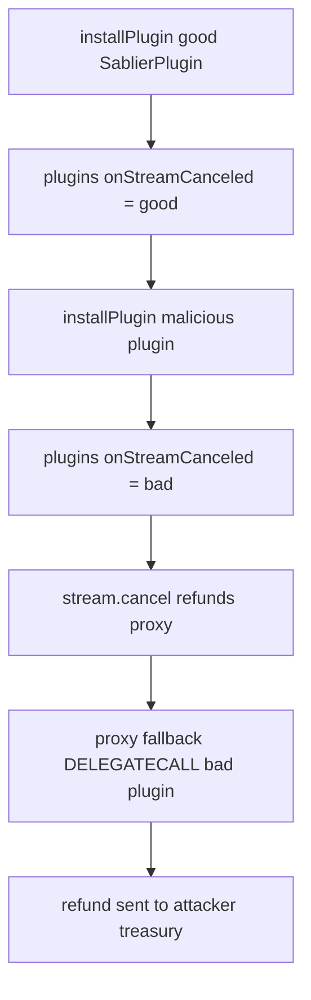

# Sablier / PRBProxy — Plugins can be maliciously overridden by colliding signatures

> **Vulnerability classes:** vuln/wrong-condition · admin-takeover · selector-collision

> **Reproduction:** self-contained Foundry PoC with only `forge-std` — no fork.
> [output.txt](output.txt) · [test/54666-…_exp.sol](test/54666-plugins-can-be-maliciously-overridden-by-colliding-signature_exp.sol).

<!-- non-defihacklabs -->
<!-- source-auditvault: https://github.com/Auditware/AuditVault/blob/main/findings/54666-plugins-can-be-maliciously-overridden-by-colliding-signature.md -->
<!-- date: 2023-07 -->

**AuditVault taxonomy:** `lang/solidity` · `platform/cantina` · `severity/high` · `sector/streaming` · genome: `wrong-condition` · `admin-takeover`

---

## Key info

| | |
|---|---|
| **Impact** | **HIGH** — a colliding plugin silently replaces `onStreamCanceled` and steals stream refunds from the proxy owner |
| **Protocol** | Sablier (PRBProxy integration) — `PRBProxyAnnex.installPlugin` |
| **Vulnerable code** | `plugins[methodList[i]] = plugin` with no collision check |
| **Bug class** | 4-byte selector collision / missing install guard |
| **Finding** | Cantina — Sablier, July 2023 · #54666 · reporter **Zach Obront** |
| **Report** | [cantina_sablier_jul2023.pdf](https://cdn.cantina.xyz/reports/cantina_sablier_jul2023.pdf) |
| **Source** | [AuditVault](https://github.com/Auditware/AuditVault/blob/main/findings/54666-plugins-can-be-maliciously-overridden-by-colliding-signature.md) |
| **Fix** | Sablier PR 121 — revert on selector collision |
| **Compiler** | `^0.8.24` (PoC) |

---

## TL;DR

1. Plugins are installed by mapping each selector from `methodList()` → plugin address.
2. There is **no check** that the selector is free; a later install overwrites the earlier plugin.
3. A malicious "fee" plugin lists the same selector as Sablier's `onStreamCanceled`.
4. On stream cancel, the proxy DELEGATECALLs the malicious plugin, which sends the refund to the attacker instead of the owner.

## Diagrams

## Impact

Theft of cancel refunds (and potentially all refundable stream value once the attacker gains control flow mid-hook).

## Sources

- [AuditVault #54666](https://github.com/Auditware/AuditVault/blob/main/findings/54666-plugins-can-be-maliciously-overridden-by-colliding-signature.md)
- [Cantina Sablier Jul 2023](https://cdn.cantina.xyz/reports/cantina_sablier_jul2023.pdf)
- Reduced PRBProxyAnnex.installPlugin from the finding (Sablier PR 121 fixed)
