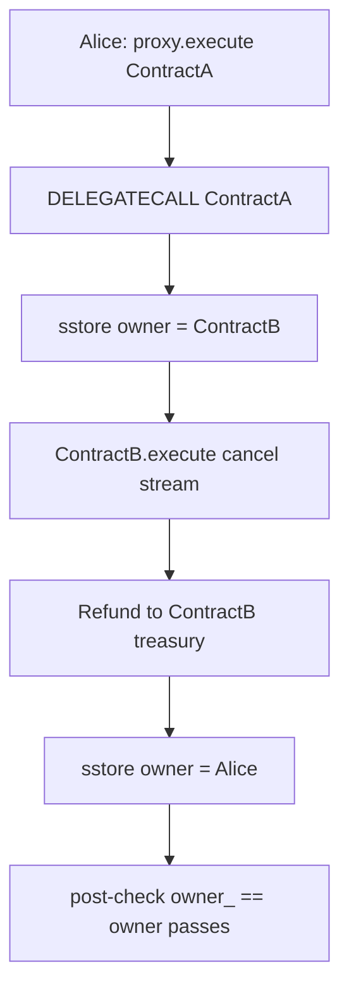

# Sablier / PRBProxy — Owner can be temporarily changed within proxy calls

> **Vulnerability classes:** admin-takeover · direct-drain · known-pattern

> **Reproduction:** self-contained Foundry PoC with only `forge-std` — no fork.
> [output.txt](output.txt) · [test/54672-…sol](test/54672-owner-can-be-temporarily-changed-within-proxy-calls-allowing.sol).

<!-- non-defihacklabs -->
<!-- source-auditvault: https://github.com/Auditware/AuditVault/blob/main/findings/54672-owner-can-be-temporarily-changed-within-proxy-calls-allowing.md -->
<!-- date: 2023-07 -->

**AuditVault taxonomy:** `lang/solidity` · `platform/cantina` · `severity/high` · `sector/streaming` · `sector/staking` · genome: `unbounded-loop` · `direct-drain` · `admin-takeover` · `known-pattern`

---

## Key info

| | |
|---|---|
| **Impact** | **HIGH** — mid-call owner swap steals stream cancel refunds (and any owner-gated action) |
| **Protocol** | Sablier (PRBProxy) — `_safeDelegateCall` |
| **Vulnerable code** | End-of-call `if (owner_ != owner) revert` only |
| **Bug class** | Transient storage ownership / TOCTOU on owner |
| **Finding** | Cantina — Sablier, Jul 2023 · #54672 · reporter **Zach Obront** |
| **Report** | [cantina_sablier_jul2023.pdf](https://cdn.cantina.xyz/reports/cantina_sablier_jul2023.pdf) |
| **Source** | [AuditVault](https://github.com/Auditware/AuditVault/blob/main/findings/54672-owner-can-be-temporarily-changed-within-proxy-calls-allowing.md) |
| **Fix** | Immutable / non-transferable owner, or registry-based ownership checks |
| **Compiler** | `^0.8.24` (PoC) |

---

## TL;DR

1. `execute` DELEGATECALLs a target and only checks that `owner` is unchanged **after** return.
2. The target overwrites storage slot 0 (`owner`) mid-call to a colluding contract.
3. That temporary owner re-enters `execute` to cancel streams and sweep refunds.
4. Original owner is restored so the final check passes — theft succeeds silently.

## Diagrams

## Impact

Any value controlled by the proxy owner mid-execution (Sablier refunds, approvals, plugin installs) can be redirected to an attacker while the post-call owner check still succeeds.

## Sources

- [AuditVault #54672](https://github.com/Auditware/AuditVault/blob/main/findings/54672-owner-can-be-temporarily-changed-within-proxy-calls-allowing.md)
- [Cantina Sablier Jul 2023](https://cdn.cantina.xyz/reports/cantina_sablier_jul2023.pdf)
- Sibling #54666 plugin collision already shipped; same PRBProxy surface
