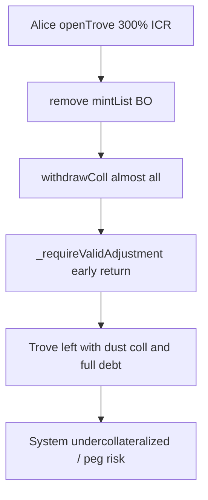

# Threshold USD — mintList early-return lets depositors run away with collateral

> **Vulnerability classes:** wrong-condition · direct-drain · liquidation-underwater

> **Reproduction:** self-contained Foundry PoC with only `forge-std` — no fork.
> [output.txt](output.txt) · [test/54691-…sol](test/54691-requirevalidadjustmentincurrentmode-bypass-when-not-in-mintl.sol).

<!-- non-defihacklabs -->
<!-- source-auditvault: https://github.com/Auditware/AuditVault/blob/main/findings/54691-requirevalidadjustmentincurrentmode-bypass-when-not-in-mintl.md -->
<!-- date: 2023-06 -->

**AuditVault taxonomy:** `lang/solidity` · `platform/cantina` · `severity/high` · `sector/cdp` · `sector/lending` · `sector/stable` · genome: `wrong-condition` · `direct-drain` · `liquidation-underwater`

---

## Key info

| | |
|---|---|
| **Impact** | **HIGH** — undercollateralized troves after deprecation; THUSD peg / system solvency at risk |
| **Protocol** | Threshold USD — `BorrowerOperations._requireValidAdjustmentInCurrentMode` |
| **Vulnerable code** | `if (!thusdToken.mintList(address(this))) return;` |
| **Bug class** | Early-return skips ICR invariants |
| **Finding** | Cantina — Threshold USD, Jun 2023 · #54691 · reporter **Alex The Entreprenerd** |
| **Report** | [cantina_threshold_usd_june2023.pdf](https://cdn.cantina.xyz/reports/cantina_threshold_usd_june2023.pdf) |
| **Source** | [AuditVault](https://github.com/Auditware/AuditVault/blob/main/findings/54691-requirevalidadjustmentincurrentmode-bypass-when-not-in-mintl.md) |
| **Fix** | commit e05abc — same checks for normal and deprecated states |
| **Compiler** | `^0.8.24` (PoC) |

---

## TL;DR

1. When `BorrowerOperations` is removed from `thUSD.mintList`, adjustment guards early-return.
2. ICR / recovery-mode checks never run for `withdrawColl`.
3. Alice withdraws nearly all collateral without repaying debt.
4. Trove ICR collapses to ~0 while bad debt remains against the system.

## Diagrams

## Impact

All depositors on a deprecated `BorrowerOperations` instance can exit collateral without repayment, leaving underwater debt that threatens THUSD for that deployment.

## Sources

- [AuditVault #54691](https://github.com/Auditware/AuditVault/blob/main/findings/54691-requirevalidadjustmentincurrentmode-bypass-when-not-in-mintl.md)
- [Cantina Threshold USD Jun 2023](https://cdn.cantina.xyz/reports/cantina_threshold_usd_june2023.pdf)
- Finding quotes `BorrowerOperations.sol#L542-L557`; fix commit e05abc
