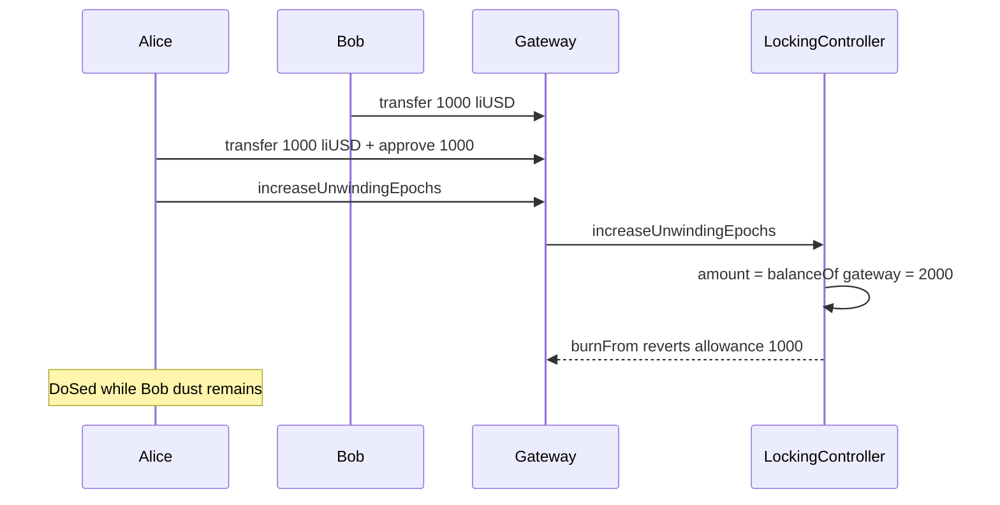

# InfiniFi — Referencing the gateway balance in `increaseUnwindingEpochs` can DoS the function

> **Vulnerability classes:** dos-resistance · dos/lockup · impact/dos/permanent

> **Reproduction:** self-contained Foundry PoC with only `forge-std` — no fork.
> [output.txt](output.txt) · [test/55052-…_exp.sol](test/55052-referencing-the-gateway-balance-in-lockingcontrollerincrease_exp.sol).

<!-- non-defihacklabs -->
<!-- source-auditvault: https://github.com/Auditware/AuditVault/blob/main/findings/55052-referencing-the-gateway-balance-in-lockingcontrollerincrease.md -->
<!-- date: 2025-03 -->

**AuditVault taxonomy:** `lang/solidity` · `platform/spearbit` · `severity/high` · genome: `dos-resistance` · `dos/lockup` · `impact/dos/permanent`

---

## Key info

| | |
|---|---|
| **Impact** | **HIGH** — blind transfers of locked-position tokens to the gateway DoS `increaseUnwindingEpochs` for everyone |
| **Protocol** | InfiniFi Contracts — `LockingController.increaseUnwindingEpochs` |
| **Vulnerable code** | Uses gateway's full `balanceOf` instead of the caller's share amount |
| **Bug class** | Wrong balance reference / transferable intermediate token |
| **Finding** | Spearbit — InfiniFi, March 2025 · #55052 · reporter **R0bert** |
| **Report** | [InfiniFi-Spearbit-Security-Review-March-2025.pdf](https://github.com/spearbit/portfolio/blob/master/pdfs/InfiniFi-Spearbit-Security-Review-March-2025.pdf) |
| **Source** | [AuditVault](https://github.com/Auditware/AuditVault/blob/main/findings/55052-referencing-the-gateway-balance-in-lockingcontrollerincrease.md) |
| **Fix** | commit 708f8bf — pass `balanceOf(msg.sender)` from the gateway |
| **Compiler** | `^0.8.24` (PoC) |

---

## TL;DR

1. LockedPositionTokens are transferable until used to vote.
2. Bob transfers his position tokens to the gateway.
3. Alice deposits her own shares and approves only her amount, then calls `increaseUnwindingEpochs`.
4. Controller reads `balanceOf(gateway)` (= Alice+Bob) and tries to `burnFrom` more than Alice approved → revert. Alice is DoSed.

## Diagrams

## Impact

Denial of service on epoch increases for all users while any third-party tokens sit on the gateway.

## Sources

- [AuditVault #55052](https://github.com/Auditware/AuditVault/blob/main/findings/55052-referencing-the-gateway-balance-in-lockingcontrollerincrease.md)
- [Spearbit InfiniFi March 2025](https://github.com/spearbit/portfolio/blob/master/pdfs/InfiniFi-Spearbit-Security-Review-March-2025.pdf)
- Reduced LockingController.increaseUnwindingEpochs from the finding (fixed in 708f8bf)
