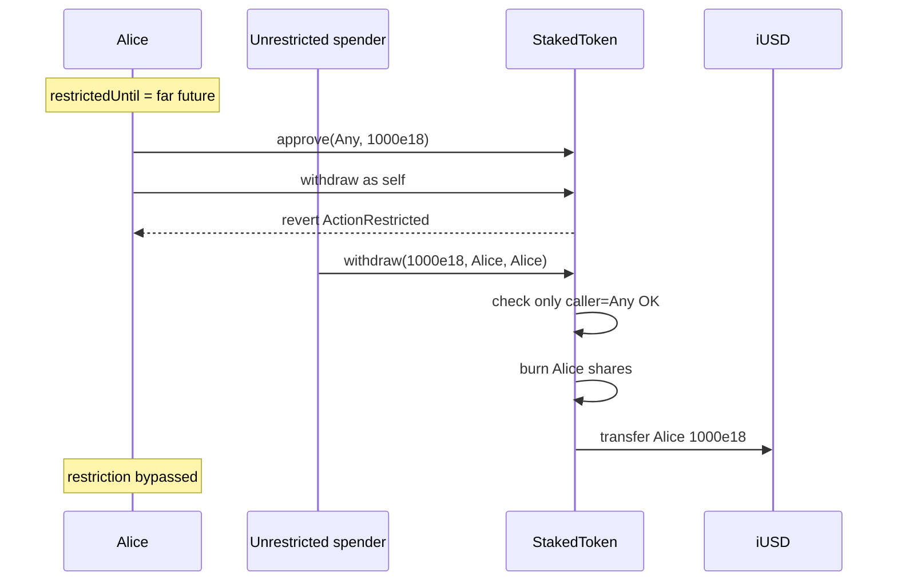

# InfiniFi — StakedToken holders can circumvent restriction by approving another address to withdraw

> **Vulnerability classes:** token-approval-flow · access-control/broken-logic · privilege-escalation/role-bypass

> **Reproduction:** self-contained Foundry PoC with only `forge-std` — no fork.
> [output.txt](output.txt) · [test/55053-…_exp.sol](test/55053-stakedtoken-holders-can-circumvent-restriction-by-approving_exp.sol).

<!-- non-defihacklabs -->
<!-- source-auditvault: https://github.com/Auditware/AuditVault/blob/main/findings/55053-stakedtoken-holders-can-circumvent-restriction-by-approving.md -->
<!-- date: 2025-03 -->

**AuditVault taxonomy:** `lang/solidity` · `platform/spearbit` · `severity/high` · genome: `token-approval-flow` · `access-roles` · `access-control/broken-logic` · `privilege-escalation/role-bypass`

---

## Key info

| | |
|---|---|
| **Impact** | **HIGH** — transfer/withdraw restriction on staked shares is bypassed via ERC-20 approve + third-party withdraw |
| **Protocol** | InfiniFi Contracts — `StakedToken._withdraw` / `_update` |
| **Vulnerable code** | `_withdraw` checks ActionRestriction on `caller` only; `_update` skips checks on burns |
| **Bug class** | Incomplete restriction surface / approval-path bypass |
| **Finding** | Spearbit — InfiniFi, March 2025 · #55053 · reporter **R0bert** |
| **Report** | [InfiniFi-Spearbit-Security-Review-March-2025.pdf](https://github.com/spearbit/portfolio/blob/master/pdfs/InfiniFi-Spearbit-Security-Review-March-2025.pdf) |
| **Source** | [AuditVault](https://github.com/Auditware/AuditVault/blob/main/findings/55053-stakedtoken-holders-can-circumvent-restriction-by-approving.md) |
| **Fix** | commit `913960a9` — also validate `owner` is not restricted |
| **Compiler** | `^0.8.24` (PoC) |

---

## TL;DR

1. Alice holds siUSD and is action-restricted (cannot transfer/withdraw).
2. Alice approves an unrestricted third party for her shares.
3. Alice's own `withdraw` reverts with `ActionRestricted`.
4. The third party calls `withdraw(assets, alice, alice)` — only `caller` is checked — burns Alice's shares and returns iUSD to Alice. Restriction bypassed.

## Vulnerable code

```solidity
function _withdraw(address caller, address receiver, address owner, uint256 assets, uint256 shares)
    internal
{
    _checkActionRestriction(caller); // @> VULN: owner never validated
    return ERC4626._withdraw(caller, receiver, owner, assets, shares);
}

function _update(address _from, address _to, uint256 _value) internal override {
    if (_from != address(0) && _to != address(0)) {
        _checkActionRestriction(_from);
    }
    // burns skip the _from check
    return ERC20._update(_from, _to, _value);
}
```

**Fix:** also call `_checkActionRestriction(owner)` in `_withdraw`.

## Diagrams



## Impact

Restricted stakers can still exit (or be exited) via any approved spender, defeating transfer/withdraw locks used for cooldowns, sanctions, or exit controls.

## Sources

- [AuditVault #55053](https://github.com/Auditware/AuditVault/blob/main/findings/55053-stakedtoken-holders-can-circumvent-restriction-by-approving.md)
- [Spearbit InfiniFi March 2025](https://github.com/spearbit/portfolio/blob/master/pdfs/InfiniFi-Spearbit-Security-Review-March-2025.pdf)
- Reduced `StakedToken._withdraw` / `_update` from the finding (fixed in `913960a9`)
