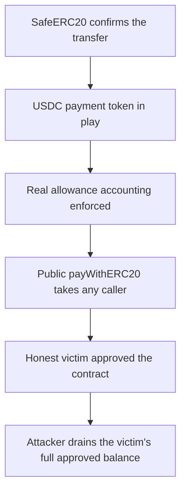

# Crestal Network: `Payment::payWithERC20` is public — anyone can drain an approved victim

> **Vulnerability classes:** vuln/theft · vuln/access-control
>
> **Reproduction:** a faithful minimal reproduction of the vulnerable finding — the vulnerable function is reproduced **verbatim** (marked `@>`) with faithful minimal doubles; local deploy, no fork.

<!-- source-auditvault: https://github.com/sherlock-audit/2025-03-crestal-network/blob/main/crestal-omni-contracts/src/Payment.sol#L25-L32 -->

## Root cause

In [`crestal-omni-contracts/src/Payment.sol#L25-L32`](https://github.com/sherlock-audit/2025-03-crestal-network/blob/main/crestal-omni-contracts/src/Payment.sol#L25-L32), the token-pull helper is declared `public` (it should be `internal`), and it takes an arbitrary `fromAddress`. The function is reproduced verbatim:

```solidity
@>  function payWithERC20(address erc20TokenAddress, uint256 amount, address fromAddress, address toAddress) public {
        // check from and to address
        require(fromAddress != toAddress, "Cannot transfer to self address");
        require(toAddress != address(0), "Invalid to address");
        require(amount > 0, "Amount must be greater than 0");
        IERC20 token = IERC20(erc20TokenAddress);
        token.safeTransferFrom(fromAddress, toAddress, amount);
    }
```

Because it is `public`, anyone can call it directly and supply any `fromAddress` that still has an allowance to the `BlueprintV5` (Payment) contract, moving those tokens to any `toAddress` of the attacker's choosing.

## Why it's exploitable here

1. A victim approves the `BlueprintV5`/Payment contract to spend their USDC (the normal flow to pay for a service) — here, the full 10,000 USDC.
2. An unrelated attacker calls `payWithERC20(USDC, 10_000e6, victim, attacker)` directly.
3. Every `require` passes (from ≠ to, to ≠ 0, amount > 0), and `safeTransferFrom` pulls the victim's entire approved balance straight to the attacker.
4. The victim took no action beyond the ordinary approval and loses all 10,000 USDC.

## Attack path



## Marked-line walkthrough (Playground)

The EVM Playground pins each step to the exact executed source line in `0x671d353a…`:

1. **L46** — SafeERC20 confirms the transfer: The SafeERC20 wrapper checks `transferFrom` succeeded, so the victim's approved tokens move exactly like real USDC.
2. **L50** — USDC payment token in play: Setup: the payment token is a faithful USDC double with 6 decimals and real balance accounting.
3. **L51** — Real allowance accounting enforced: Setup: allowances are tracked exactly like real USDC, so `transferFrom` only moves tokens the victim actually approved.
4. **L100** — Public payWithERC20 takes any caller: Root cause: `payWithERC20` is `public` and takes an arbitrary `fromAddress`, so anyone can pull an approved victim's tokens.
5. **L106** — Honest victim approved the contract: Setup: the victim is an ordinary user who approved the BlueprintV5 (Payment) contract to spend USDC.
6. **L111** — Victim grants max allowance: Setup: the victim approves BlueprintV5 for the max amount, arming the exact allowance the attacker abuses.

## PoC

Registry (Foundry, local deploy — verbatim vulnerable source + harm-asserting test):

```bash
cd 55092-crestal-network-anyone-approving-blueprintv5-can-drain-erc20-via-payment-paywitherc20_exp
forge test -vvv
```

The browser Playground replays the same synthetic opcode-for-opcode and measures the harm: **an unrelated attacker drains the victim's full 10,000 USDC approved balance with zero victim action**. Both gates are green (registry `forge test` PASS + Playground `_verify-poc` **VERDICT: PASS**).
