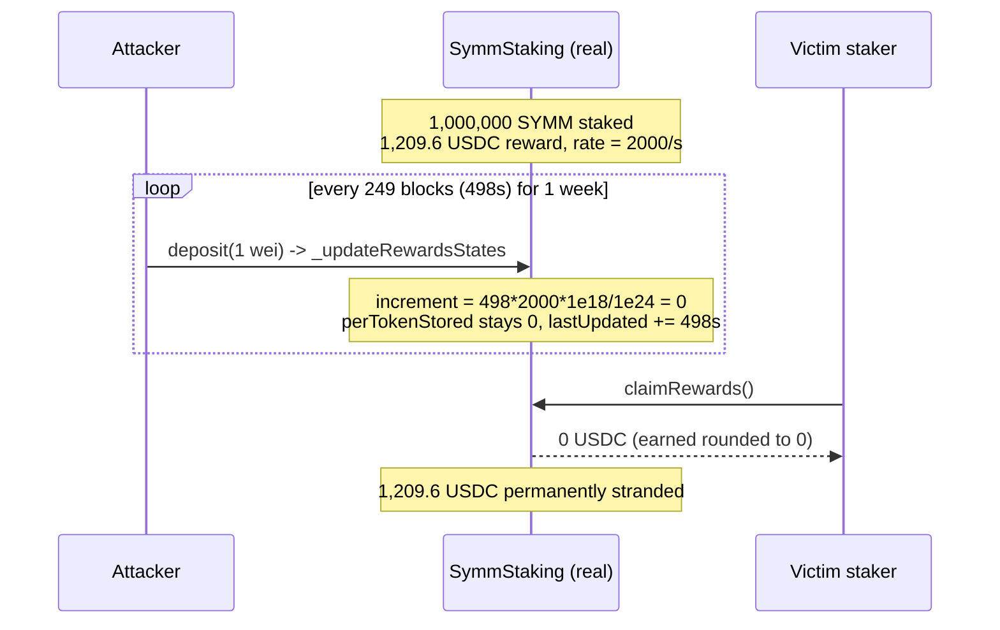

# H-1: USDC rewards are never distributed if `_updateRewardsStates` is triggered too often

**Protocol:** Symmio — Staking & Vesting (`SymmStaking`)
**Source:** Sherlock contest `2025-03-symm-io-stacking`, finding [#575](https://github.com/sherlock-audit/2025-03-symm-io-stacking-judging/issues/575) · AuditVault [#55104](https://github.com/Auditware/AuditVault/blob/main/findings/55104-h-1-usdc-rewards-will-not-be-distributed-if-updaterewardsst.md)
**Real code:** [`token/contracts/staking/SymmStaking.sol`](https://github.com/sherlock-audit/2025-03-symm-io-stacking/blob/main/token/contracts/staking/SymmStaking.sol) @ `d7cf7fc96af1c25b53a7b500a98b411cd018c0d3`
**Severity:** High — direct, permanent loss of low-decimal (USDC/USDT) staking rewards.

This PoC deploys the **real, unmodified `SymmStaking`** audited source (compiled with OpenZeppelin upgradeable v5.1.0, the versions the repo pins) and reproduces the reward-truncation griefing with concrete numbers. Only the SYMM/USDC tokens are minimal real ERC20s — the staking math treats them as opaque tokens, so only their `decimals` matter.

## Root cause

`rewardPerToken` accumulates the per-token reward with a `1e18` factor that up-scales the **staking** token (18-decimal SYMM) but performs **no up-scaling of the reward token**:

```solidity
// SymmStaking.sol L194-L202
function rewardPerToken(address _rewardsToken) public view returns (uint256) {
    if (totalSupply == 0) return rewardState[_rewardsToken].perTokenStored;
    return
        rewardState[_rewardsToken].perTokenStored +
        (((lastTimeRewardApplicable(_rewardsToken) - rewardState[_rewardsToken].lastUpdated)
            * rewardState[_rewardsToken].rate * 1e18) / totalSupply);   // <-- no reward up-scaling
}
```

For a 6-decimal reward the increment `(elapsed * rate * 1e18) / totalSupply` is tiny, and `_updateRewardsStates` writes `perTokenStored` **and** advances `lastUpdated` on every call:

```solidity
// SymmStaking.sol L406-L423
state.perTokenStored = rewardPerToken(token);            // increment truncates to 0
state.lastUpdated   = lastTimeRewardApplicable(token);   // clock advances anyway
```

So if the increment for the elapsed window rounds down to zero, the accrued rewards are silently discarded, yet `lastUpdated` moves forward — permanently.

## The numbers

- Total staked: `1,000,000 SYMM` = `1e24` wei.
- Reward: `1,209.6 USDC` (6dp) over `DEFAULT_REWARDS_DURATION` = 1 week (604 800 s).
- `rate = 1_209_600_000 / 604_800 = 2000` usdc-wei/s (this alone is **not** truncated).
- Per-token increment over `Δt` seconds: `Δt * 2000 * 1e18 / 1e24 = Δt * 2000 / 1e6`.
- The increment becomes `≥ 1` only once `Δt ≥ 500 s`. Any `_updateRewardsStates` firing more often than every ~500 s truncates the increment to **0**.

An attacker calls `deposit`/`withdraw`/`claimRewards`/`notifyRewardAmount` (all call `_updateRewardsStates`) every **249 blocks (498 s < 500 s)**. Every poke rounds the increment to `0` while advancing `lastUpdated`, so after a full week the staker's `earned` is `0` and the entire `1,209.6 USDC` is stranded in the contract.

## Attack flow



## Proof — assertions with numbers

`test/…_exp.sol` deploys the real `SymmStaking` and proves both directions:

- **Griefed (`testFrequentUpdatesRoundSixDecimalRewardsToZero`)** — poke every 498 s for a week →
  `rewardPerToken == 0`, `earned(victim) == 0`, `pendingRewards == 1_209_600_000`, victim claims **0 USDC**, and all `1,209.6 USDC` stays in the contract.
- **Control (`testInfrequentUpdateDistributesRewards`)** — identical setup but updated only **once** at week end → victim earns and claims **1,209 USDC**. This isolates the cause: the loss is due to the frequent updates, not an absent/unfunded reward.

## Reproduce

```bash
_shared/run-poc/run_poc.sh 55104-h-1-usdc-rewards-will-not-be-distributed-if-updaterewardsst_exp -vvvvv
```

Both tests print `[PASS]`. See `output.txt` for the recorded run.

## Mitigation

Up-scale low-decimal reward tokens (e.g. multiply by `1e12` for 6-decimal tokens) inside the reward accounting and divide back out on claim, so the per-token increment cannot round to zero for realistic update cadences.
