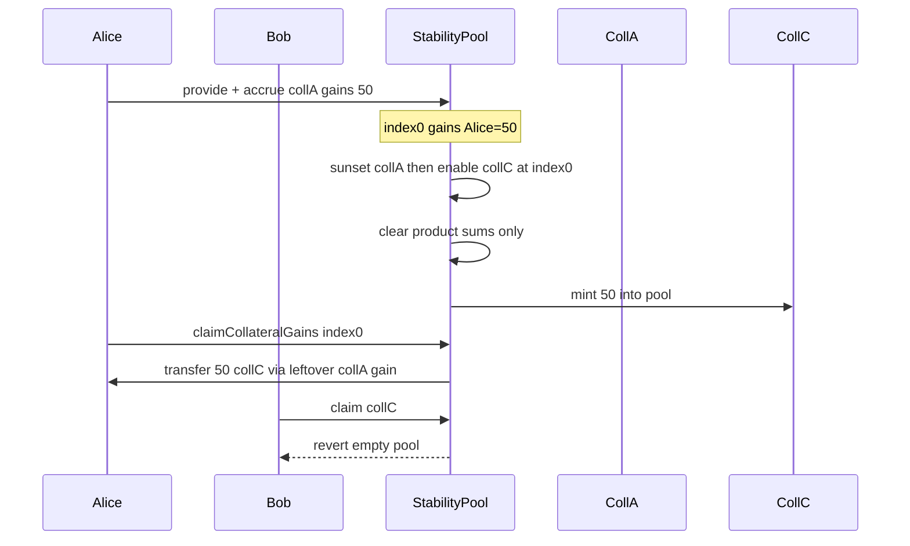

# Roots — [H-01] Overwriting collateral breaks collateral gains logic

> **Vulnerability classes:** integer-bounds · underflow · fix-arithmetic · known-pattern

> **Reproduction:** self-contained Foundry PoC with only `forge-std` — no fork.
> [output.txt](output.txt) · [test/55111-…_exp.sol](test/55111-h-01-overwriting-collateral-breaks-collateral-gains-logic-pa_exp.sol).

<!-- non-defihacklabs -->
<!-- source-auditvault: https://github.com/Auditware/AuditVault/blob/main/findings/55111-h-01-overwriting-collateral-breaks-collateral-gains-logic-pa.md -->
<!-- date: 2025-02 -->

**AuditVault taxonomy:** `lang/solidity` · `sector/cdp` · `severity/high` · genome: `integer-bounds` · `underflow` · `fix-arithmetic`

---

## Key info

| | |
|---|---|
| **Impact** | **HIGH** — reusing a sunset collateral index pays old gains in the new token; other depositors cannot claim |
| **Protocol** | Roots — `StabilityPool` collateral enable / gains |
| **Vulnerable code** | Overwrite clears `epochToScaleToSums` but not `collateralGainsByDepositor` / `depositSums` |
| **Bug class** | Incomplete state wipe on index reuse |
| **Finding** | Pashov Audit Group — Roots security review 2025-02-09 · #55111 |
| **Report** | [Roots-security-review_2025-02-09.md](https://github.com/pashov/audits/blob/master/team/md/Roots-security-review_2025-02-09.md) |
| **Source** | [AuditVault](https://github.com/Auditware/AuditVault/blob/main/findings/55111-h-01-overwriting-collateral-breaks-collateral-gains-logic-pa.md) |
| **Fix** | Do not overwrite sunset collaterals; add disable-after-expiry without reusing dirty indices |
| **Compiler** | `^0.8.24` (PoC) |

---

## TL;DR

1. Alice accrues coll-A gains on stability-pool index 0 and leaves them unclaimed.
2. Coll A is sunset; coll C is enabled and **reuses index 0**.
3. Product sums for index 0 are zeroed; Alice's pending gain mapping is **not**.
4. Alice claims index 0 and is paid in coll-C tokens for her coll-A leftover, draining the pool.
5. Bob's coll-C claim reverts (`transfer amount exceeds balance`).

## Vulnerable code

```solidity
function _overwriteCollateral(uint256 index, MockCollateral coll) internal {
    collateralTokens[index] = coll;
    sunsetExpiry[index] = 0;
    epochToScaleToSums[index][0][0] = 0; // @> VULN: only product sums cleared
    // depositSums[*][index] and collateralGainsByDepositor[*][index] left dirty
}
```

**Fix:** never reuse sunset indices, or wipe all per-depositor gain state for the index before reuse.

## Diagrams



## Impact

Depositors of a new collateral can have their gains drained by leftover accounting from a previous collateral on the same index; claims may also DoS via underflow on `sums - depSums`.

## Sources

- [AuditVault #55111](https://github.com/Auditware/AuditVault/blob/main/findings/55111-h-01-overwriting-collateral-breaks-collateral-gains-logic-pa.md)
- [Pashov Roots 2025-02-09](https://github.com/pashov/audits/blob/master/team/md/Roots-security-review_2025-02-09.md)
- Reduced StabilityPool overwrite path from the finding (sunset expiry reduced to immediate for offline PoC)
