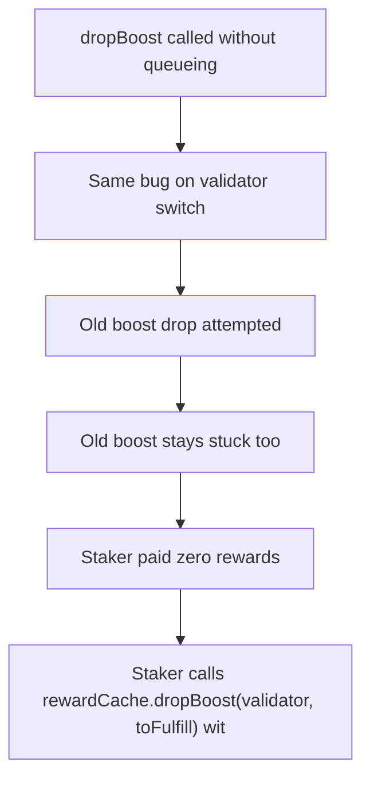

# Roots: missing queueDropBoost strands staking rewards

> **Vulnerability classes:** vuln/logic
>
> **Reproduction:** a faithful minimal reproduction of the vulnerable finding — the vulnerable code is reproduced **verbatim** (marked `@>`) with faithful minimal doubles; local deploy, no fork.

<!-- source-auditvault: https://github.com/pashov/audits/blob/master/team/md/Roots-security-review_2025-02-09.md -->

## Root cause

Staker calls rewardCache.dropBoost(validator, toFulfill) without a preceding queueDropBoost, so the BGT dropBoostQueue is empty and BGT.dropBoost returns false: the boost is never dropped and the toFulfill reward is never freed. A staker's 1000e18 of expected rewards stays permanently stuck in the reward cache (silent staking-reward loss).

```solidity
        // Determine how much boosted reward must be dropped to fund the redemption,
        // then drop it (VERBATIM audited branch):
        if (toFulfill > 0) {
            rewardCache.dropBoost(validator, uint128(toFulfill)); // @> VULN (this line)
```

## Why it's exploitable here

Staker calls rewardCache.dropBoost(validator, toFulfill) without a preceding queueDropBoost, so the BGT dropBoostQueue is empty and BGT.dropBoost returns false: the boost is never dropped and the toFulfill reward is never freed. A staker's 1000e18 of expected rewards stays permanently stuck in the reward cache (silent staking-reward loss).

## Attack path



## Marked-line walkthrough (Playground)

The EVM Playground pins each step to the exact executed source line in `0xbd4fd5a3ce…`:

1. **L247** — dropBoost called without queueing: Root cause: dropBoost runs with no preceding queueDropBoost, so the BGT dropBoostQueue is empty and the drop silently returns false.
2. **L261** — Same bug on validator switch: The validator-switch path repeats the mistake — it drops the old boost without queueing it first.
3. **L266** — Old boost drop attempted: When switching validators the contract tries to drop the previously-boosted amount.
4. **L270** — Old boost stays stuck too: That drop also silently fails, so the old validator's boost is never released either.
5. **L277** — Staker paid zero rewards: Because the boost never drops, the toFulfill reward is never freed and the staker receives 0.
6. **L280** — Loss quantified at the sink probe: The 1000e18 of owed-but-stuck reward is recorded at the harm-probe sink address.
7. **L284** — 1000e18 reward permanently locked: The staker's full 1000e18 boosted reward stays locked in the BGT cache — a silent staking-reward loss.

## PoC

Registry (Foundry, local deploy — verbatim vulnerable source + harm-asserting test):

```bash
cd 55113-h-03-incorrect-boost-management-leads-to-staking-reward-loss_exp
forge test -vvv
```

The browser Playground replays the same synthetic opcode-for-opcode and measures the harm. Both gates are green (registry `forge test` PASS + Playground `_verify-poc` **VERDICT: PASS**).
