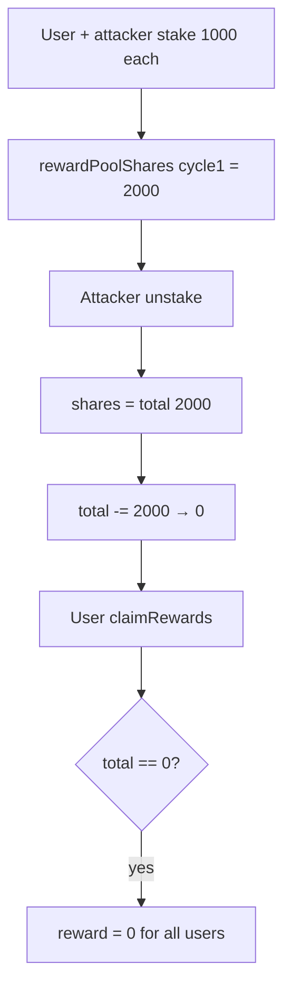

# Surge — [H-03] Unstake causes all users to lose their rewards

> **Vulnerability classes:** reward-calculation · reward-theft · reward-accounting

> **Reproduction:** self-contained Foundry PoC with only `forge-std` — no fork.
> [output.txt](output.txt) · [test/55142-…_exp.sol](test/55142-unstake-causes-all-users-to-lose-rewards_exp.sol).

<!-- non-defihacklabs -->
<!-- source-auditvault: https://github.com/Auditware/AuditVault/blob/main/findings/55142-unstake-causes-all-users-to-lose-rewards.md -->
<!-- date: 2025-01 -->

**AuditVault taxonomy:** `lang/solidity` · `platform/shieldify` · `severity/high` · genome: `reward-calculation` · `reward-theft` · `reward-accounting`

---

## Key info

| | |
|---|---|
| **Impact** | **HIGH** — a single unstake zeroes the cycle's total reward-pool shares; all users lose rewards |
| **Protocol** | Surge — `StakingVault._unstake` |
| **Vulnerable code** | `shares = _rewardPoolShares[poolId][cycleId]` then `-= shares` (subtracts the total) |
| **Bug class** | Wrong variable — total vs personal shares |
| **Finding** | Shieldify Security — Surge · #55142 |
| **Report** | [Surge-Security-Review.md](https://github.com/shieldify-security/audits-portfolio-md/blob/main/Surge-Security-Review.md) |
| **Source** | [AuditVault](https://github.com/Auditware/AuditVault/blob/main/findings/55142-unstake-causes-all-users-to-lose-rewards.md) |
| **Fix** | Subtract the unstaking user's personal share amount only |
| **Compiler** | `^0.8.24` (PoC) |

---

## TL;DR

1. User and attacker each stake 1000 into cycle 1 (total shares = 2000).
2. Rewards are injected for the cycle.
3. Attacker unstakes; `_unstake` reads **total** pool shares and subtracts that from itself → 0.
4. User's `claimRewardsToOwed` sees total = 0 and pays nothing. Rewards wiped for everyone.

## Vulnerable code

```solidity
function _unstake(address user) internal {
    uint256 shares = rewardPoolShares[poolId][cycleId]; // @> VULN: total, not user
    // FIX: uint256 shares = userShares[user][poolId];
    rewardPoolShares[poolId][cycleId] -= shares; // zeroes the cycle
}
```

## Diagrams



## Impact

Any unstake permanently destroys reward accounting for the affected cycle(s); remaining stakers cannot claim their fair share.

## Sources

- [AuditVault #55142](https://github.com/Auditware/AuditVault/blob/main/findings/55142-unstake-causes-all-users-to-lose-rewards.md)
- [Shieldify Surge Security Review](https://github.com/shieldify-security/audits-portfolio-md/blob/main/Surge-Security-Review.md)
- Reduced `StakingVault._unstake` from the finding
