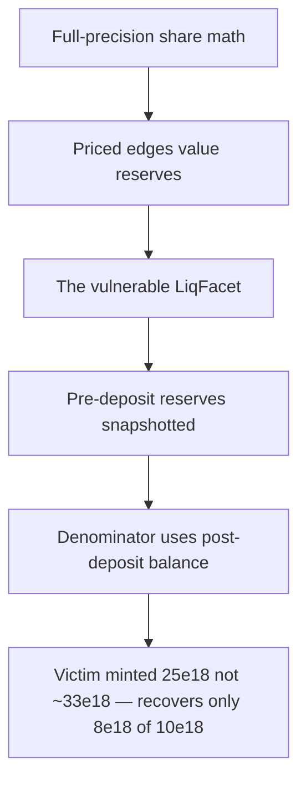

# Burve: Incorrect `cumulativeValue` in `LiqFacet::addLiq` mints too few shares

> **Vulnerability classes:** vuln/precision-loss · vuln/theft · vuln/logic
>
> **Reproduction:** a faithful minimal reproduction of the vulnerable finding — the `cumulativeValue` accumulation of `LiqFacet::addLiq` is reproduced **verbatim** (marked `@>`) with faithful minimal doubles; local deploy, no fork.

<!-- source-auditvault: https://github.com/pashov/audits/blob/master/team/md/Burve-security-review_2025-01-29.md -->

## Root cause

In Burve's [`LiqFacet::addLiq`](https://github.com/pashov/audits/blob/master/team/md/Burve-security-review_2025-01-29.md), the closure's total value `cumulativeValue` is the **denominator** of the share formula `shares = FullMath.mulDiv(addedBalance, totalShares, cumulativeValue)`. It is initialized to `tokenBalance` — the token reserve **after** the user's own deposit has been pulled in — instead of `preBalance[idx]`, the reserve **before** the deposit. The vulnerable lines, reproduced verbatim:

```solidity
uint256 addedBalance = tokenBalance - preBalance[idx];

@>  uint256 cumulativeValue = tokenBalance;

TokenRegistry storage tokenReg = Store.tokenRegistry();

for (uint256 i = 0; i < n; ++i) {
    if (i == idx) {
        continue;
    } else if (preBalance[i] != 0) {
        address otherToken = tokenReg.tokens[i];
        Edge storage e = Store.edge(token, otherToken);
        uint256 priceX128 = (token < otherToken) ? e.getInvPriceX128(tokenBalance, preBalance[i]) : e.getPriceX128(preBalance[i], tokenBalance);
        cumulativeValue += FullMath.mulX128(preBalance[i], priceX128, true);
    }
}

shares = AssetLib.add(recipient, cid, addedBalance, cumulativeValue);
```

Because `cumulativeValue` starts at `tokenBalance` (which already contains `addedBalance`), the denominator is inflated by exactly the user's own deposit. The numerator `addedBalance` is downscaled against a total value that double-counts the deposit, so the depositor is minted **fewer** shares than their contribution warrants. On withdrawal they recover less than they put in; the shortfall is silently diluted to the pre-existing LPs.

## Why it's exploitable here

Following the finding's worked example — a 3-token closure, every edge priced 1:1, 100 pre-existing LP shares:

1. The pool holds `10` of each token and a prior LP owns `100` shares. The victim adds `10` of token0, so `tokenBalance` becomes `20` and `addedBalance = 10`.
2. The bug sets `cumulativeValue = tokenBalance = 20`; the loop then adds the two other `10`-token reserves (`+10 +10`), giving a denominator of `40`. The correct start (`preBalance[idx] = 10`) would have yielded `30`.
3. `shares = mulDiv(10, 100, 40) = 25` — instead of the fair `10 * 100 / 30 ≈ 33`. Total shares rise to `125`.
4. The victim immediately withdraws all `25` shares: `25 / 125` of the pool value (`40`) = `8` token0 — a **2-token loss on a 10-token deposit**, pocketed by the existing LP as dilution.

The reproduction scales every quantity by `1e18`: the victim deposits `10e18`, is minted only `25e18` shares (not `~33e18`), withdraws `8e18`, and the harness asserts the exact `2e18` shortfall.

## Attack path



## Marked-line walkthrough (Playground)

The EVM Playground pins each step to the exact executed source line in `0xbd4fd5a3…`:

1. **L77** — Full-precision share math: The 512-bit mulDiv here computes shares as addedBalance × totalShares / denominator; an inflated denominator is exactly what mints too few shares.
2. **L160** — Priced edges value reserves: Store.edge returns each token pair's configured 1:1 price, which addLiq uses to convert the other pooled reserves into the deposit token's units.
3. **L202** — The vulnerable LiqFacet: LiqFacet reproduces Burve's addLiq share accounting verbatim, so the closure's total value is what decides how many shares a depositor is minted.
4. **L247** — Pre-deposit reserves snapshotted: Before the deposit is pulled in, addLiq records each prior reserve into preBalance and marks idx — preBalance[idx] is the value the denominator should use.
5. **L265** — Denominator uses post-deposit balance: Root cause: cumulativeValue is initialized to tokenBalance (the reserve after the deposit) not preBalance[idx], inflating the share denominator by addedBalance.
6. **L284** — addLiq mints the shares: addLiq feeds addedBalance and the inflated cumulativeValue into AssetLib.add, minting the victim 25e18 shares instead of the fair ~33e18.
7. **L325** — Withdrawal values the whole pool: On removeLiq the pool's full value is summed here and split pro-rata by shares, so the victim's shorted 25e18 shares redeem only 8e18 of their 10e18.
8. **L357** — Victim approves the facet: Setup: the victim grants LiqFacet an allowance so addLiq can pull the 10e18 token0 deposit into the closure's reserves.

## PoC

Registry (Foundry, local deploy — verbatim vulnerable source + harm-asserting test):

```bash
cd 55209-c-02-incorrect-cumulativevalue-in-liqfacetaddliq-gives-less_exp
forge test -vvv
```

The browser Playground replays the same synthetic opcode-for-opcode and measures the harm: **deposit 10e18, receive only 25e18 shares (not ~33e18), withdraw 8e18 — a 2e18 loss diluted to existing LPs**. Both gates are green (registry `forge test` PASS + Playground `_verify-poc` **VERDICT: PASS**).
