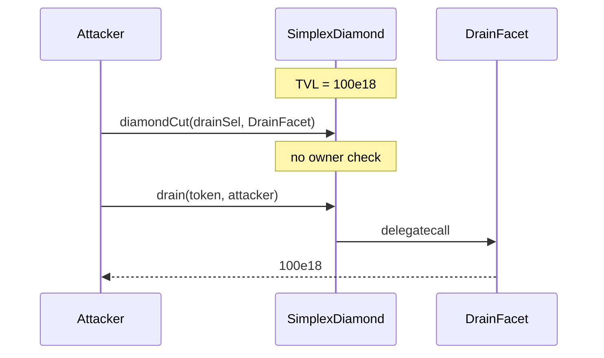

# Burve SimplexDiamond — Unrestricted `diamondCut` allows unauthorized facet modifications

> **Vulnerability classes:** missing-modifier · admin-takeover · access-roles

> **Reproduction:** self-contained Foundry PoC, offline, forge-std only.
> Full trace: [output.txt](output.txt).

<!-- non-defihacklabs -->
<!-- source-auditvault: https://github.com/Auditware/AuditVault/blob/main/findings/55210-c-03-unrestricted-diamondcut-allows-unauthorized-facet-modif.md -->
<!-- date: 2025-01 -->

---

## Key info

| | |
|---|---|
| **Impact** | **HIGH** — anyone can replace facets and drain protocol TVL |
| **Protocol** | Burve — SimplexDiamond (EIP-2535) |
| **Vulnerable code** | `diamondCut` with no owner/admin check |
| **Bug class** | Missing access control on diamond upgrade surface |
| **Finding** | Pashov Audit Group — Burve, Jan 2025 · #55210 · C-03 |
| **Report** | [Burve-security-review_2025-01-29](https://github.com/pashov/audits/blob/master/team/md/Burve-security-review_2025-01-29.md) |
| **Source** | [AuditVault](https://github.com/Auditware/AuditVault/blob/main/findings/55210-c-03-unrestricted-diamondcut-allows-unauthorized-facet-modif.md) |
| **Compiler** | `^0.8.24` (PoC) |

---

## TL;DR

1. `SimplexDiamond` exposes `diamondCut` without `AdminLib.validateOwner()` (or any auth).
2. Any address can add/replace/remove facet selectors.
3. Attacker adds a `drain` facet and empties the diamond's token balance.
4. **HARM:** full TVL stolen.

---

## The vulnerable code

```solidity
function diamondCut(bytes4 selector, address newFacet) external {
    // FIX: require(msg.sender == diamondOwner, "not owner");
    facets[selector] = newFacet; // @> VULN: unrestricted diamondCut
}
```

---

## Root cause

EIP-2535 upgrade entrypoint registered without an owner/admin guard.

## Preconditions

- Diamond holds TVL (or any valuable storage/balance reachable via a new facet).
- Attacker has no admin role.

## Attack walkthrough

1. Protocol bootstraps honest facets; diamond holds 100e18.
2. Attacker calls `diamondCut(drainSelector, DrainFacet)`.
3. Attacker calls `drain(token, attacker)` via the diamond fallback.
4. **HARM:** 100e18 drained.

## Diagrams



## Impact

Complete loss of control of the diamond and any assets it holds.

## Sources

- [AuditVault finding #55210](https://github.com/Auditware/AuditVault/blob/main/findings/55210-c-03-unrestricted-diamondcut-allows-unauthorized-facet-modif.md)
- [Pashov Burve review 2025-01-29](https://github.com/pashov/audits/blob/master/team/md/Burve-security-review_2025-01-29.md)
- Reduced C2 synthetic from finding PoC (`test_rediamondCut`)
