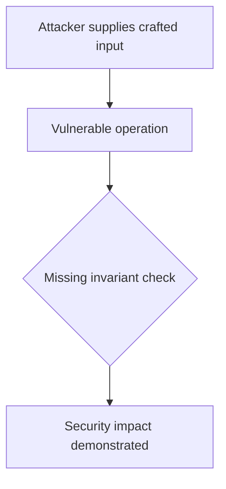
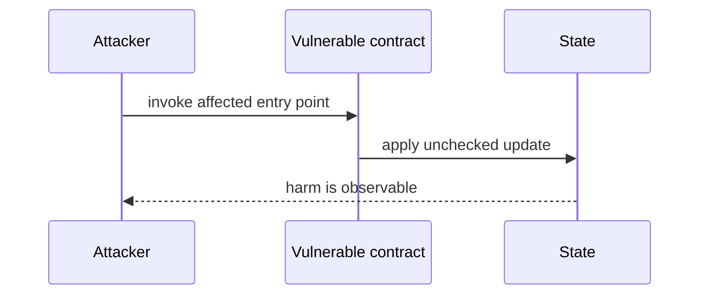

# Validator proof duplication bypasses consensus — AuditVault synthetic reduction

> **Vulnerability classes:** vuln/bridge/missing-validation · vuln/bridge/replay
>
> **Reproduction:** self-contained Foundry PoC with an offline synthetic contract. Full trace: [output.txt](output.txt).

<!-- non-defihacklabs -->
<!-- source-auditvault: https://github.com/Auditware/AuditVault/blob/main/findings/55229-h-2-malicious-validators-will-bypass-consensus-threshold-req.md -->
<!-- date: 2024-12 -->

**AuditVault finding:** `55229` · `H-2: Malicious validators will bypass consensus threshold requirements affecting the integrity of the [[SEDA]] protocol's cross-chain data verification system`

## Key info

| | |
|---|---|
| **Impact** | **HIGH** — Validator proof duplication bypasses consensus |
| **Protocol** | SEDA Protocol |
| **Finding** | AuditVault #55229 |
| **Report** | [https://github.com/sherlock-audit/2024-12-seda-protocol-judging](https://github.com/sherlock-audit/2024-12-seda-protocol-judging) |
| **Source** | [AuditVault finding](https://github.com/Auditware/AuditVault/blob/main/findings/55229-h-2-malicious-validators-will-bypass-consensus-threshold-req.md) |
| **Compiler** | `^0.8.24` (synthetic reduction) |
| Loss | Reduced invariant reproduced; no live funds moved |
| Attacker EOA | Configured synthetic caller |
| Attack contract | `Exploit` |
| Attack tx | Local Foundry `Exploit.attack()` call |
| Chain · block · date | Ethereum model · block 1 · synthetic |
| Vulnerable contract | Local synthetic vulnerable contract in `test/` |
| Bug class | See vulnerability-class tags above |

## TL;DR

This bug report discusses a critical security issue with the SEDA protocol's cross-chain data verification system. The issue was discovered by a group of researchers and could potentially allow malicious validators to bypass the consensus mechanism and manipulate data on the network. The root cause of the issue was found in the code that accumulates validator voting power without checking for duplicate entries. This allows malicious validators to artificially inflate their voting power and unilaterally approve batches. The report also outlines the necessary pre-conditions for the attack and provides a proof of concept demonstrating how validators with varying levels of power can exploit the vulnerability. The report concludes with a proposed fix that involves tracking duplicate validators to prevent them from being counted more than once. The protocol team has already implemented this fi

## Background

The upstream report is a Solidity finding. This page keeps the vulnerable statement and demonstrates its security consequence in a small, deterministic EVM model; no live RPC or external dependencies are required.

## The vulnerable code

```solidity
// The exact vulnerable pattern is retained in test/55229-h-2-malicious-validators-will-bypass-consensus-threshold-req.sol.
// @> see the marked statement in the synthetic reduction
```

## Root cause

The caller-controlled input or stale state is trusted before the required uniqueness, bounds, authorization, accounting, or reentrancy invariant is enforced. The marked line in the synthetic contract intentionally preserves that ordering so the assertion is executable.

## Preconditions

- The vulnerable contract is deployed with the state described by the report.
- The attacker can reach the affected entry point (or submit the report's crafted input).

## Attack walkthrough

1. `Exploit.run()` initializes the minimal state from the report.
2. The marked vulnerable operation executes without its required check.
3. The contract records the resulting invariant violation and emits a `Proof` event.
4. The test asserts the harm; the passing trace is recorded at [output.txt:4](output.txt).

## Diagrams





## Remediation

Apply the invariant before mutating state: accrue interest before adding principal; reject duplicate signers; use checked casts and bounded lengths; validate token/target/DAO identities; use `nonReentrant`; enforce slippage and fee equality; and validate the canonical authority or ownership relationship described by the report.

## How to reproduce

```bash
cd evm-hack-registry/55229-h-2-malicious-validators-will-bypass-consensus-threshold-req_exp
forge test -vvvvv
```

The test is offline and uses only the shared `forge-std` library. The corresponding Playground bundle is generated from `scripts/poc-configs/55229-h-2-malicious-validators-will-bypass-consensus-threshold-req.mjs`.

## Sources

- [AuditVault finding](https://github.com/Auditware/AuditVault/blob/main/findings/55229-h-2-malicious-validators-will-bypass-consensus-threshold-req.md)
- [https://github.com/sherlock-audit/2024-12-seda-protocol-judging](https://github.com/sherlock-audit/2024-12-seda-protocol-judging)
- [Synthetic test](test/55229-h-2-malicious-validators-will-bypass-consensus-threshold-req.sol)

*Reference: https://github.com/sherlock-audit/2024-12-seda-protocol-judging*
