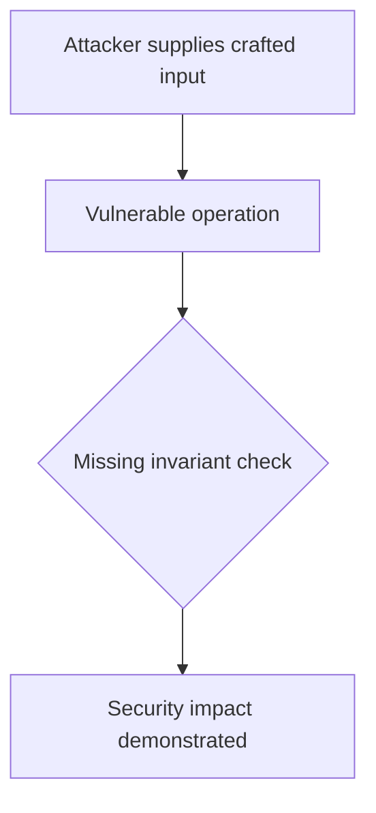
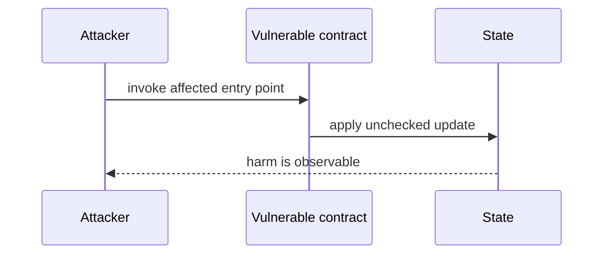

# Non-payable batch sender blocks result submissions — AuditVault synthetic reduction

> **Vulnerability classes:** vuln/dos/frozen-funds · vuln/dependency/unchecked-return-value
>
> **Reproduction:** self-contained Foundry PoC with an offline synthetic contract. Full trace: [output.txt](output.txt).

<!-- non-defihacklabs -->
<!-- source-auditvault: https://github.com/Auditware/AuditVault/blob/main/findings/55233-h-6-attacker-can-exploits-batch-sender-role-to-block-result.md -->
<!-- date: 2024-12 -->

**AuditVault finding:** `55233` · `H-6: Attacker can exploits batch sender role to block result Submissions via fee transfer reversion`

## Key info

| | |
|---|---|
| **Impact** | **HIGH** — Non-payable batch sender blocks result submissions |
| **Protocol** | [[SEDA]] Protocol |
| **Finding** | AuditVault #55233 |
| **Report** | [https://github.com/sherlock-audit/2024-12-seda-protocol-judging](https://github.com/sherlock-audit/2024-12-seda-protocol-judging) |
| **Source** | [AuditVault finding](https://github.com/Auditware/AuditVault/blob/main/findings/55233-h-6-attacker-can-exploits-batch-sender-role-to-block-result.md) |
| **Compiler** | `^0.8.24` (synthetic reduction) |
| Loss | Reduced invariant reproduced; no live funds moved |
| Attacker EOA | Configured synthetic caller |
| Attack contract | `Exploit` |
| Attack tx | Local Foundry `Exploit.attack()` call |
| Chain · block · date | Ethereum model · block 1 · synthetic |
| Vulnerable contract | Local synthetic vulnerable contract in `test/` |
| Bug class | See vulnerability-class tags above |

## TL;DR

This bug report discusses an issue with the SEDA protocol that allows an attacker to exploit the batch sender role and block result submissions by using a contract that reverts when receiving native tokens. The root cause of this issue is that the `postBatch` function allows any address to submit a batch as long as certain conditions are met. This includes validating the batch height, the validators in the batch, and the signatures for the batch. Once these validations pass, the state is updated to assign the batch sender to the address of the person who submitted the batch. However, if this address is a contract that does not accept native tokens, the fee transfer and `postResult` will fail. This can be exploited by an attacker by front-running a legitimate transaction and becoming the batch sender with a contract that reverts when receiving tokens. This can block all result submissions

## Background

The upstream report is a Solidity finding. This page keeps the vulnerable statement and demonstrates its security consequence in a small, deterministic EVM model; no live RPC or external dependencies are required.

## The vulnerable code

```solidity
// The exact vulnerable pattern is retained in test/55233-h-6-attacker-can-exploits-batch-sender-role-to-block-result.sol.
// @> see the marked statement in the synthetic reduction
```

## Root cause

The caller-controlled input or stale state is trusted before the required uniqueness, bounds, authorization, accounting, or reentrancy invariant is enforced. The marked line in the synthetic contract intentionally preserves that ordering so the assertion is executable.

## Preconditions

- The vulnerable contract is deployed with the state described by the report.
- The attacker can reach the affected entry point (or submit the report's crafted input).

## Attack walkthrough

1. `Exploit.run()` initializes the minimal state from the report.
2. The marked vulnerable operation executes without its required check.
3. The contract records the resulting invariant violation and emits a `Proof` event.
4. The test asserts the harm; the passing trace is recorded at [output.txt:4](output.txt).

## Diagrams





## Remediation

Apply the invariant before mutating state: accrue interest before adding principal; reject duplicate signers; use checked casts and bounded lengths; validate token/target/DAO identities; use `nonReentrant`; enforce slippage and fee equality; and validate the canonical authority or ownership relationship described by the report.

## How to reproduce

```bash
cd evm-hack-registry/55233-h-6-attacker-can-exploits-batch-sender-role-to-block-result_exp
forge test -vvvvv
```

The test is offline and uses only the shared `forge-std` library. The corresponding Playground bundle is generated from `scripts/poc-configs/55233-h-6-attacker-can-exploits-batch-sender-role-to-block-result.mjs`.

## Sources

- [AuditVault finding](https://github.com/Auditware/AuditVault/blob/main/findings/55233-h-6-attacker-can-exploits-batch-sender-role-to-block-result.md)
- [https://github.com/sherlock-audit/2024-12-seda-protocol-judging](https://github.com/sherlock-audit/2024-12-seda-protocol-judging)
- [Synthetic test](test/55233-h-6-attacker-can-exploits-batch-sender-role-to-block-result.sol)

*Reference: https://github.com/sherlock-audit/2024-12-seda-protocol-judging*
