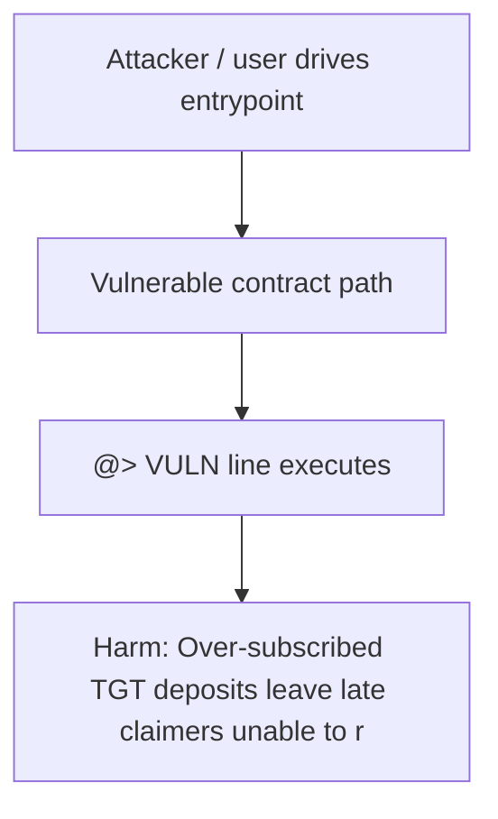

# THORWallet — MergeTgt has no deposit cap vs TGT_TO_EXCHANGE — late claimers stuck

> **Vulnerability classes:** integer-bounds, known-pattern

> **Reproduction:** self-contained Foundry PoC (only `forge-std`) — no fork, no RPC.
> Full trace: [output.txt](output.txt). PoC: [test/55396-h-1-mergetgt-has-no-handling-if-tgttoexchange-is-exceeded-du_exp.sol](test/55396-h-1-mergetgt-has-no-handling-if-tgttoexchange-is-exceeded-du_exp.sol).

<!-- non-defihacklabs -->
<!-- source-auditvault: https://github.com/Auditware/AuditVault/blob/main/findings/55396-h-1-mergetgt-has-no-handling-if-tgttoexchange-is-exceeded-du.md -->
<!-- date: 2025-02 -->

---

## Key info

| | |
|---|---|
| **Impact** | **HIGH** — Over-subscribed TGT deposits leave late claimers unable to redeem TITN |
| **Protocol** | THORWallet |
| **Vulnerable code** | `MergeTgt` (see `@>` in synthetic) |
| **Finding** | Code4rena · #55396 |
| **Report** | [https://code4rena.com/reports/2025-02-thorwallet](https://code4rena.com/reports/2025-02-thorwallet) |
| **Source** | [AuditVault](https://github.com/Auditware/AuditVault/blob/main/findings/55396-h-1-mergetgt-has-no-handling-if-tgttoexchange-is-exceeded-du.md) |
| **Status** | Audit finding — reproduced as a standalone local PoC |
| **Compiler** | `^0.8.24` |

---

## TL;DR

MergeTgt has no deposit cap vs TGT_TO_EXCHANGE — late claimers stuck. Harm demonstrated: **Over-subscribed TGT deposits leave late claimers unable to redeem TITN**.

---

## The vulnerable code

See `test/55396-h-1-mergetgt-has-no-handling-if-tgttoexchange-is-exceeded-du.sol` — the blamed line is marked `// @> VULN`.

---

## Root cause

See the synthetic header comment and the AuditVault finding for the full root-cause write-up. The Playground preserves the vulnerable line verbatim and asserts the concrete harm in `Exploit.run()`.

## Attack walkthrough

1. Deploy the reduced vulnerable system (CREATE order: MockERC20(TGT), MockERC20(TITN), MergeTgt, UserActor1, UserActor2).
2. Seed the preconditions from the finding (approvals, balances, whitelist).
3. Execute the attack path; the `@>` line runs.
4. `require(...)` asserts the harm.

## Diagrams

## Impact

Over-subscribed TGT deposits leave late claimers unable to redeem TITN

## Taxonomy

- integer-bounds, known-pattern

## Sources

- [AuditVault finding](https://github.com/Auditware/AuditVault/blob/main/findings/55396-h-1-mergetgt-has-no-handling-if-tgttoexchange-is-exceeded-du.md)
- [Code4rena report](https://code4rena.com/reports/2025-02-thorwallet)
- Reduced from: `code-423n4/2025-02-thorwallet contracts/MergeTgt.sol onTokenTransfer`
