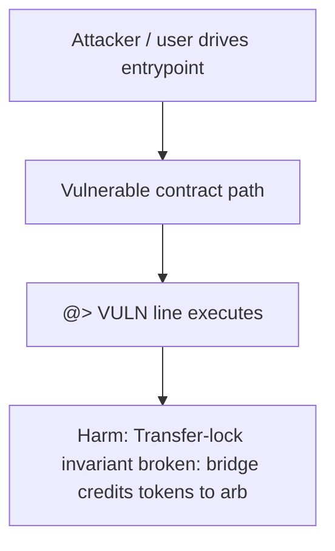

# THORWallet — Bridge path bypasses TITN transfer lock — send to any address

> **Vulnerability classes:** bridge-message-validation, access-roles, multi-tx

> **Reproduction:** self-contained Foundry PoC (only `forge-std`) — no fork, no RPC.
> Full trace: [output.txt](output.txt). PoC: [test/55397-h-2-the-user-can-send-tokens-to-any-address-by-using-two-bri_exp.sol](test/55397-h-2-the-user-can-send-tokens-to-any-address-by-using-two-bri_exp.sol).

<!-- non-defihacklabs -->
<!-- source-auditvault: https://github.com/Auditware/AuditVault/blob/main/findings/55397-h-2-the-user-can-send-tokens-to-any-address-by-using-two-bri.md -->
<!-- date: 2025-02 -->

---

## Key info

| | |
|---|---|
| **Impact** | **HIGH** — Transfer-lock invariant broken: bridge credits tokens to arbitrary recipient |
| **Protocol** | THORWallet |
| **Vulnerable code** | `Titn` (see `@>` in synthetic) |
| **Finding** | Code4rena · #55397 |
| **Report** | [https://code4rena.com/reports/2025-02-thorwallet](https://code4rena.com/reports/2025-02-thorwallet) |
| **Source** | [AuditVault](https://github.com/Auditware/AuditVault/blob/main/findings/55397-h-2-the-user-can-send-tokens-to-any-address-by-using-two-bri.md) |
| **Status** | Audit finding — reproduced as a standalone local PoC |
| **Compiler** | `^0.8.24` |

---

## TL;DR

Bridge path bypasses TITN transfer lock — send to any address. Harm demonstrated: **Transfer-lock invariant broken: bridge credits tokens to arbitrary recipient**.

---

## The vulnerable code

See `test/55397-h-2-the-user-can-send-tokens-to-any-address-by-using-two-bri.sol` — the blamed line is marked `// @> VULN`.

---

## Root cause

See the synthetic header comment and the AuditVault finding for the full root-cause write-up. The Playground preserves the vulnerable line verbatim and asserts the concrete harm in `Exploit.run()`.

## Attack walkthrough

1. Deploy the reduced vulnerable system (CREATE order: Titn, BridgedUser).
2. Seed the preconditions from the finding (approvals, balances, whitelist).
3. Execute the attack path; the `@>` line runs.
4. `require(...)` asserts the harm.

## Diagrams

## Impact

Transfer-lock invariant broken: bridge credits tokens to arbitrary recipient

## Taxonomy

- bridge-message-validation, access-roles, multi-tx

## Sources

- [AuditVault finding](https://github.com/Auditware/AuditVault/blob/main/findings/55397-h-2-the-user-can-send-tokens-to-any-address-by-using-two-bri.md)
- [Code4rena report](https://code4rena.com/reports/2025-02-thorwallet)
- Reduced from: `code-423n4/2025-02-thorwallet contracts/Titn.sol _credit / transfer lock`
