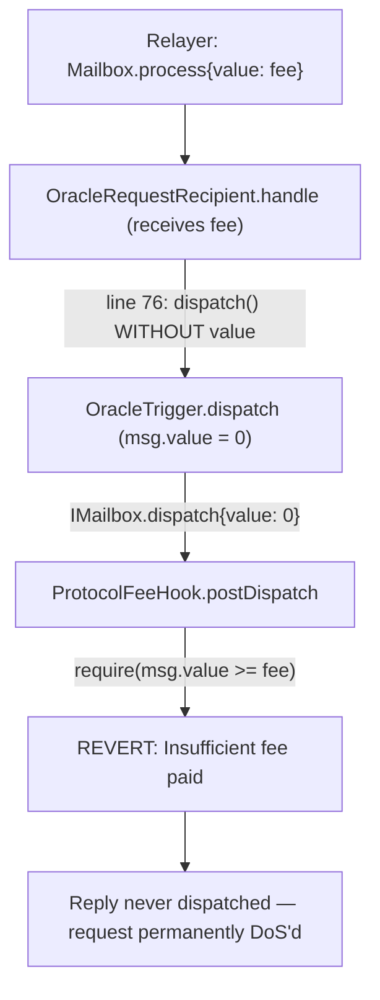

# DIA Spectra — fee dropped during the interchain oracle callback (permanent DoS)

<!-- source-auditvault: https://github.com/Auditware/AuditVault/blob/main/findings/55410-issue-with-fee-payment-during-interchain-callback-mixbytes-n.md -->
<!-- date: 2025-03 -->

> **Vulnerability classes:** vuln/cross-chain/fee-accounting · vuln/dos/liveness · vuln/logic/missing-value-forward

> **Reproduction:** Real audited source, deployed locally. Run [forge test](.) and inspect [output.txt](output.txt). The Playground bundle replays the same `55410` DoS invariant against the same real `OracleRequestRecipient` / `OracleTrigger`.

## Key info

| Field | Value |
| --- | --- |
| Loss | The interchain oracle callback reverts on every delivery — requested prices are never dispatched back to the requesting chain (liveness DoS; fixable only by redeployment) |
| Vulnerable contract | [`OracleRequestRecipient.sol:76`](src/OracleRequestRecipient.sol) (calls `OracleTrigger.dispatch()` without `{value: msg.value}`) |
| Protocol | DIA Spectra interoperability (cross-chain oracle) |
| Repo · commit | [diadata-org/Spectra-interoperability](https://github.com/diadata-org/Spectra-interoperability) @ `ed9f1e5ff3aa6cfba02d12f0bed1e435aeec24c1` |
| Auditor · severity | MixBytes · **High** |
| Attacker EOA | 0x1111111111111111111111111111111111111111 (synthetic relayer) |
| Attack contract | [Exploit](test/55410-issue-with-fee-payment-during-interchain-callback-mixbytes-n_exp.sol) |
| Chain · date | Local (no fork) · 2025-03 |
| Compiler | Solidity 0.8.26 |
| Bug class | vuln/cross-chain/fee-accounting · vuln/dos/liveness |

## TL;DR

`OracleRequestRecipient.handle()` is the destination-chain entrypoint the Hyperlane
relayer calls to deliver an inbound oracle **request**. To answer it, `handle()`
dispatches a **reply** message back through the Mailbox, which charges an interchain
fee. But line 76 calls `OracleTrigger.dispatch(...)` **without** `{value: msg.value}`,
so the reply dispatch is invoked with `msg.value == 0`. The Mailbox's required fee hook
rejects the zero payment and the whole delivery reverts — **every** request is denied,
and the requesting chain never receives its price. Because it is a code bug, not a
config value, the only fix is a redeployment.

## The vulnerable code

Real audited source, vendored unchanged from the audited commit
([`src/OracleRequestRecipient.sol`](src/OracleRequestRecipient.sol)):

```solidity
// OracleRequestRecipient.handle(...)  — line 76
IOracleTrigger(oracleTriggerAddress).dispatch(_origin, sender, key);   // @> VULN: no {value: msg.value}
```

`OracleTrigger.dispatch()` then pays the outbound Mailbox with whatever value it
received ([`src/OracleTrigger.sol:230`](src/OracleTrigger.sol)):

```solidity
bytes32 messageId = IMailbox(mailBox).dispatch{value: msg.value}(  // msg.value == 0 here
    _destinationDomain, recipientAddress.addressToBytes32(), messageBody);
```

Because `handle()` swallowed the relayer's `msg.value`, `dispatch()` sees `msg.value == 0`
and the Mailbox's required fee hook ([`src/ProtocolFeeHook.sol`](src/ProtocolFeeHook.sol),
`postDispatch` → `require(msg.value >= requiredFee)`) reverts with `"Insufficient fee paid"`.

## Root cause

`handle()` receives the fee (`msg.value`) but forwards **nothing** to `dispatch()`.
The fee is stranded in the recipient and the outbound reply is always underpaid.

## Preconditions

Standard, intended deployment: the recipient is whitelisted in Hyperlane and granted
`OWNER_ROLE` on the `OracleTrigger` so it may dispatch replies; the Mailbox charges a
non-zero required fee (production Hyperlane always does). No attacker setup and no
special state is needed — a perfectly honest, fully-funded relayer delivery is enough
to trigger the revert.

## Attack walkthrough

The PoC deploys the **real** audited `OracleRequestRecipient`, `OracleTrigger`, and
`ProtocolFeeHook`, and doubles only the opaque boundaries: the Hyperlane Mailbox
(cross-chain messenger) and the DIA oracle feed.

1. The relayer calls `Mailbox.process{value: fee}(...)` — the full required fee attached —
   which forwards the value into `OracleRequestRecipient.handle{value: fee}(...)`.
2. `handle()` passes every check, then calls `OracleTrigger.dispatch(_origin, sender, key)`
   **without** the value (line 76). The fee stays in the recipient.
3. `dispatch()` calls `IMailbox(mailBox).dispatch{value: 0}(...)`; the required fee hook
   reverts `"Insufficient fee paid"`. The whole delivery reverts — the reply is never sent.
4. The registry test repeats this three times to show the DoS is persistent, and asserts
   `mailbox.dispatchCount() == 0` (zero replies produced).
5. **Negative control:** the same, equally-funded flow against the real one-line fix
   (`dispatch{value: msg.value}`, upstream commit `0c4418c`) succeeds and produces exactly
   one reply — proving the missing value forward is the sole cause.

## Diagrams



## Remediation

Forward the value (the upstream fix, commit `0c4418c`):

```solidity
IOracleTrigger(oracleTriggerAddress).dispatch{value: msg.value}(_origin, sender, key);
```

and add a mechanism to ensure the relayer supplies the required fee to
`Mailbox.process()` in the first place.

## How to reproduce

```bash
cd 55410-issue-with-fee-payment-during-interchain-callback-mixbytes-n_exp
forge test -vvv
```

The browser replay uses
`scripts/poc-configs/55410-issue-with-fee-payment-during-interchain-callback-mixbytes-n.mjs`
and the same real `OracleRequestRecipient` / `OracleTrigger` inlined into the `Exploit`.

## Sources

- [AuditVault finding](https://github.com/Auditware/AuditVault/blob/main/findings/55410-issue-with-fee-payment-during-interchain-callback-mixbytes-n.md)
- [MixBytes DIA report — §3 Issue with fee payment during interchain callback](https://github.com/mixbytes/audits_public/blob/master/DIA/Multi%20Scope/README.md#3-issue-with-fee-payment-during-interchain-callback)
- Real audited source: [diadata-org/Spectra-interoperability @ ed9f1e5f](https://github.com/diadata-org/Spectra-interoperability/blob/ed9f1e5ff3aa6cfba02d12f0bed1e435aeec24c1/contracts/contracts/OracleRequestRecipient.sol#L76)
- Forge regression: [test/55410-issue-with-fee-payment-during-interchain-callback-mixbytes-n_exp.sol](test/55410-issue-with-fee-payment-during-interchain-callback-mixbytes-n_exp.sol)
