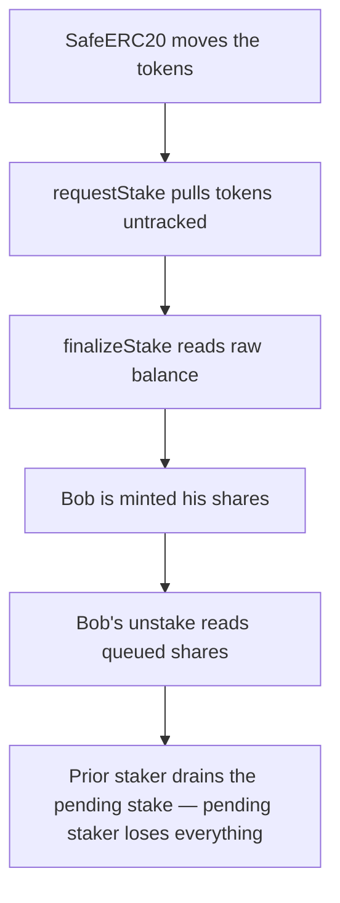

# Coinflip: pending stake counted as liquidity, drained by a prior staker

> **Vulnerability classes:** vuln/theft · vuln/accounting
>
> **Reproduction:** a faithful minimal reproduction of the vulnerable finding — the `requestStake` token transfer and the `finalizeUnstake` liquidity math are reproduced **verbatim** (marked `@>`) with faithful minimal doubles; local deploy, no fork.

<!-- source-auditvault: https://github.com/pashov/audits/blob/master/team/md/Coinflip-security-review_2025-02-19.md -->

## Root cause

In the audited Coinflip `Staking` contract, `requestStake()` moves the staker's tokens into the contract immediately via `safeTransferFrom`, but never records them as a *pending* stake to be excluded from available liquidity. Every share and pro-rata calculation then reads the raw `IERC20(token).balanceOf(address(this))`, which now includes the still-pending tokens. The vulnerable line, reproduced verbatim from the finding:

```solidity
function requestStake(address token, uint256 amount) external nonReentrant {
    --- SNIPPED 
---

    // Transfer the tokens from the user to this contract
@>  IERC20(token).safeTransferFrom(msg.sender, address(this), amount);

    --- SNIPPED 
---
}
```

Because the pending amount is folded straight into the pool balance, `finalizeUnstake()` — and `finalizeStake()`, `totalOwed()`, `lockLiquidity()` — all over-estimate the liquidity backing existing shares:

```solidity
@>  uint256 totalBalance = IERC20(token).balanceOf(address(this));
    // The user's pro-rata portion of the underlying tokens
@>  uint256 amountOwed = (sharesToRedeem * totalBalance) / totalShares;
```

## Why it's exploitable here

Following the finding's worked example (100 tokens each):

1. Bob is the sole existing staker: 100 shares, pool balance 100 tokens — he owns 100% of the liquidity. He queues a full unstake (cooldown already elapsed).
2. Alice only *requests* a stake of 100 tokens. Her tokens land in the contract immediately, so the pool balance becomes 200 — but 100 of it is still pending and unaccounted for.
3. Bob finalizes his unstake. `amountOwed = 100 * 200 / 100 = 200` — he walks away with 200 tokens, i.e. his own 100 plus Alice's pending 100.
4. Alice finalizes her stake (mints 100 shares) and tries to redeem, but the pool is empty: `amountOwed = 100 * 0 / totalShares = 0`. She is left with shares and zero backing — a direct loss of her entire deposit to the prior staker.

## Attack path



## Marked-line walkthrough (Playground)

The EVM Playground pins each step to the exact executed source line in `0x671d353a…`:

1. **L50** — SafeERC20 moves the tokens: Setup: SafeERC20's require runs the real ERC20 transferFrom, pulling a staker's tokens straight into the Staking contract.
2. **L125** — requestStake pulls tokens untracked: Root cause: requestStake moves the staker's tokens into the pool immediately but never tracks them as pending, so balanceOf() inflates all liquidity math.
3. **L133** — finalizeStake reads raw balance: finalizeStake reads balanceOf(this) as totalBalance to price new shares, trusting the raw pool balance with no pending stake excluded.
4. **L144** — Bob is minted his shares: Setup: totalShares grows by Bob's freshly minted shares, making him the sole staker who owns the entire 100-token pool.
5. **L159** — Bob's unstake reads queued shares: Bob's finalizeUnstake loads sharesToRedeem from his queued full-unstake request, about to claim a pro-rata slice of the pool.
6. **L170** — Bob receives inflated payout: The Unstaked event fires as Bob is paid 200 tokens, his pro-rata cut of the inflated 200-token balance, pocketing Alice's pending 100.
7. **L181** — Alice approves the staking pool: Setup: Alice grants the Staking contract an unlimited allowance so her pending stake request can pull her 100 tokens in.
8. **L194** — Alice tries to unstake, empty: Alice's requestUnstake queues her 100 shares to redeem, but Bob already drained the pool so her later finalizeUnstake pays out zero.

## PoC

Registry (Foundry, local deploy — verbatim vulnerable source + harm-asserting test):

```bash
cd 55503-c-02-pending-stake-not-accounted-for-in-liquidity-calculatio_exp && forge test -vvv
```

The browser Playground replays the same synthetic opcode-for-opcode and measures the harm: **Bob supplies 100, Alice only requests a 100 stake, Bob finalizes his unstake to drain the inflated 200-token balance, and Alice redeems 0.** Both gates are green (registry `forge test` PASS + Playground `_verify-poc` **VERDICT: PASS**).
