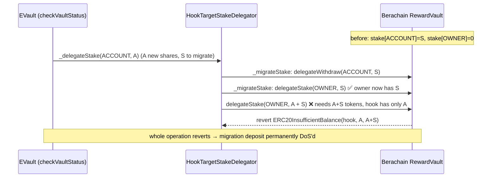

# Euler HookTargetStakeDelegator double-counts the migrated stake

> **Vulnerability classes:** vuln/logic/accounting-error · vuln/defi/reward-accounting · vuln/dos/fund-lock
>
> **Reproduction:** the test deploys the REAL audited `HookTargetStakeDelegator`
> (+ its `ERC20ShareRepresentation`) from evk-periphery at the audited commit,
> with only the opaque Berachain RewardVault / EVault / EVC boundaries represented
> by faithful minimal doubles. A stake migration is triggered and the concrete
> double-count is proven with numbers, alongside a negative control that applies
> the MixBytes fix.

<!-- source-auditvault: https://github.com/Auditware/AuditVault/blob/main/findings/55523-double-counting-of-the-migrated-stake-mixbytes-none-euler-ma.md -->
<!-- date: 2025 -->

## Root cause

`HookTargetStakeDelegator` mirrors EVault share balances into Berachain's
Proof-of-Liquidity reward vault. Stake is always delegated to an account's EVC
*owner*. When a sub-account first receives shares its owner may not yet be
registered, so the stake is temporarily delegated directly to the sub-account.
Once the owner registers, the next operation must *migrate* that stake to the
owner. `_migrateStake` performs the migration itself:

```solidity
function _migrateStake(address owner, address account) internal returns (uint256) {
    uint256 stake;
    if (owner != address(0) && owner != account) {
        stake = rewardVault.getDelegateStake(account, address(this));
        if (stake > 0) {
            rewardVault.delegateWithdraw(account, stake);
            rewardVault.delegateStake(owner, stake);   // <-- migrated stake ALREADY staked to owner
        }
    }
    return stake;
}
```

The bug is in how `_delegateStake` consumes that return value
([`HookTargetStakeDelegator.sol#L283`](src/HookTarget/HookTargetStakeDelegator.sol)):

```solidity
function _delegateStake(address account, uint256 amount) internal {
    address owner = evc.getAccountOwner(account);
    // @> VULN: _migrateStake already delegate-staked `stake` to `owner`.
    // @> Adding its return value to `amount` stakes that migrated amount AGAIN.
    rewardVault.delegateStake(owner == address(0) ? account : owner, amount + _migrateStake(owner, account));
}
```

The migrated stake `S` is delegated to the owner **twice**: once inside
`_migrateStake` and again in the outer `delegateStake(owner, amount + S)`. The
owner is credited `amount + 2·S` instead of `amount + S`.

Because the real Berachain `RewardVault.delegateStake` **pulls the stake token**
(`stakeToken.safeTransferFrom(msg.sender, …)`, via `StakingRewards._stake`), the
hook only ever holds exactly the share-representation tokens it just minted for
the new `amount`. The double count therefore tries to move `amount + S` tokens
while only `amount` exist — so the outer `delegateStake` **reverts**, which
reverts the whole `checkVaultStatus` / EVC batch. Any user whose sub-account
stake must be migrated (a normal lifecycle: fund a sub-account before its owner
is registered, then fund it again afterwards) has that operation permanently
bricked.



The audited source is vendored byte-identically at
[`src/HookTarget/HookTargetStakeDelegator.sol`](src/HookTarget/HookTargetStakeDelegator.sol);
its real OZ / evk / evc import closure is under `src/dep/`. The client fixed it
in [PR #270](https://github.com/euler-xyz/evk-periphery/pull/270/files).

## Reproduction

The test funds a sub-account `ACCOUNT` with `S = 100` shares while its EVC owner
is unregistered (stake delegated directly to `ACCOUNT`), registers the owner,
then deposits `A = 40` more shares to trigger the migration.

- `test_DoubleCountMigratedStake_reverts_migration_deposit` — the migration
  deposit reverts with **`ERC20InsufficientBalance(hook, 40e18, 140e18)`**: the
  buggy hook tries to stake `A + S = 140` share tokens to the owner (on top of
  the `S` the migration already staked, i.e. `A + 2S`) while only `A = 40` exist.
- `test_Fix_removes_double_count_and_operation_succeeds` — the same scenario with
  only the MixBytes fix applied completes and credits the owner **exactly
  `A + S = 140`**, with `ACCOUNT` migrated to `0` and total delegated stake equal
  to total shares.

```bash
cd 55523-double-counting-of-the-migrated-stake-mixbytes-none-euler-ma_exp
forge test -vvv
```

Expected result: `2 passed`.

## Sources

- [AuditVault finding #55523](https://github.com/Auditware/AuditVault/blob/main/findings/55523-double-counting-of-the-migrated-stake-mixbytes-none-euler-ma.md)
- [MixBytes report — Euler HookTargetStakeDelegator §1](https://github.com/mixbytes/audits_public/blob/master/Euler/HookTargetStakeDelegator/README.md#1-double-counting-of-the-migrated-stake)
- [Audited source `HookTargetStakeDelegator.sol` @ `647866626f`](https://github.com/euler-xyz/evk-periphery/blob/647866626fbceec678e3e11cdd9d7e5be9e5f6e5/src/HookTarget/HookTargetStakeDelegator.sol#L283)
- [Client fix — evk-periphery PR #270](https://github.com/euler-xyz/evk-periphery/pull/270/files)
