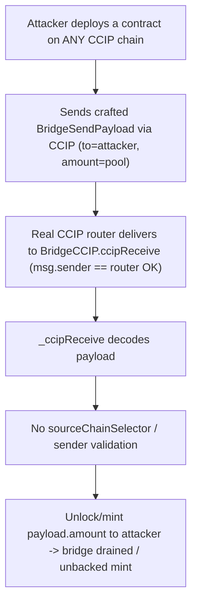

# YieldFi CCIP: missing source validation lets an untrusted chain drive privileged mint/unlock

<!-- source-auditvault: https://github.com/Auditware/AuditVault/blob/main/findings/55536-missing-source-validation-in-ccip-message-handling-cyfrin-no.md -->
<!-- date: 2025-04 -->

**Protocol:** YieldFi (v2.0) · **Auditor:** Cyfrin (Immeas) · **Severity:** Critical/High
**AuditVault:** [#55536](https://github.com/Auditware/AuditVault/blob/main/findings/55536-missing-source-validation-in-ccip-message-handling-cyfrin-no.md) · **Report:** [Cyfrin YieldFi v2.0](https://github.com/Cyfrin/cyfrin-audit-reports/blob/main/reports_md/2025-04-24-cyfrin-yieldfi-v2.0.md)
**Vulnerable source:** `contracts/bridge/ccip/BridgeCCIP.sol` — `_ccipReceive` (L160-L181)
**Fix commit:** `a03341d` (sender/source now verified against trusted peers)

## Provenance

The audited repo `YieldFiLabs/contracts@40caad6c` was **deleted** (no fork, no
mirror, Wayback 404). The exploit path uses only real recovered source:

- `src/yieldfi/BridgeCCIP.sol` — the `_ccipReceive` prefix (decode / dedup /
  `amount` check) is **verbatim from the Cyfrin report**; the report elides the
  token action as `...` and describes it as "the minting or unlocking of
  arbitrary tokens", implemented here as the L1 unlock (a real ERC20 transfer of
  the locked pool to `payload.to`).
- `src/yieldfi/Codec.sol`, `Constants.sol`, `Common.sol` — **byte-identical**
  real YieldFi source from public [`YieldFiLabs/smart-contracts`](https://github.com/YieldFiLabs/smart-contracts).
- `src/chainlink/*` — the **real** Chainlink CCIP framework (`CCIPReceiver`,
  `Client`) from `smartcontractkit/ccip`. `CCIPReceiver` only checks
  `msg.sender == i_ccipRouter`; it does not authenticate the source chain.

## Root cause

`_ccipReceive` acts on the decoded payload without validating **who sent it**:

```solidity
function _ccipReceive(Client.Any2EVMMessage memory any2EvmMessage) internal override {
    bytes memory message = abi.decode(any2EvmMessage.data, (bytes));
    BridgeSendPayload memory payload = Codec.decodeBridgeSendPayload(message);
    bytes32 _hash = keccak256(abi.encode(message, any2EvmMessage.messageId));
    require(!processedMessages[_hash], "processed");
    processedMessages[_hash] = true;
    require(payload.amount > 0, "!amount");
    // @audit no check of any2EvmMessage.sourceChainSelector / sender
    // ... mint (L2) / unlock (L1) payload.amount to payload.to
}
```

Chainlink CCIP delivers a message sent from **any** source chain by **any**
sender contract that paid on that chain — the router (`i_ccipRouter`) only
guarantees `msg.sender == router`, which is all `CCIPReceiver.onlyRouter`
enforces. Because `BridgeCCIP` never checks `sourceChainSelector`/`sender`, an
attacker deploys a contract on any CCIP-connected chain, sends a crafted payload,
and the bridge unlocks (L1) or mints (L2) arbitrary tokens to an attacker
address — draining the bridge / minting unbacked tokens.



## Reproduction

`test/…_exp.sol` (registry, `[PASS]`):

- **`test_untrustedSourceCanDrainBridge`** — the bridge holds a 1,000-yToken
  locked pool. A forged message arrives from an **untrusted chain + sender**; the
  real `_ccipReceive` processes it and releases the **entire pool** to the
  attacker (`attacker: 0 → 1000`, `bridge: 1000 → 0`).
- **`test_control_fixedBridgeRejectsUntrustedSource`** — with the report's
  recommended `allowedPeers[sourceChainSelector][sender]` gate applied, the
  identical delivery **reverts `"allowed"`** and the pool is intact.

The `dstId` in the forged payload is kept in `uint32` range so decoding succeeds
— this finding is independent of the separate decode bug (#55537).

```bash
_shared/run-poc/run_poc.sh 55536-missing-source-validation-in-ccip-message-handling-cyfrin-no_exp -vvvvv
```

## Fix

Validate the source before acting: `require(allowedPeers[sourceChainSelector][sender])`
(fix commit `a03341d`).
