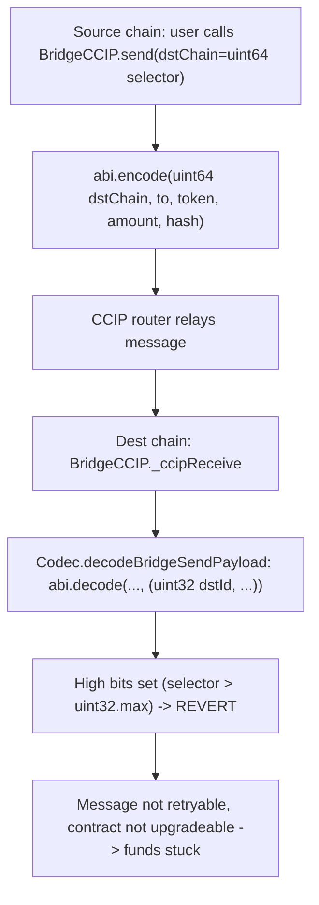

# YieldFi CCIP: every inbound message reverts when decoded (`uint32` vs `uint64` chain selector)

<!-- source-auditvault: https://github.com/Auditware/AuditVault/blob/main/findings/55537-all-ccip-messages-reverts-when-decoded-cyfrin-none-yieldfi-m.md -->
<!-- date: 2025-04 -->

**Protocol:** YieldFi (v2.0) · **Auditor:** Cyfrin (Immeas) · **Severity:** High
**AuditVault:** [#55537](https://github.com/Auditware/AuditVault/blob/main/findings/55537-all-ccip-messages-reverts-when-decoded-cyfrin-none-yieldfi-m.md) · **Report:** [Cyfrin YieldFi v2.0](https://github.com/Cyfrin/cyfrin-audit-reports/blob/main/reports_md/2025-04-24-cyfrin-yieldfi-v2.0.md)
**Vulnerable source:** `contracts/libs/Codec.sol` — `decodeBridgeSendPayload` · driven by `contracts/bridge/ccip/BridgeCCIP.sol` — `_ccipReceive`
**Fix commit:** `14fc17a` (`dstId` changed to `uint64`)

## Provenance

The audited repo `YieldFiLabs/contracts@40caad6c` was **deleted** (no fork, no
mirror, Wayback returns 404). The exploit path here uses only real YieldFi
source recovered from surviving sources:

- `src/yieldfi/Codec.sol`, `Constants.sol`, `Common.sol` — **byte-identical**
  to the public [`YieldFiLabs/smart-contracts`](https://github.com/YieldFiLabs/smart-contracts)
  repo (the vulnerable `uint32 dstId` decode is present there verbatim; only the
  `decodeBridgeSendPayload` parameter is `bytes memory` to match the audited
  `_ccipReceive` call site).
- `src/yieldfi/BridgeCCIP.sol` — the `send` and `_ccipReceive` bodies are
  reproduced **verbatim from the Cyfrin report** (the auditor's own copy of the
  audited source).
- `src/chainlink/*` — the **real** Chainlink CCIP framework
  (`Client`, `CCIPReceiver`, `IRouterClient`) from `smartcontractkit/ccip`.

## Root cause

`BridgeCCIP.send` builds the custom payload with the **`uint64`** destination
chain selector as the first field:

```solidity
bytes memory _encodedMessage =
    abi.encode(_dstChain /*uint64*/, _to, tokens[_yToken][_dstChain], _amount, Constants.BRIDGE_SEND_HASH);
```

On the destination chain, `_ccipReceive` hands the payload to the real
`Codec.decodeBridgeSendPayload`, which decodes that first field into a
**`uint32`**:

```solidity
(uint32 dstId, address to, address token, uint256 amount, bytes32 trxnType) =
    abi.decode(_data, (uint32, address, address, uint256, bytes32));
```

Every Chainlink CCIP chain selector is a `uint64` far above `uint32.max`
(Ethereum = `5009297550715157269`). `abi.decode` validates the high bits of the
32-byte word and **reverts** when they are non-zero. So *every* inbound CCIP
message reverts on this first statement, before any handling. `BridgeCCIP` is
not upgradeable and CCIP messages cannot be retried → **permanent cross-chain
liveness break**; bridged tokens are locked/burned on the source with nothing
released on the destination.



## Reproduction

`test/…_exp.sol` (registry, `[PASS]`):

- **`test_everyCcipMessageRevertsOnDecode`** — a user bridges via the real
  `BridgeCCIP.send` (packing the `uint64` Base selector); a router double relays
  the exact bytes to the destination bridge; the real `_ccipReceive` **reverts**
  while decoding. The message can never be processed.
- **`test_codec_control_uint32_vs_uint64_selector`** — the same well-formed
  payload decodes cleanly through the real `Codec` when `dstId` is within
  `uint32` range, and reverts for the real Ethereum selector — isolating the
  mechanism as the `uint64 → uint32` truncation, not a malformed payload.

```bash
_shared/run-poc/run_poc.sh 55537-all-ccip-messages-reverts-when-decoded-cyfrin-none-yieldfi-m_exp -vvvvv
```

## Fix

Change `Codec.BridgeSendPayload.dstId` (and the `abi.decode` type) to `uint64`,
matching the Chainlink chain-selector width (fix commit `14fc17a`).
